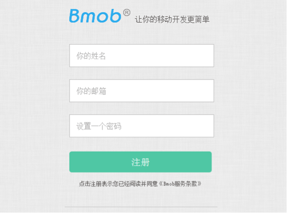
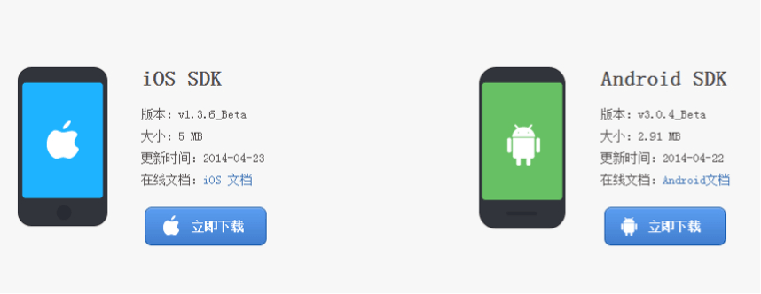
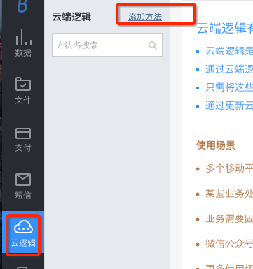
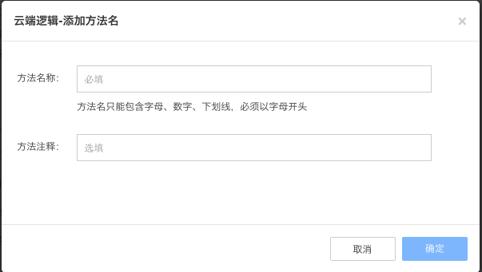

## 注册Bmob帐号
在网址栏输入www.bmob.cn或者在百度输入Bmob进行搜索，打开Bmob官网后，点击右上角的“注册”，在跳转页面填入你的姓名、邮箱、设置密码，确认后到你的邮箱激活Bmob账户，你就可以用Bmob轻松开发应用了。


## 网站后台创建应用

登录账号进入bmob后台后，点击后台界面左上角“创建应用”，在弹出框输入你应用的名称，然后确认，你就拥有了一个等待开发的应用。


## 获取应用密钥和下载SDK

选择你要开发的应用，进入该应用


在跳转页面，进入设置/应用密钥，点击复制，即可得到Application ID


获取Application ID后，下载SDK，开发者可以根据自己的需求选择相应的iOS SDK 或Android SDK，点击下载即可。




## 创建云端逻辑

在Bmob后台中，选择你刚刚创建好的应用，然后依次点击“云端逻辑->添加方法”，在弹出窗口中输入云端逻辑的方法名，该方法名将会在SDK调用时使用到。如下图所示：





接着，你就可以在云端逻辑的编辑器中撰写云端逻辑了。如果你熟悉js脚本语言的话，撰写云端逻辑非常简单，你只需要在onRequest方法中补充你的业务逻辑代码就可以了。onRequest方法包含3个参数，分别是request（请求对象，可以从中获取SDK上传的参数）, response（回应对象，可以将云端逻辑的执行结果返回到SDK中）, modules（可调用的模块，包含数据库对象、HTTP对象等）。为方便演示，这里简单实现一个功能：接收客户端上传上来的name参数，根据name的值返回不同的结果。代码如下：

```java
function onRequest(request, response, modules) {
  //获取SDK客户端上传的name参数
  var name = request.body.name;
    if(name == 'bmob')
      response.end('欢迎使用Bmob');
    else
      response.end('输入错误，请重新输入');
}                         
```

## 安装和初始化BmobSDK

云端逻辑的调用执行可以是在云端（通过“定时任务”模块去设置执行，实现定时业务逻辑计算的功能，如排行榜，这个操作非常简单，这里不再一一介绍），但更多的开发者是通过SDK调用的方式来执行云端逻辑。这有点像存储过程，大家可以将更多的业务逻辑放在云端，可以随意改变，不需要更新应用，也不需要上传太多的数据参数。

安装和初始化SDK的过程大家根据各自的平台（[Android](http://docs.bmob.cn/data/Android/a_faststart/doc/index.html "Android快速入门文档") / [iOS](http://docs.bmob.cn/data/iOS/a_faststart/doc/index.html "iOS快速入门文档")等）具体参考快速入门文档即可。

## 调用云端逻辑

将如下的代码根据各自平台，插入到触发执行的方法里面。

### Android调用云端逻辑

```java
//test对应你刚刚创建的云端逻辑名称
String cloudCodeName = "test";
JSONObject params = new JSONObject();
//name是上传到云端的参数名称，值是bmob，云端逻辑可以通过调用request.body.name获取这个值 
params.put("name", "bmob");
//创建云端逻辑对象
AsyncCustomEndpoints cloudCode = new AsyncCustomEndpoints();
//异步调用云端逻辑
cloudCode.callEndpoint(MainActivity.this, cloudCodeName, params, new CloudCodeListener() {

    //执行成功时调用，返回result对象
    @Override
    public void onSuccess(Object result) {
        Log.i("bmob", "result = "+result.toString());
    }

    //执行失败时调用
    @Override
    public void onFailure(String err) {
        Log.i("bmob", "BmobException = "+err);
    }
});
```

### iOS调用云端逻辑

```java
	//name是上传到云端的参数名称，值是bmob，云端逻辑可以通过调用request.body.name获取这个值 
    NSDictionary  *dic = [NSDictionary  dictionaryWithObject:@"bmob" forKey:@"name"];
    //test对应你刚刚创建的云端逻辑名称
    [BmobCloud callFunctionInBackground:@"test" withParameters:dic block:^(id object, NSError *error) {

    if (!error) {
     	//执行成功时调用
    	NSLog(@"error %@",[object description]);
    }else{
       //执行失败时调用
    	NSLog(@"error %@",[error description]);
    }

    }] ;
```

## 源码下载

[iOS源码下载](https://github.com/bmob/bmob-ios-demo/blob/master/CloudFunction.zip)

[Android源码下载](http://www.bmob.cn/static/Bmob_Sample_android_cloud.zip "Android源码下载")


