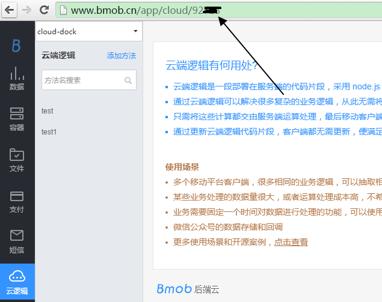
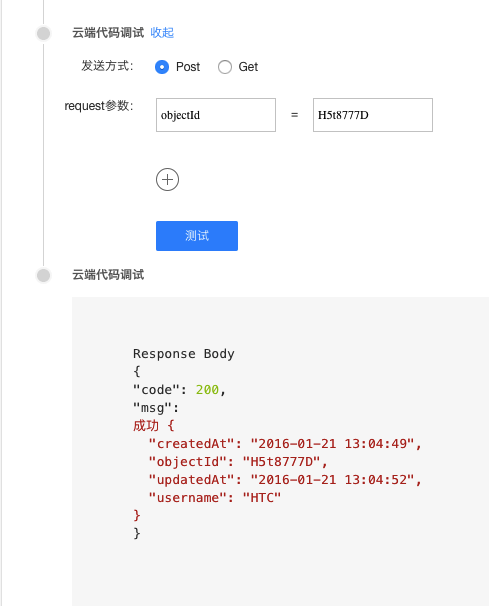

## 简介

Bmob旨在让移动开发变得更简单。对于一些复杂的应用，您可能希望增加一些特有的业务逻辑，并能灵活掌控，Bmob云端逻辑提供了这种灵活性，可以让您的代码直接在Bmob云上运行。一旦你在云端更新了代码，所有的移动应用都会立即自动更新，新功能的发布将会变得更加简单可控。

## 开源案例

为方便大家更好的使用云端逻辑，Bmob为大家提供了一些常用模块，方便大家直接拿来使用的。


- 对整个表进行排序：[https://github.com/bmob/bmob-cloudcode-demo-ranking/blob/master/order1.js](https://github.com/bmob/bmob-cloudcode-demo-ranking/blob/master/order1.js) 可结合定时任务使用

- 获取某行数据对应排行的信息： [https://github.com/bmob/bmob-cloudcode-demo-ranking/blob/master/order2.js](https://github.com/bmob/bmob-cloudcode-demo-ranking/blob/master/order2.js)

- 获取前N名数据排行信息：[https://github.com/bmob/bmob-cloudcode-demo-ranking/blob/master/order3.js](https://github.com/bmob/bmob-cloudcode-demo-ranking/blob/master/order3.js)


在开发云端逻辑时，希望大家能够先看看我们提供的编码规范文档：[http://docs.bmob.cn/cloudcode/WEB/f_codehelp/doc/index.html](http://docs.bmob.cn/cloudcode/WEB/f_codehelp/doc/index.html)

## 调用云端逻辑的方式

bmob允许以http的方式直接调用云端逻辑。

### 获取Secret Key
用户需要以http的方式运行云端逻辑，需要先确定应用的Secret Key。 调用云端逻辑时，通过Secret Key标识一个应用，获取Secret Key的路径：
管理后台->应用密钥->Secret Key, 如下图所示：


注意：请妥善保管Secret Key，避免Secret Key的泄露！！！

### 以Get的方式调用云端逻辑

下面展示了以Get的方式调用云端逻辑：
```
curl -X GET http://cloud.bmob.cn/0348d0c262bc91d9/test?name=jeff
```
其中：
0348d0c262bc91d9：应用的Secret Key。
test：云端逻辑的名称
name=jeff: 传入一个参数，名称是name，值是jeff
与restful不同，无需再传其它诸如app id等请求头。

### 以Post的方式调用云端逻辑
下面展示了以Post的方式调用云端逻辑：
```
curl -X POST \
    -H "Content-Type: application/x-www-form-urlencoded" \
    -d 'name=jeff' \
    http://cloud.bmob.cn/0348d0c262bc91d9/test
```
其中：
0348d0c262bc91d9：应用的Secret Key。
test：云端逻辑的名称
name=jeff: 传入一个参数，名称是name，值是jeff
与restful不同，无需再传其它诸如app id等请求头。

## 转为套餐后调用云端逻辑的方式

**注意：升级云端代码套餐后就没法在微信公众号中调用云端代码**

bmob允许以http的方式直接调用云端逻辑。

### 获取应用的id值

进入应用后台->云逻辑，下图中的箭头所指的数字就是该应用的id值：



### Get的方式调用云端逻辑

下面展示了以Get的方式调用云端逻辑：
```
curl -X GET http://cloud-xxxxx.bmobapp.com/test?name=jeff
```
其中：
cloud-xxxxx.bmobapp.com：该应用的云端代码专属域名，其中xxxxx为上节“获取应用的id值”所获取的id值。
test：云端逻辑的名称。
name=jeff: 传入一个参数，名称是name，值是jeff。
与restful不同，无需再传其它诸如app id等请求头。

### Post的方式调用云端逻辑
下面展示了以Post的方式调用云端逻辑：
```
curl -X POST \
    -H "Content-Type: application/x-www-form-urlencoded" \
    -d 'name=jeff' \
    http://cloud-xxxxx.bmobapp.com/test
```
其中：
cloud-xxxxx.bmobapp.com：该应用的云端代码专属域名，其中xxxxx为上节“获取应用的id值”所获取的id值。
test：云端逻辑的名称
name=jeff: 传入一个参数，名称是name，值是jeff
与restful不同，无需再传其它诸如app id等请求头。

## 云端逻辑模块解释

从云端逻辑的入口方法function onRequest(request, response, modules)可知，云端逻辑包含三个模块，分别是request模块、response模块和modules模块。

### request模块

request模块用于获取传入的参数。由于现在调用云端逻辑有两种方式（get和post），所以获取传入的参数的方式需要使用不同的方法。

**注意，当通过android，ios等客户端sdk调用云端逻辑，或者通过restful api的方式调用云端逻辑，都是采用post的方式。**

#### get方式
用get方式调用云端逻辑，例如：
```
curl -X GET http://cloud.bmob.cn/0348d0c262bc91d9/test?name=jeff
```
可用下面的方法获取name的值：
```
request.query.name
```

#### post方式
用post方式调用云端逻辑，例如：
```
curl -X POST \
    -H "Content-Type: application/x-www-form-urlencoded" \
    -d 'name=jeff' \
    http://cloud.bmob.cn/0348d0c262bc91d9/test
```
可用下面的方法获取name的值：
```
request.body.name
```

#### 获取调用云端逻辑的http方式

当云端逻辑是用于某些平台的回调时，同一段云端逻辑可能有时是采用get的方式调用，有时是采用post的方式调用, 可用下面的方法获取当前云端逻辑是采用get还是post方式调用。

例子如下：
```
	var httptype = request.method;　//获取调用云端逻辑的是post或者get方式
    if ("GET" == httptype) {
		//采用get方式调用云端逻辑
	}else{
		//采用post方式调用云端逻辑
	}

```

### response模块

response为云端逻辑的信息回传模块，该模块包含了一个send方法，实现将云端的执行结果（如查询的数据）返回给SDK或者RestApi等调用端：

```java
response.send(string result)
```
### modules模块

modules是Bmob云端逻辑提供给大家的各种对象处理的模块，包括数据库对象（oData）、文件对象（oFile）、地理位置对象（oLocation）、关联关系对象（oRelation）、原子操作对象（oAtom）、数据批量操作对象（oBatch）、数组对象（oArray）、消息推送对象（oPush）、云端逻辑对象（oFunctions）、邮件发送对象（oMail）、HTTP对象（oHttp）、字符编码转换对象（oEncodeing）、事件对象（oEvent）、bql对象（oBql）、html元素解析对象（oHtmlparser）、加密对象（oCrypto）。云端逻辑想要调用这些对象时，只需要用如下的方法即可获取：

```java
  //获取数据库对象
  var db = modules.oData;
  //下面进行其他操作
```

** 这里需要说明一点的是：云端逻辑对数据格式的封装遵循RestApi的规则，如果在查看过程中有什么疑问，请移步到[RestApi开发文档](http://docs.bmob.cn/data/Restful/b_developdoc/doc/index.html#简介)。 **

## 数据库对象

数据库操作的简单实例如下：
```
function onRequest(request, response, modules) {
  //获取数据库对象
  var db = modules.oData;
  //获取Posts表中的所有值
  db.find({
	"table":"Posts",
  },function(err,data){
	response.send(data);
  });
}
```
其中，Posts是查找的数据表名称，table是关键词。

需要注意的是，Bmob云端逻辑底层采用Nodejs进行开发，继承了Nodejs的异步非阻塞事件驱动模式，因此也不可避免的需要大量使用回调方法，这些方法往往以非显式声明的闭包形式存在。

**此外，通过oData数据库对象获取返回的回调接口中，所有的data数据都是string类型，如果需要在云端中作为对象类型调用的话，需要将string类型转换为object类型，即：**
```
    var dataObject= JSON.parse(data);
```

oData对象的其他操作方法如下：

### 查询多条数据
```
find({
  "table":"XXX",          //表名
  "keys":"a,b,c",         //返回字段列表，多个字段用,分隔
  "where":{"a":"XXXX","b":"XXXX"},       //查询条件是一个JSON object
  "order":"-a,b",         //排序列表，[-]字段名称,-表示降序，默认为升序
  "limit":10,            //limit大小，一页返回多少条记录，默认为0
  "skip":2,             //skip,分页offset，(page-1)*limit
  "count":1            //count,只返回符合条件的记录总数
 },function(err,data){    //回调函数
 });
```

以下是读取Games表（包含name字段）的数据，并对这些数据进行遍历，将name字段连接起来的一段代码样例：

```java
function onRequest(request, response, modules) {
  var db = modules.oData;
  db.find({
	"table":"Games"
  },function(err,data){ 
  //将返回结果转换为Json对象
  var resultObject= JSON.parse(data);
  //遍历这个Json对象
  for(var results in resultObject)
  {
	var resultArr = resultObject[results];
	var str =" ";
	//遍历得到的每行结果
	for(var oneline in resultArr){
	  str =str +" " + resultArr[oneline].name;
	}
	response.send(str);
  }
});
}
```
    

### 查询单条数据

```java
findOne({
  "table":"XXX",             //表名
  "objectId":"XXXX"         //记录的objectId
},function(err,data){         //回调函数
});
```

**需要注意的是：**
1. 为确保User表的安全性，findOne方法不能直接操作User表。
2. find方法返回的data是字符串类型，如果需要直接对象化调用的话，需要将string类型转换为object类型，即如下，从_User表中查找objectId=YIuNDDDO的数据，并把username信息显示出来：
```
function onRequest(request, response, modules) {
  var db = modules.oData;
  db.findOne({
	"table":"_User",
	"objectId":"YIuNDDDO"
  },function(err,data){ 
	var dataObject= JSON.parse(data);
	response.send("获取用户名信息为： " + dataObject.username);
  });
}
```


### 获取表的记录数

```
function onRequest(request, response, modules) {
    var db = modules.oData;
    //获取表"GameScore"的总记录数
    db.find({
      "table":"GameScore",
      "limit":0,
      "count":1 
    },function(err,data){     
        
        resultObject= JSON.parse(data);
        count=resultObject.count;
        response.send("表记录数:"+count);
        
    });	    
}                                                    
```

其中，`count`为标识位，具体原因大家可以参考Restapi说明文档：[http://docs.bmob.cn/data/Restful/b_developdoc/doc/index.html#查询结果计数](http://docs.bmob.cn/data/Restful/b_developdoc/doc/index.html#查询结果计数)。

### 修改数据
```
update({
  "table":"XXX",             //表名
  "objectId":"XXXX",        //记录的objectId
  "data":{"a":"XXXX","b":"XXXX"}           //需要更新的数据，格式为JSON
},function(err,data){         //回调函数
});
```

以下是一个更新数据的示例代码，实现的效果是从Games表中找到objectId=hmw9888C的数据，将其name数据改为pingpang games。
    
```
function onRequest(request, response, modules) {
  var db = modules.oData;
  db.update({
	"table":"Games",
	"objectId":"hmw9888C",
	"data":{"name":"pingpang games"}
  },function(err,data){ 
	response.send("success");
  });
}
```
    
### 添加数据
```
insert({
  "table":"XXX",             //表名
  "data":{"a":"XXXX","b":"XXXX"}            //需要更新的数据，格式为JSON
},function(err,data){         //回调函数
});
```

### 删除数据
```
remove({
  "table":"XXX",             //表名
  "objectId":"XXXX"        //记录的objectId
},function(err,data){         //回调函数
});
```


### 用户注册
```
userSignUp({
  "data":{"a":"XXXX","b":"XXXX"}             //用户注册的信息，格式为JSON
},function(err,data){         //回调函数
});
```

### 用户登录
```
userLogin({
  "username":"aa",            //登录用户名
  "password":""              //用户密码
},function(err,data){         //回调函数
});
```

### 用户密码重置
```
userRestPassword({
  "data":{"email":"XX@XX.com"}      //需要重置密码的用户邮件账号
},function(err,data){         //回调函数
});
```

### 获取某一用户记录
```
getUserByObjectId({
  "objectId":"XXXX"          //记录的objectId
},function(err,data){         //回调函数
});
```

### 更新某一用户记录

**说明：必须先登录才能更新，切记！！！否则会报sessionToken error**

```
updateUserByObjectId({
	  "objectId":"XXXX",        //记录的objectId
	  "data":{"a":"XXXX","b":"XXXX"}           //需要更新的数据，格式为JSON
	},function(err,data){         //回调函数
});
```

以下是更新用户信息的示例代码：

```
function onRequest(request, response, modules) {
  var db = modules.oData;
  db.userLogin({
	"username":"123567",
	"password":"123"
  },function(err, data){
	if(data){
	  var dataObject = JSON.parse(data);
	  if(dataObject.error == null){
		//需要设置登录之后获取的sessionToken头信息
		db.setHeader({"X-Bmob-Session-Token":dataObject.sessionToken});
		db.updateUserByObjectId({"objectId":dataObject.objectId ,data:{"username":"123"}},function(err,data){
		  response.send("更新成功");
	  })
	}else{
	  response.send("找不到该用户！");
	}
  }
}); 
} 
```

### 获得所有用户信息
```
getAllUser(function(err,data){         //回调函数
});
```

### 删除某一个指定用户

**说明：必须登录才行，切记！！！否则会报sessionToken error**
```
removeUserByObjectId({
	  "objectId":"XXXX"        //记录的objectId
	},function(err,data){         //回调函数
});
```

### 邮箱验证

发送给用户的邮箱验证的邮件会在一周内失效，可以通过下面的方法来强制重新发送
```
requestEmailVerify({
	  "data":{"email":"coolguy@iloveapps.com"}
  },function(err,data){ 
	//回调函数
  });
```

**这里有一个小技巧分享给大家，有时候你会希望能够用Master Key（Bmob给大家提供的超级权限，可以对数据进行任何操作）对数据进行操作，包括不需要用户登录就可以修改用户信息等。那么你只需要在对数据进行操作前，通过db.setHeader方法设置下Master Key头信息即可，如下：**

```
function onRequest(request, response, modules) {
  var db = modules.oData;
  db.setHeader({"X-Bmob-Master-Key":"这里填写Master Key信息"});
  db.updateUserByObjectId({"objectId":"这里是需要更新的用户ObjectId信息" ,data:{"username":"123"}},function(err,data){
	response.send("更新成功");
  }); 
} 
```
## 文件对象

云端逻辑只支持文件的删除操作。删除文件，必须要知道文件的组名和url，示例代码如下：

```
function onRequest(request, response, modules) {

  var file = modules.oFile;

  file.del({
	"group":"group1",
	"url":"M00/00/01/wKgBP1N3FAWRJXsSAAAB_rYZATs52.html"
  },function(err,data){
	 //回调函数
  });
}
```

在上面的例子中，group1是组名，M00/00/01/wKgBP1N3FAWRJXsSAAAB_rYZATs52.html是url。

返回结果是个json对象：
```
{
  "msg": "delete file success"
}
```

## 云端逻辑对象

在云端逻辑中可以调用本app的其它云端逻辑，示例代码如下：

```
function onRequest(request, response, modules) {

    var functions = modules.oFunctions;
    
	functions.run({
	   "name": "test",
	   "data":{"content":"你好","address":"guangzhou"}
	},function(err,data){
	   //回调函数
	});
}
```

在上面的例子中，`name`是云端逻辑的函数名，`data`中是传递的参数

如果不需要传递任何参数，可以用下面的实例代码：

```
function onRequest(request, response, modules) {

    var functions = modules.oFunctions;
    
	functions.run({
	   "name": "test"
	},function(err,data){
	   //回调函数
	});
}
```

## 地理位置对象

Bmob允许用户根据地球的经度和纬度坐标进行基于地理位置的信息查询。你可以在查询中添加一个GeoPoint的对象查询。您可以实现轻松查找出离当前用户最接近的信息或地点的功能。

### 创建地理位置

创建地理位置的示例代码如下：

```
function onRequest(request, response, modules) {

  var location = modules.oLocation;

  location.create({
	"table":"GameScore",
	"objectId":"j4w2DDDT",
	"data":{"location":{            
            "__type": "GeoPoint",
            "latitude":  12.934755,
            "longitude": 24.52065
        }}
  },function(err,data){
	 //回调函数
  });
}
```


### 查询地理位置

现在您有一系列的对象对应的地理坐标，如果能发现那些对象离指定的点近就好了，这可以通过GeoPoint数据类型加上在查询中使用$nearSphere做到。获取离用户最近的10个地点的实现代码如下：

```
  location.query({
	"table":"GameScore",
	"limit":10,
	"where":{
	    "location": {
	        "$nearSphere": {
	            "__type": "GeoPoint",
	            "latitude": 30.0,
	            "longitude": 20.0
	        }
	      }
    }
  },function(err,data){
	 //回调函数
  });

```


这会按离纬度30.0，经度-20.0的距离排序返回一系列的结果，第一个就是最近的对象。(注意如果一个特定的order参数给了的话，它会覆盖按距离排序)，例如，下面是两个上面的查询返回的结果：
```
{
    "results": [
    {
        "location": {
             "__type": "GeoPoint",
            "latitude": 40.0,
            "longitude": -30.0
        },
        "updatedAt": "2011-12-06 22:36:04",
        "createdAt": "2011-12-06 22:36:04",
        "objectId": "e1kXT22L"
        },
        {
        "location": {
             "__type": "GeoPoint",
	         "latitude": 30.0,
	         "longitude": 20.0
        },
        "updatedAt": "2011-12-06 22:36:26",
        "createdAt": "2011-12-06 22:36:26",
        "objectId": "51e3a2a8e4b015ead4d95dd9"
        }
    ]
}
```

为了限定搜素的最大举例，需要加入$maxDistanceInMiles和$maxDistanceInKilometers或者$maxDistanceInRadians参数来限定。如果不加，则默认是100KM的半径。如，要找半径在10公里内的数据的实现代码如下：

```
  location.query({
	"table":"GameScore",
	"limit":10,
	"where":{
        "location": {
            "$nearSphere": {
                "__type": "GeoPoint",
	            "latitude": 30.0,
	            "longitude": 20.0
            },
        "$maxDistanceInKilometers": 10.0
        }
    }
  },function(err,data){
	 //回调函数
  });

```

同样做查询寻找在一个特定的范围里面的对象也是可以的，为了找到在一个矩形的区域里的对象，按下面的格式加入一个约束 {"$within": {"$box": {[southwestGeoPoint, northeastGeoPoint]}}}，下面是一段示例代码：

```
  location.query({
	"table":"GameScore",
	"limit":10,
	"where":{
        "location": {
            "$within": {
                "$box": [
                    {
                        "__type": "GeoPoint",
                        "latitude": 37.71,
                        "longitude": 22.53
                    },
                    {
                        "__type": "GeoPoint",
                        "latitude": 30.82,
                        "longitude": 22.37
                    }
                ]
            }
        }
    }
  },function(err,data){
	 //回调函数
  });
```

## 关联关系对象

一个对象可以与其他对象相联系。就像数据库中的主外键关系一样，数据表 A 的某一个字段是数据表 B 的外键，只有表 B 中存在的数据才可插入进表 A 中的字段。 

### 添加关联关系

为了更新 `Pointer` 的Key类型，Bmob提供特殊的操作来原子化地添加和删除一个指针，我们可以像这样添加一行记录时并添加一个指针：


```
function onRequest(request, response, modules) {

  var rel = modules.oRelation;
  rel.add({
	"table":"GameScore",
	"data":{"game":{"__type":"Pointer","className":"Game","objectId":"ekZq111a"}}
  },function(err,data){
	 //回调函数
  });
}
```

为了更新 `Relation` 的Key类型，Bmob提供特殊的操作来原子化地添加和删除一个或多个关系，我们可以像这样添加一行记录时并添加多个关系:

```
  rel.add({
	"table":"GameScore",
	"data":{"gamerel":{"__op":"AddRelation","objects":[{"__type":"Pointer","className":"Game","objectId":"ekZq111a"},{"__type":"Pointer","className":"Game","objectId":"80SLHHHj"}]}}
  },function(err,data){
	 //回调函数
  });

```


### 修改关联对象

为了更新 `Pointer` 的Key类型，Bmob提供特殊的操作来原子化地添加和删除一个指针，我们可以像这样添加一个指针:

```
  rel.update({
	"table":"GameScore",
	"objectId":"8106dc7c9e",
	"data":{"game":{"__type":"Pointer","className":"Game","objectId":"80SLHHHj"}}
  },function(err,data){
	 //回调函数
  });
```

为了更新 `Relation` 的Key类型，Bmob提供特殊的操作来原子化地添加和删除一个或多个关系，我们可以像这样添加多个关系:

```
  rel.update({
	"table":"GameScore",
	"objectId":"8106dc7c9e",
	"data":{"gamerel":{"__op":"AddRelation","objects":[{"__type":"Pointer","className":"Game","objectId":"ekZq111a"}]}}
  },function(err,data){
	 //回调函数
  });
```

### 查询关联对象

有几种方式来对关系 `Relation` 或 指针 `Pointer` 类型数据进行查询, 如果您将要获取对象中有个Key类型是关系 `Relation` 或 指针 `Pointer`，这都说明你要获取的对象是匹配到另一个特殊（关联或指向）的对象的, 您可以用一个 `where` 参数查询, 自己使用 `__type` 构造一个 `Pointer`, 就像你构造其他数据类型一样。举例说, 如果每一条评论(Comment对象)有一个Key叫post，类型是Pointer，并且指向了一个具体的帖子(Post对象，用objectId表示一个帖子)，那么您可以使用下面的请求获取一个帖子的所有评论:

```
rel.query({
  "table":"Comment",   
  "where":{"post":{"__type":"Pointer","className":"Post","objectId":"l4fQ999O"}},
 },function(err,data){    
	//回调函数
 });
```


如果您想要获取对象, 这些对象的一个字段指向的对象是符合另一个查询的, 您可以使用 $inQuery 操作符，注意默认的 limit 是 100 而且最大的 limit 是 1000，这个限制同样适用于内部的查询, 所以对于较大的数据集您可能需要细心地构建查询来获得期望的行为。举例说, 假设您有一个 帖子(Post)类和一个评论(Comment)类, 每个评论(Comment)都有一个指向它的帖子(Post)的关系Key名为post，并且类型为Pointer, 您可以找到所有有图片的帖子(Post)的评论(Comment):

```
rel.query({
  "table":"Comment",   
  "where":{"post":{"$inQuery":{"where":{"image":{"$exists":true}},"className":"Post"}}},
 },function(err,data){    
	//回调函数
 });
```

同理，使用下面的请求，您可以找到所有没有图片的帖子(Post)的评论(Comment):
```
rel.query({
  "table":"Comment",   
  "where":{"post":{"$notInQuery":{"where":{"image":{"$exists":true}},"className":"Post"}}},
 },function(err,data){    
	//回调函数
 });
```

如果您想获取的对象，是其父对象的关系 `Relation` 类型的Key的所有成员的话, 您可以使用 $relatedTo 操作符, 假设您有一个帖子(Post)类和一个系统默认的用户(_User)类, 而每一个帖子(Post)都可以被不同的用户(_User)所喜欢。 如果帖子(Post)类下面有一个Key名为likes，且是 `Relation` 类型, 存储了喜欢这个帖子(Post)的用户(_User)。那么您可以找到喜欢过同一个指定的帖子(Post)的所有用户：

```
rel.query({
  "table":"users",   
  "where":{"$relatedTo":{"object":{"__type":"Pointer","className":"Post","objectId":"l4fQ999O"},"key":"likes"}},
 },function(err,data){    
	//回调函数
 });
```

还可以使用组合查询，比如下面这样，判断用户是否喜欢(likes)过这个帖子：
```
rel.query({
  "table":"Comment",   
  "where":{"likes":{"$inQuery":{"where":{"objectId":"l3xRGGGa"},"className":"_User"}}, "objectId":"l4fQ999O"},
  "limit":10,  
  "count":true   
 },function(err,data){    
	//回调函数
 });
```

返回结果集如下：
```
{
    count: 1
    results: [ ]
}
```

你可以做如下判断，如果count=1，表明用户喜欢的这个帖子objectId存在，即用户喜欢过这个帖子；若count=0, 表明用户没有喜欢过这个帖子。

在某些情况之下，您可能需要在一个查询之中返回关联对象的多种类型，您可以通过传入字段名称到include参数中，多个字段名称用,间隔， 比如，我们想获得最近的10篇评论，而您想同时得到它们相关的post：
`include的Key必须是Pointer类型`

```
rel.query({
  "table":"Comment",   
  "order":"-createdAt",
  "limit":10,  
  "include":"post"   
 },function(err,data){    
	//回调函数
 });
```

不是作为一个 `Pointer` 类型表示，post字段现在已经被展开为一个完整的帖子(Post)对象， __type 被设置为 `Object` 而 `className` 同样也被提供了。 举例说， 一个指向帖子(Post)的Pointer原本展示为：
```
{
  "__type": "Pointer",
  "className": "Post",
  "objectId": "51e3a359e4b015ead4d95ddc"
}
```

当一个查询使用include参数来包含进去来取代 `Pointer` 之后，可以看到 `Pointer` 被展开为：
```
{
  "__type": "Object",
  "className": "Post",
  "objectId": "51e3a359e4b015ead4d95ddc",
  "createdAt": "2011-12-06T20:59:34.428Z",
  "updatedAt": "2011-12-06T20:59:34.428Z",
  "otherFields": "willAlsoBeIncluded"
}
```

您可以同样做多层的include, 这时要使用 "." 号. 如果您要include一条评论(Comment)对应的帖子(Post)的作者(author)：
`include的Key必须是Pointer类型`
```
rel.query({
  "table":"Comment",   
  "order":"-createdAt",
  "limit":10,  
  "include":"post.author"   
 },function(err,data){    
	//回调函数
 });
```


### 删除关联关系

可以在一个对象中删除一个关系:

```
  rel.delete({
	"table":"GameScore",
	"objectId":"8106dc7c9e",
	"data":{"gamerel":{"__op":"RemoveRelation","objects":[{"__type":"Pointer","className":"Game","objectId":"ekZq111a"}]}}
  },function(err,data){
	 //回调函数
  });
```

## 原子操作对象

很多应用可能会有需要计数器的功能，比如某条信息被点赞多少次等。Bmob提供了非常便捷的方式来保证原子性的修改某一数值字段的值，示例代码如下：

```
function onRequest(request, response, modules) {
  //获取原子操作对象
  var atom = modules.oAtom;

  //score增加一个固定值操作
  atom.exec({
	"table":"GameScore",
	"objectId":"j4w2DDDT",
	"data":{"score":{"__op":"Increment","amount":1}}
  },function(err,data){
	 //回调函数
  });
}
```

```
function onRequest(request, response, modules) {
  //获取原子操作对象
  var atom = modules.oAtom;

  //score减少一个固定值操作
  atom.exec({
	"table":"GameScore",
	"objectId":"j4w2DDDT",
	"data":{"score":{"__op":"Increment","amount":-1}}
  },function(err,data){
	 //回调函数
  });
}
```

## 批量操作对象

为了减少因为网络通讯次数太多而带来的时间浪费, 您使用使用下面的批量(batch)操作，在一个请求中对多个普通对象(不支持系统内置的用户对象)进行添加(create)、更新(update)、删除(delete) 操作，上限为50个。

```
function onRequest(request, response, modules) {
  //获取数组对象
  var bat = modules.oBatch;

  //批量操作
  bat.exec({
	"data":{
        "requests": [
          {
            "method": "POST",
            "path": "/1/classes/GameScore",
            "body": {
              "score": 1337,
              "playerName": "Sean Plott"
            }
          },
          {
            "method": "POST",
            "path": "/1/classes/GameScore",
            "body": {
              "score": 1338,
              "playerName": "ZeroCool"
            }
          }
        ]
      }
  },function(err,data){
	 //回调函数
  });
}
```


批量操作的响应会是一个列表, 列表的返回值个数同给定的requests请求个数是相等的。列表中每个返回项都有一个字段是 `"success"` 或者 `"error"`， `"success"` 的值是通常是和你进行其他REST操作成功时返回的值是一样的:
```
{
  "success": {
    "createdAt": "2012-06-15T16:59:11.276Z",
    "objectId": "51c3ba67e4b0f0e851c16221"
  }
}
```
`"error"` 的值是有返回码和错误信息字符串的一个对象:
```
{
  "error": {
    "code": 101,
    "error": "object not found for delete"
  }
}
```

在 batch 操作中更新(update)和删除(delete)同样是有效的:
```
function onRequest(request, response, modules) {
  //获取数组对象
  var bat = modules.oBatch;

  //批量操作
  bat.exec({
	"data":{
        "requests": [
          {
            "method": "PUT",
            "path": "/1/classes/GameScore/51e3a334e4b0b3eb44adbe1a",
            "body": {
              "score": 999999
            }
          },
          {
            "method": "DELETE",
            "path": "/1/classes/GameScore/51a8a4d9e4b0d034f6159a35"
          }
        ]
      }
  },function(err,data){
	 //回调函数
  });
}
```


## 数组操作对象

用下面的方法来获取数组对象：

```
  var arr = modules.oArray;

```

### 添加数组对象

添加数组对象,不管元素是否存在都添加的实现代码如下：

```
  arr.add({
	"table":"GameScore",
	"data":{"skills":{"__op":"Add","objects":["flying","kungfu"]}}
  },function(err,data){
	  //回调函数
  });

```

添加数组对象,只有在元素不存在情况下才添加的实现代码如下：

```
  //往GameScore表中字段skills添加的数组
  arr.addUnique({
	"table":"GameScore",
	"objectId":"j4w2DDDT",
	"data":{"skills":{"__op":"AddUnique","objects":["flying","kungfu"]}}
  },function(err,data){
	 //回调函数
  });

```

### 删除数组对象
```
  //往GameScore表中字段skills删除数组
  arr.remove({
	"table":"GameScore",
	"objectId":"j4w2DDDT",
	"data":{"skills":{"__op":"Remove","objects":["flying","kungfu"]}}
  },function(err,data){
	 //回调函数
  });

```

### 查询数组对象

查询数组对象,可以查找skills的数组值中包含有"flying"的对象的实现方法如下:

```
  //往GameScore表中字段skills添加的数组
  arr.query({
	"table":"GameScore",
	"where":{"skills":"flying"}
  },function(err,data){
	 //回调函数
  });
```

查询数组对象,可以查找skills的数组值中包含有"flying","kungfu"的对象的实现方法如下：

```
  //往GameScore表中字段skills添加的数组
  arr.query({
	"table":"GameScore",
	"where":{"skills":{"$all":["flying","kungfu"]}}
  },function(err,data){
	 //回调函数
  });

```

## 消息推送对象
推送通知是让用户及时被通知、和你的应用保持联系的一种非常棒的方式，你可以快速而有效地通知到所有的用户，下面这个教程将会教会你使用Bmob来推送消息。用下面的方法来获取消息推送对象：

```
  var push = modules.oPush;

```

### 安装消息推送服务

每一个Bmob的App安装在用户设备后，如果要使用消息推送功能，Bmob SDK会自动生成一个Installation对象。Installation对象包含了推送所需要的所有信息。举例：一个棒球的App，你可以让用户订阅感兴趣的棒球队，然后及时将这个球队的消息推送给用户 。

Installation对象有几个系统默认的特殊字段来帮助你的管理和定位到设备：
- `badge` : iOS应用中右上角的图标标识
- `channels` : 当前这个设备订阅的渠道名称数组
- `timeZone` : 设备所在位置的时区， 如Asia/Shanghai，这个会在每个Installation对象更新时同步（只读）
- `deviceType` : 设备的的类型, 值为："ios" 或 "android" (只读)
- `installationId` : Bmob使用的设备唯一号，Android设备是必须的，iOS可选 (只读)
- `deviceToken` : iOS设备由Apple APNS生成的唯一性token标识 (只读)

### 保存installation

#### 保存iOS设备的deviceToken

iOS设备通常使用deviceToken来惟一标识一台设备。

```
  push.add({
	"data":{
        "deviceType": "ios",
        "deviceToken": "abcdef0123456789abcdef0123456789abcdef0123456789abcdef0123456789",
        "channels": [
          "Giants"
        ]
      }
  },function(err,data){
	 //回调函数
  });

```
	  
#### 保存Android设备的installationId

对于Android设备，SDK会自动生成uuid作为installationId保存到Bmob。 您可以使用以下云端逻辑保存Android设备的installation ID：
```
  push.add({
	"data":{
        "deviceType": "android",
        "installationId": "12345678-4312-1234-1234-1234567890ab",
        "channels": [
          "Giants"
        ]
      }
  },function(err,data){
	 //回调函数
  });

```

你还可以更新Installation对象的更多属性，用来查询installationId，定制更通用的推送：

```
  push.update({
	"objectId":"400a12ed3a",
	"data":{
        "scores": true,
        "gameResults": true,
        "injuryReports": true
      }
  },function(err,data){
	 //回调函数
  });

```

#### 保存Windows Phone设备的 notificationUri

对于Windows Phone设备，BmobSDK会自动从Windows Push Center获取到notificationUri并保存到 Bmob。 你可以使用以下REST API保存Windows Phone设备的notificationUri：
```
  push.add({
	"data":{
        "deviceType": "windows phone",
        "notificationUri": "https://hk1.notify.live.net/unthrottledthirdparty/01.00/AQHgHh6EuwNtTa1TbwvaAjnmAgAAAAADEAAAAAQUZm52OkZDM0U5RDkxQzIzREJBNDYFBkFTRUEwMQ",
        "channels": [
          "Giants"
        ]
      }
  },function(err,data){
	 //回调函数
  });

```

### 订阅频道和退订

#### 订阅频道

覆盖已订阅的频道：
```
  push.update({
	"objectId":"400a12ed3a",
	"data":{
        "channels": [
          "Giants",
          "Mets"
        ]
      }
  },function(err,data){
	 //回调函数
  });

```

订阅一个新频道，不覆盖已订阅的频道：
```
  push.update({
	"objectId":"400a12ed3a",
	"data":{
		"channels":{"__op":"AddUnique","objects":["Giants111"]}
	}
  },function(err,data){
	 //回调函数
  });

```

#### 退订频道
```
  push.update({
	"objectId":"400a12ed3a",
	"data":{
		"channels":{"__op":"Remove","objects":["Giants","Mets"]}
	}
  },function(err,data){
	 //回调函数
  });

```

### 广播推送消息
```
  push.send({
	"data":{
        "data": {
          "alert": "Hello From Bmob."
        }
      }
  },function(err,data){
	 //回调函数
  });

```

### 组播推送消息

发送给订阅了Giants频道的用户
```
  push.send({
	"data":{
        "where":{
          "channels":["Giants"]
        },
        "data": {
          "alert": "Hello From Bmob."
        }
      }
  },function(err,data){删除数据
	 //回调函数
  });

```

 或者更简便的方式
```
  push.send({
	"data":{
        "channels":["Giants"],
        "data": {
          "alert": "Hello From Bmob."
        }
      }
  },function(err,data){
	 //回调函数
  });

```

### 多播推送消息

#### 推送给不活跃的用户
```
  push.send({
	"data":{
        "where":{
            "updatedAt":{
                "$lt":{"__type":"Date","iso":"2014-01-29 11:33:53"}
              }
        },
        "data": {
            "alert": "Hello From Bmob."
        }
      }
  },function(err,data){
	 //回调函数
  });

```

#### 根据查询条件做推送
```
  push.send({
	"data":{
        "where": {
          "scores": true
        },
        "data": {
          "alert": "Willie Hayes injured by own pop fly."
        }
      }
  },function(err,data){
	 //回调函数
  });

```

请注意，where 条件查询的都是 installations 表。这里是假设 installations 表存储了 scores 的布尔属性，你可以像查询普通对象一样构造where查询

#### 根据平台做推送
```
  push.send({
	"data":{
        "where": {
          "deviceType": "android"
        },
        "data": {
          "alert": "Your suitcase has been filled with tiny robots!"
        }
      }
  },function(err,data){
	 //回调函数
  });

```

```
  push.send({
	"data":{
        "where": {
          "deviceType": "ios"
        },
        "data": {
          "alert": "Your suitcase has been filled with tiny robots!"
        }
      }
  },function(err,data){
	 //回调函数
  });

```
   
#### 根据地理信息位置做推送
```
  push.send({
	"data":{
        "where": {
          "user": {
            "$inQuery": {
              "location": {
                "$nearSphere": {
                  "__type": "GeoPoint",
                  "latitude": 30.0,
                  "longitude": -20.0
                },
                "$maxDistanceInMiles": 1.0
              }
            }
          }
        },
        "data": {
          "alert": "Free hotdogs at the bmob concession stand!"
        }
      }
  },function(err,data){
	 //回调函数
  });

```

上面的例子假设 installation 有个 user 属性指向_User 表的记录，并且用户有个 location 属性是 GeoPoint 类型，我们就可以根据地理信息位置做推送。

### 点播推送消息

发送给Android单个客户端
```
  push.send({
	"data":{
        "where":{
            "installationId":"12345678-4312-1234-1234-1234567890ab"
            },
        "data": {
          "alert": "Hello From Bmob."
        }
      }
  },function(err,data){
	 //回调函数
  });

```

发送给iOS单个客户端
```
  push.send({
	"data":{
        "where":{
            "deviceToken":"abcdef0123456789abcdef0123456789abcdef0123456789abcdef0123456789"
            },
        "data": {
          "alert": "Hello From Bmob."
        }
      }
  },function(err,data){
	 //回调函数
  });

```

### 发送选项设置

推送通知不仅仅可以用来发送消息，iOS中，推送内容还可以包含要播放的声音和要显示的badge数字值,还可以定制任何你想发送的内容，对于Android，你甚至可以指定Intent应用于接收消息，对于时间性有要求的消息您还可以设置一个消息过期时间。

#### 定制您的通知

如果你想发送更多的消息，你可以在data的字典对象中设置其他字段，下面这些保留的字段有其特殊的意义：
- `alert` : 通知的消息内容
- `badge` : (仅iOS)一个数字值将会高亮显示在应用图标的右上角
- `sound` : (仅iOS)应用绑定包中的声音文件 
- `content-available` : (仅iOS)如果你的应用是新闻类的，或者你的应用正在使用iOS7的Remote Notification Background Mode，设定这个值为1将为触发离线下载功能。
- `action` : (仅Android)接收到推送消息时应用Intent，如果没有指定title或alert，Intent将被应用，但是没有通知呈现给用户。
- `title` : (仅Android)这个值将显示在系统通知栏

例如，推送一条通知，将当前的badge值自增1,并且播放iOS设备上定制的音乐，对于Android用户，将在系统通知栏中显示特殊的标题，则请求如下：

```
  push.send({
	"data":{
        "channels": [
          "Giants"
        ],
        "data": {
          "alert": "The Mets scored! The game is now tied 1-1.",
          "badge": 1,
          "sound": "cheering.caf",
          "title": "Mets Score!"
        }
      }
  },function(err,data){
	 //回调函数
  });
``` 
    

当然，你也可以在data字典对象中定制自己的字段，推送消息，但不显示在 Andoid 系统的通知栏中，而是执行应用程序预定义的逻辑，Android或iOS接收消息文档中对此有说明，iOS只有当用户从通知中打开应用，才能访问data的数据，Android将提供这个数据在action Intent应用之后,

```
  push.send({
	"data":{
        "channels": [
          "Giants"
        ],
        "data": {
          "alert": "The Mets scored! The game is now tied 1-1.",
          "badge": "Increment",
          "sound": "cheering.caf",
          "title": "Mets Score!"
        }
      }
  },function(err,data){
	 //回调函数
  });
```
  

#### 设置消息过期时间 

过期时间，可以是绝对时间：
```
  push.send({
	"data":{
        "expiration_time": "2015-12-04 00:51:13",
        "data": {
          "alert": "Season tickets on sale until December  4, 2013"
        }
      }
  },function(err,data){
	 //回调函数
  });
```

也可以是相对时间（根据push_time做定期推送，从push_time时间开始算起，直到expiration_interval时间后过期），下面请求表示消息将在2012-01-28 00:51:13这个时间点开始推送，直到7天后过期:

```
  push.send({
	"data":{
        "push_time": "2012-01-28 00:51:13",
        "expiration_interval": 518400,
        "data": {
          "alert": "Season tickets on sale until December  4, 2013"
        }
      }
  },function(err,data){
	 //回调函数
  });
```

## 邮件发送对象
Bmob的邮件发送对象采用Nodejs提供的nodemailer模块，这里提供简单的一个发送邮件的操作实例。更多的功能详细参考：[https://npmjs.org/package/nodemailer](https://npmjs.org/package/nodemailer "参考")
```
function onRequest(request, response, modules) {
//获得发送邮件的对象 
var mailer = modules.oMail; 
//设置发送服务器信息 
var  transport = mailer.createTransport( "SMTP" , {
    host: "smtp.126.com" ,
    secureConnection: true , // use SSL
    port: 465, // port for secure SMTP
    auth: {
user: "bmobtest111@126.com", //设置发送邮箱帐号 
pass: "xxx" //设置发送邮箱密码 
    }
});
 
transport.sendMail({
    from : "bmobtest111@126.com" ,
    to : "test@126.com" ,
    subject: "主题" ,
    generateTextFromHTML : true ,
    html : "啊哈哈哈"
}, function (error, responseback){
   
    transport.close();
     if(error){
        //发送失败
    }else{
        //发送成功
        response.send("发送成功");
    }
});


}                                                                                                                                                                                                                                   
```


## HTTP请求对象
oHttp对象可以模拟实现get、post、put、delete等各种HTTP请求信息，让你在云端实现诸如数据采集、OAuth授权登录等功能。Bmob的HTTP请求模块采用Nodejs提供的request模块，这里提供简单的Get和Post的操作实例。更多的功能详细参考：[https://npmjs.org/package/request](https://npmjs.org/package/request)
```
/**
*发起Get请求
*/
//获取Http模块
var http = modules.oHttp;
//发起Get请求
http('http://www.bmob.cn', function (error, res, body) {
	if (!error && res.statusCode == 200) {
	  response.send(body);
	}
})

-

/**
*发起Post请求
*/
//获取Http模块
var http = modules.oHttp;
//往http://bmob.cn/save发起POST请求
http.post('http://bmob.cn/save', {form:{key:'value'}})
```

## 事件对象
oEvent，也就是eventproxy模块，解决异步回调的问题。

更多的功能详细参考：[https://github.com/JacksonTian/eventproxy](https://github.com/JacksonTian/eventproxy)


```
function onRequest(request, response, modules) {

    var ep = modules.oEvent;  //eventproxy模块，解决异步回调的问题

    ep.after('got_file', 3, function (list) {
        response.send("len:"+list.length);
        
    });
    
    //发送3次事件后触发事件，输出list的长度
    ep.emit("got_file", "1");  
    ep.emit("got_file", "1");  
    ep.emit("got_file", "1");  
  
    
}                        
```


## Encode编码转换对象
Encode对象可以实现字符编码的转换。更多的功能详细参考：[https://www.npmjs.org/package/encoding](https://www.npmjs.org/package/encoding)

Encode对象就一个方法convert()，使用方法为：encoding.convert(text, toCharset, fromCharset)。

text: 需要转换的对象，可以为Buffer或者String对象。

toCharset: 转换后的编码。

fromCharset: 转换前的编码，缺省为uft8。

转换后的输入结果为Buffer对象。

```
var encoding = modules.oEncodeing;
var result = encoding.convert("禅","gbk","utf8");
response.send(result.toString()); 

```

## html元素解析对象（oHtmlparser）
html元素解析对象可以实现html的解释。更多的功能详细参考：[https://www.npmjs.org/package/htmlparser](https://www.npmjs.org/package/htmlparser)

代码例子

```
function onRequest(request, response, modules) {
    var htmlparser = modules.oHtmlparser;
    var rawHtml = "<a href='test.html'>xxx</a>";
    var handler = new htmlparser.DefaultHandler(function (error, dom) {});
    var parser = new htmlparser.Parser(handler);
    parser.parseComplete(rawHtml);
    response.send(JSON.stringify(handler.dom, null, 2));
 
}                                                                                                                         

```

代码的输出：

```
[
  {
    "raw": "a href='test.html'",
    "data": "a href='test.html'",
    "type": "tag",
    "name": "a",
    "attribs": {
      "href": "test.html"
    },
    "children": [
      {
        "raw": "xxx",
        "data": "xxx",
        "type": "text"
      }
    ]
  }
]                                                                                                                        

```

## bql对象（oBql）

我们提供类 SQL 语法的 BQL 查询语言来查询数据

下面的代码例子就是查询GameScore表的所有数据

```
function onRequest(request, response, modules) {
    //获得bql的对象 
    var Bql = modules.oBql; 
    
    Bql.exec({
      "bql":"select * from GameScore"
  	},function(err,data){
      response.send(data);
  	});
    
    
}                                                                                                                        

```

BQL 还支持占位符查询，where 和 limit 子句的条件参数可以使用问号替换，然后通过 values 数组传入：
```
function onRequest(request, response, modules) {
    //获得bql的对象 
    var Bql = modules.oBql; 
    
    Bql.exec({
      "bql":"select * from GameScore where name=? limit ?,? ",
      "values":"[\"tom\",0,100]"
    },function(err,data){
      response.send(data);
     //回调函数
    });
    
    
}                                                                         
```


更多请参考 [BQL 详细指南](/bql/index.html?menukey=otherdoc&key=bql "BQL 详细指南") 。

## 加密对象（oCrypto）
提供md5和sha1两种加密算法。更多的功能详细参考：[https://www.npmjs.org/package/crypto](https://www.npmjs.org/package/crypto)

代码例子

```
  function onRequest(request, response, modules) {
	var crypto = modules.oCrypto;
	var md5 = crypto.createHash('md5');
	md5.update("hello"); //输入要md5的内容
	response.send(md5.digest('hex'));//以16进制编码
}                                                                                                                         

```


## 云端逻辑调试工具

为方便开发者调试云端逻辑，Bmob为开发者提供了便捷的云端调试工具，你可以直接在云端逻辑的编辑页面下对编写的代码进行调试，如实现从Bar表中查找指定objectId号（SDK中上传参数）的数据，你可以在云端逻辑中实现如下：
```
function onRequest(request, response, modules) {
  var db = modules.oData;
  db.findOne({
	"table":"Bar",
	"objectId":request.body.objectId
  },function(err,data){ //回调函数
	 response.send("成功 " + data);
  });
}
```

调试时，你在云端调试工具中输入参数名为objectId，参数值为你想要查询的信息，如下图，即可查看到调试结果。



## 错误对象

Bmob提供的官方模块（非第三方）的错误回调中都会有一个`err`对象，这个`err`对象包含两个属性：`error`和`code`，分别代表错误异常信息和错误代码。调用时可以简单如下使用：

```
function onRequest(request, response, modules) {
    var db = modules.oData;
    db.findOne({
        "table":"YourTableName",
        "objectId":request.body.oid
    },function(err,data){ 
        //对返回结果进行处理
        if(err)  response.send("error is  " + err.code  + "error message is " + err.error );
        else response.send(data);
    });
}                                                                                                 
```


