## 简介

在这篇微信公众平台开发教程中，将会带领你一步步领略使用云后端服务bmob的方便性，同时使用bmob进行微信公众号平台开发。

**注意：升级云端代码套餐后就没法在微信公众号中调用云端代码**

使用bmob有什么好处，下面一一为你道来：

 - 不需要购买服务器，不需要懂linux，不需要懂运维知识，零成本地拥有属于自己的后台系统。
 - 不在需要mysql，轻松存储和获取数据，同时提供了一个方便的数据管理后台。
 - 提供灵活的“云端逻辑”，其融合了bmob的数据服务和大量的第三方服务，让你轻松应对复杂的业务逻辑。同时云端逻辑能被第三方平台调用，再也不需要php，java等复杂的web服务。
 
本教程将引导你完成如下任务：

 - 创建bmob应用
 - 使用bmob云端逻辑实现微信公众平台的开发


## 创建bmob应用

在这节中，将会从基本的创建bmob账号开始，到创建应用，数据的基本操作，到云端逻辑的运行，使读者对bmob的功能有初步的了解。

在这个教程中，用到了bmob的两个功能：

 - 数据存储：把订阅者发到微信公众号的信息存储起来。

 - 云端逻辑：微信后台回调云端逻辑后，完成公众号所需的业务逻辑：信息存储，把信息加工后返回给订阅者的微信。

### 注册bmob账号

在网址栏输入[www.bmob.cn](www.bmob.cn "www.bmob.cn")或者在百度输入Bmob进行搜索，打开Bmob官网后，点击右上角的“注册”，在跳转页面填入你的姓名、邮箱、设置密码，如下图1所示：


注册成功，到注册所填入的邮箱查看bmob发送的邮件，点击其中激活链接后，就能使用邮箱和密码登录bmob。

### 创建应用

登录后，点击“我的控制台”，进入到了管理后台，如下图2所示：
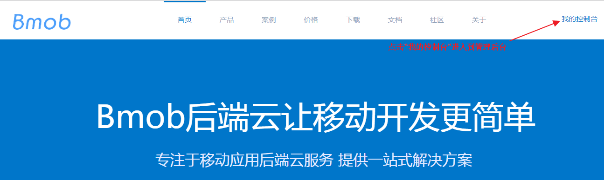

在bmob中，一个用户可以创建多个应用，每个应用拥有其所属的专用数据库，多个应用之间相互独立。

用户需要创建一个应用，先点击管理后台中的“创建应用”按钮，如下图3所示：

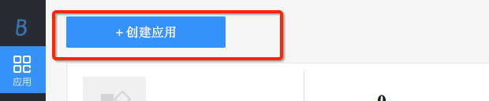

在创建应用的输入框中输入app的名称，点击“创建应用”，就能成功创建应用，如下图4所示：

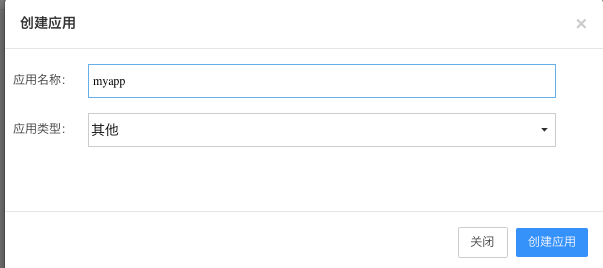

### 数据的基本操作
												
创建应用成功后，开发者在管理后台点击刚才创建的应用，进入到应用的后台界面，其中最常用的是“数据浏览界面”，在该界面提供了便利的图形化操作，让开发者轻松地对该应用所属的数据库进行表的增删，数据的增删改查等操作，如下图5所示：

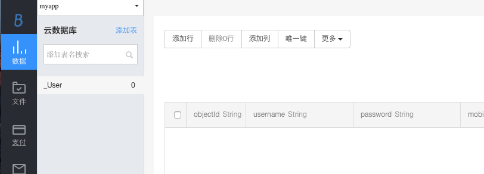

每个应用的数据库都有一个默认的表"_User",其提供了一些常用的字段来记录该应用的用户信息。

开发者需要增加新的表来存储信息时，点击“添加表”按钮，输入表名，就能创建一张新表，如下图6所示：

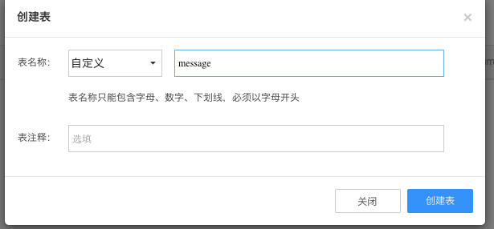

在"添加新的表"界面中,选项“自定义”选项即可创建一张新的普通表，另外两个选项是较高级的功能，在本教程中暂时不需要用到。

在这里，创建了一张名为"message"的表，用于存储订阅者发送到公众号后台的信息。

在表"message"的操作界面中可看到，表"message"有4个默认的字段，其中3个最常用字段的含义如下：


 - objectId：该行的id，objectId的作用和mysql中的经常使用的id类似，用于唯一标示一行。
 - createdAt：改行数据的创建时间。
 - updatedAt：改行数据的最后修改时间。
 
当操作一行数据的时候，以上的3个字段的值由bmob后台自动管理。另外这些字段的名字是保留的，你不能自行设置它们。

由于表"message"是需要把订阅者发到微信公众号的信息存储起来，存储信息的两个属性：谁发送这条信息，信息的内容，所以添加下面所需的字段：

userId：订阅者的id，String类型。
content：发送的内容，String。

通过图8的“添加一列”功能，依次把userId和content这两个字段添加到表"message"中。

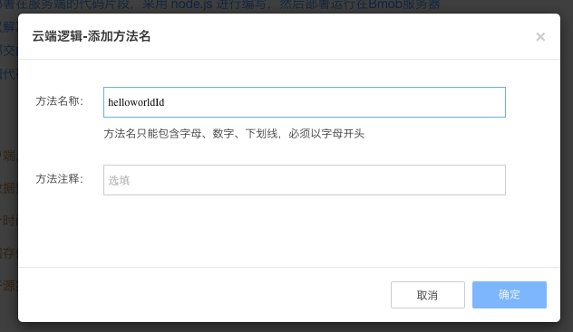

**注意：在用云端逻辑添加数据时，如果发现其所操作的表和所操作的列不存，bmob后台会自动创建。这里为了演示bmob的数据浏览操作，所以才手动创建一次。**

### 云端逻辑

阅读了上面的“数据的基本操作”的内容后，读者可能有个疑问，怎么对表的数据进行增删改查等操作呢？除了可以在"数据浏览"界面可以进行操作外，也可以通过云端逻辑进行数据的增删改查，开发者也可以通过云端逻辑完成更加复杂的业务逻辑。

#### 云端逻辑的基本知识

对于一些复杂的应用，您可能希望增加一些特有的业务逻辑，并能灵活掌控，Bmob 云端逻辑提供了这种灵活性，可以让您的代码直接在 Bmob云上运行, 通过SDK（Android，iOS），restful api或者任何http的方式调用，即可获取结果数据。

云端逻辑的编码采用nodejs语法，简单易用。在云端逻辑的编辑器中，系统默认生成了云端逻辑的入口函数function onRequest(request, response, modules)，你可以根据自己的需求实现业务逻辑代码。 

在云端逻辑界面，创建一个名为"helloworld"的云端逻辑，如下图9所示：

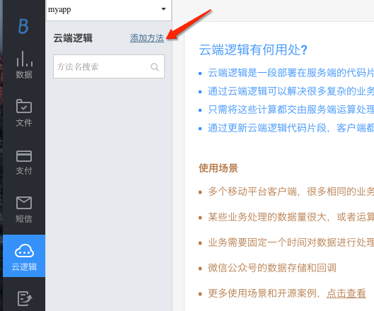

生成云端逻辑后，可看到云端逻辑生成的入口方法，如下图10所示：

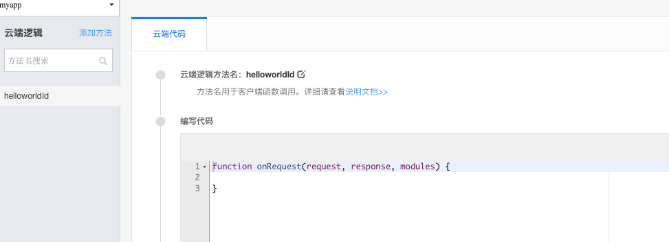

开发者按照云端逻辑的相关语法和提供的模块编写云端逻辑，就能实现各种业务逻辑。

从云端逻辑的入口方法function onRequest(request, response, modules)可知，云端逻辑包含三个模块，分别是request模块、response模块和modules模块。

##### request模块

request模块用于获取传入的参数。由于现在调用云端逻辑有两种方式（get和post），所以获取传入的参数的方式需要使用不同的方法。

当用get请求的方式传入参数，可用如下的方法获取参数的值：
```
request.query.name  //获取传入参数name的值
```

当用post请求的方式传入参数，可用如下的方法获取参数的值：
```
request.body.name  //获取传入参数name的值
```


##### response模块

response为云端逻辑的信息回传模块，该模块包含了一个end方法，实现将云端的执行结果（如查询的数据）返回给SDK或者RestApi等调用端：

```
response.end(string result)
```
##### modules模块

modules是Bmob云端逻辑提供给大家的各种对象处理的模块，包括数据库对象（oData）、文件对象（oFile）、地理位置对象（oLocation）、关联关系对象（oRelation）、原子操作对象（oAtom）、数据批量操作对象（oBatch）、数组对象（oArray）、消息推送对象（oPush）、云端逻辑对象（oFunctions）、邮件发送对象（oMail）、同步对象（oAsync）、HTTP对象（oHttp）、字符编码转换对象（oEncodeing）、事件对象（oEvent）、bql对象（oBql）、html元素解析对象（oHtmlparser）、加密对象（oCrypto）。云端逻辑想要调用这些对象时，只需要用如下的方法即可获取：

```
  //获取数据库对象
  var db = modules.oData;
  //下面进行其他操作
```

#### 用云端逻辑实现"helleworld"

下面用云端逻辑输出一个经典的"helleworld"程序，让开发者对编写云端逻辑有个初步的了解。

输出"helleworld"的云端逻辑如下：
```
function onRequest(request, response, modules) {
    response.end("this is hello world");  //返回字符串"this is hello world"
}                         
```

在"helloworld"的云端逻辑编辑界面上输入上面的代码，按下“保存”按钮就能把编辑完毕的代码保存在云端，如下图11所示：

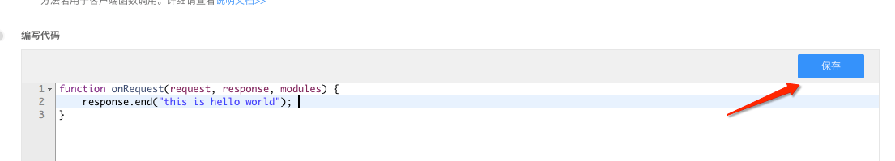

怎么运行上面编辑完毕云端逻辑呢？bmob在每个云端逻辑的编辑界面下方提供了一个方便的调试工具，如下图12所示：

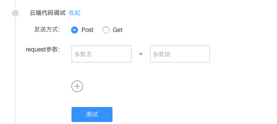


这个工具有下面的功能：

 - 可选择以http "post"或者"get"的方法运行云端逻辑。
 - 选择request的参数和对应值：可添加传入云端逻辑的request的参数和对应值，参数的数目可以通过“再添加一个”按钮调整。

需要运行名称为"helloworld"的云端逻辑，在"helloworld"的云端逻辑编辑界面下点击“发送请求”按钮，就能在调试工具上看到云端逻辑返回的字符串“this is hello world”，如下图13所示：

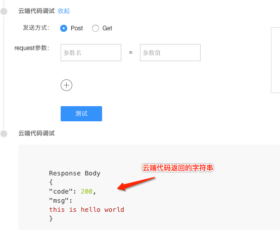

整个云端逻辑的执行流程如图13.1所示：

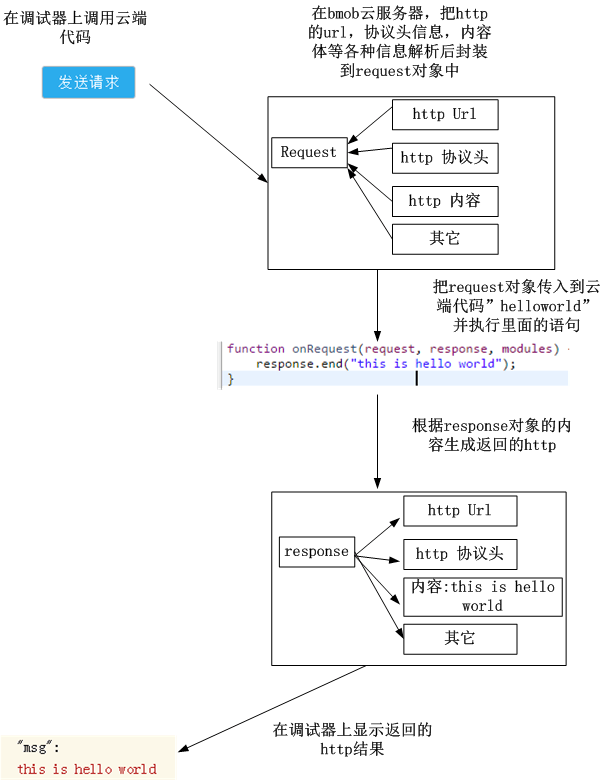

#### 调用云端逻辑的方式

除了使用bmob提供的云端逻辑调式工具外，bmob允许开发者以http的方式直接调用云端逻辑。

### 获取Secret Key
用户需要以http的方式运行云端逻辑，需要先确定应用的Secret Key。 调用云端逻辑时，通过Secret Key标识一个应用，获取Secret Key的路径：
管理后台->应用密钥->Secret Key, 如下图14所示：

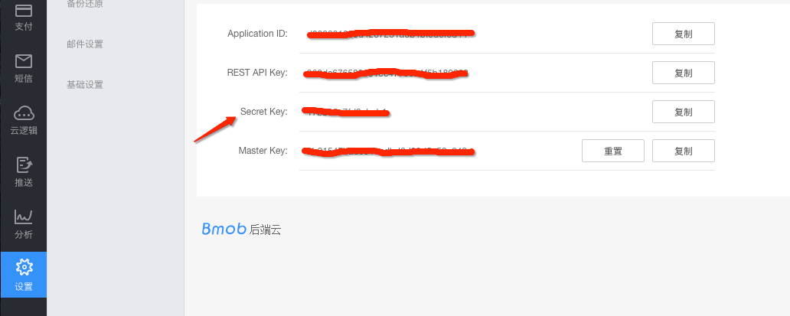

注意：请妥善保管Secret Key，避免Secret Key的泄露！！！

### 以Get的方式调用云端逻辑

下面展示了以Get的方式调用云端逻辑，在浏览器中输入下面的url：

```
http://cloudweixinopen.bmob.cn/a12af19a1b8bf434/helloworld
```

其中：

 - a12af19a1b8bf434：应用的Secret Key。
 - helloworld：云端逻辑的名称

看到云端逻辑的返回结果如下图15所示：

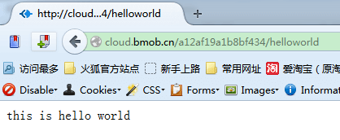


### 以Post的方式调用云端逻辑

下面通过curl工具展示了以Post的方式调用云端逻辑：

```
curl -X POST \
    http://cloudweixinopen.bmob.cn/a12af19a1b8bf434/helloworld
```

其中：

 - a12af19a1b8bf434：应用的Secret Key。
 - helloworld：云端逻辑的名称
 
#### 云端逻辑操作数据库初步入门

bmob提供了数据库对象（oData）用于操作数据。

用云端逻辑往数据表“message”插入一条数据，可用如下的代码

```
function onRequest(request, response, modules) {
    //获取数据库对象
    var db = modules.oData;
    db.insert({
      "table":"message",             //表名
      "data":{"userId":"dsfd2324","content":"插入的第一条信息"}            //需要插入的数据，格式为JSON
    },function(err,data){         //回调函数
        response.end("success");  //运行完毕后返回“success”
    });
}                         
```

点击保存后在云端逻辑调试区按“发送请求”，返回“success”的值，如下图16所示：

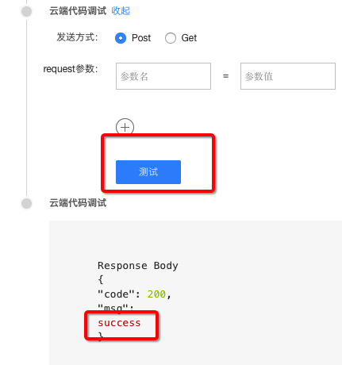

在管理后台->数据浏览->应用表“message”下查看通过云端逻辑新增的数据，如下图17所示：

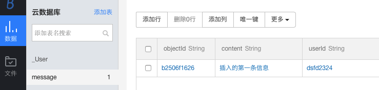


用云端逻辑查询表“message”的所有数据，可用如下的代码：

```
function onRequest(request, response, modules) {
    //获取数据库对象
    var db = modules.oData;
    db.find({
      "table":"message"             //表名
    },function(err,data){         //回调函数
        response.end(data);       //data为返回的数据，格式为json
    });
}                                                 
```


点击保存后在云端逻辑调试区按“发送请求”，返回表“message”的数据，如下图18所示：

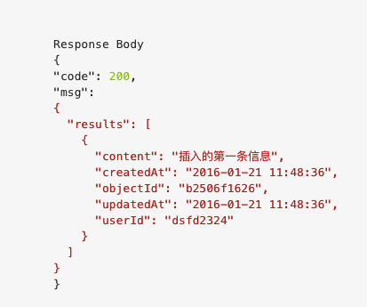

需要了解更多云端逻辑的操作，可阅读[http://docs.bmob.cn/cloudcode/WEB/a_faststart/doc/index.html](http://docs.bmob.cn/cloudcode/WEB/a_faststart/doc/index.html "云端逻辑开发文档")

在编写云端逻辑时有个注意事项：云端逻辑是使用异步编程。也就是说，当遇到文件读写请求，网络请求等IO操作时，代码不等待IO操作返回结果就执行后面的语句,当接收到IO操作的返回结果后才调用回调函数。

当使用php，java等非异步编程语言时，如果需要插入数据后再查找数据，可用类似下面的代码：

```
	db->insert(xxxxx);
	db->find(xxxxx);                                                 
```

在同步型的编程语言中，find和insert都是数据库的操作，有文件读写的IO操作，在db->find执行前，能确保db->insert已经执行完毕了。

在异步编程中，用类似下面的代码才能保证执行完db.insert后才执行：

```
	db.insert({xxx},function(xxx){
		db.find({xxx},function(xxx){xxxx});
	});
	                                         
```

只有通过在db.insert的回调函数中执行db.find，才能保证执行db.find前db.insert的数据库操作已经完成。

举个生活中的例子说明异步编程。在饭馆里，服务员接待客人一般是这样的：

> 服务员指引客人就座，把菜单递给客人，在客人浏览菜单时服务员在旁边一直等待，当客户点菜后，服务员把订单交给厨房后继续干别的事情。

采用异步模式的服务员可以这样接待客人：

> 服务员指引客人就座，把菜单递给客人，在客人浏览菜单时服务员就去干别的事情。当客户决定点菜后，客人把服务员招来，服务员把客人下的订单交给厨房后继续干别的事情。

在服务员接待客人的行为中，通过比较普通的做法和异步的做法，能发现采用异步的方法后服务员的效率大大提高，云端逻辑使用异步也是基于同样的理由，当云端逻辑在等待IO操作（文件读写请求，网络请求）的结果时是一直空闲，如果不等待IO的结果继续执行下面的语句，能大大提高系统的效率。

在云端逻辑异步编程中“function(xxx){xxxx}”部分称为回调函数，云端逻辑会把IO操作的返回结果封装后传入到function函数执行里面的逻辑。

```
	db.insert({xxx},function(xxx){xxxx});                            
```


## 微信公众平台的开发

在本节中，通过bmob云端逻辑开发微信公众平台，实现一个反馈意见收集的功能：
1.把订阅者发送到公众号后台的反馈意见存储在上一节在bmob中创建的表“message”中。
2.订阅者提交反馈意见后，公众号自动给订阅者发送消息，表示消息已收到。

### 创建云端逻辑

创建一个名为"feedback"的云端逻辑用于实现上面的功能，代码如下：

```

function onRequest(request, response, modules) {
    var token = "weixin";         //这里的值必须与在微信公众号后台填入的token值一致
    var crypto = modules.oCrypto; //使用加解密模块
    var httptype = modules.oHttptype;　//获取调用云端逻辑的是post或者get方式
    var xml2js = modules.oXml2js;　//实现xml和js格式之间的相互转换
    var db = modules.oData;         //数据库对象
    if ("get" == httptype) {
        　//是get方法,则是微信验证回调的url是否有效
          var oriStr = [token, request.query.timestamp, request.query.nonce].sort().join('')
          var code = crypto.createHash('sha1').update(oriStr).digest('hex');
          if (code == request.query.signature) {　//验证通过，输出
              response.end(request.query.echostr);
          } else {
              response.end("Unauthorized");
          }
    } else {
           //是post,接收定阅者发送过来的消息后返回，把反馈意见存储表“message”中。
            db.insert({
              "table":"message",             //表名
              "data":{"userId":request.body.xml.FromUserName,"content":request.body.xml.Content}           
            },function(err,data){                        
              //构造公众号后台所需要的xml格式，并返回给公众号后台  
               var result = {
                    xml: {
                      ToUserName: request.body.xml.FromUserName,
                      FromUserName: request.body.xml.ToUserName ,
                      CreateTime: new Date().getTime(),
                      MsgType: 'text',
                      Content: '你好，你发送的反馈内容「' + request.body.xml.Content + '」已收到。'
                    }
                }
                var builder = new xml2js.Builder();
                var xml = builder.buildObject(result); //利用模块xml2js，把json对象转换为一个xml文本
                response.set('Content-Type', 'text/xml'); //设置返回的http header
                response.end(xml);
            });
        
        

    }
}                                                                         
	                                         
```

这个云端逻辑的内容暂时看不懂没关系，下面会逐渐解释其中的含义。


### 启用微信公众号的开发模式

只有启用微信公众号的开发模式后，才能把订阅者发送到微信公众号后台的消息发送到bmob云端逻辑中进行处理。

微信公众平台地址：[https://mp.weixin.qq.com ](https://mp.weixin.qq.com  "https://mp.weixin.qq.com ")

登录微信公众平台后台，在左侧列表中最下方，找到“开发者中心”，点击进入，如图19所示：

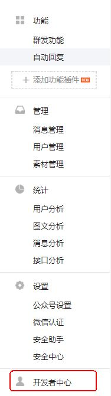


进入服云端逻辑务器配置填写框，如图20所示：

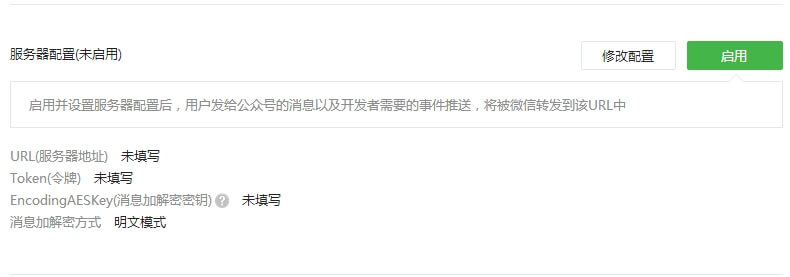

点击“修改配置”按钮，如图21所示：

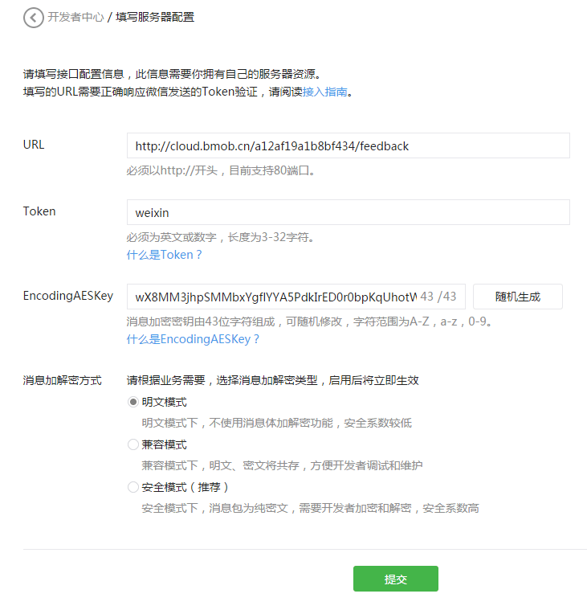

此处的URL（http://cloudweixinopen.bmob.cn/a12af19a1b8bf434/feedback）为上节中生成的云端逻辑“feedback”的调用，按照云端逻辑的调用规格，a12af19a1b8bf434为该应用的Secret Key，标明调用的是哪个应用，feedback为云端逻辑的名称。Token定义为weixin。EncodingAESKey则不用填，点击“随机生成”让自动生成一个，消息加解密方式选择“明文模式”，然后点击“提交”按钮，如图22所示：


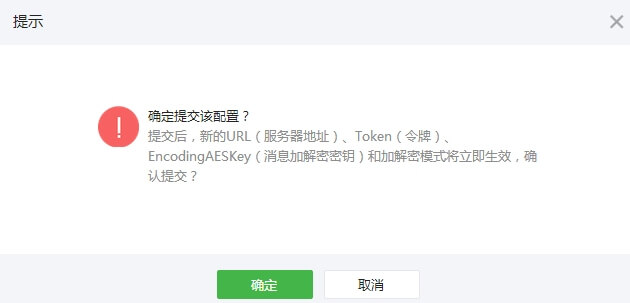


在弹出框中点击确定，如图24所示：

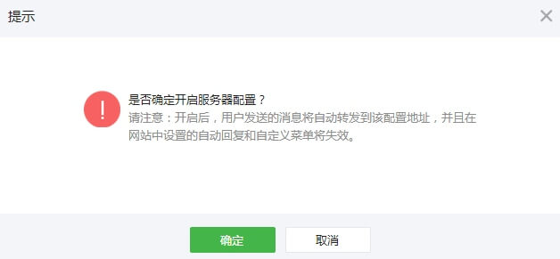

成功启用后如图25所示：

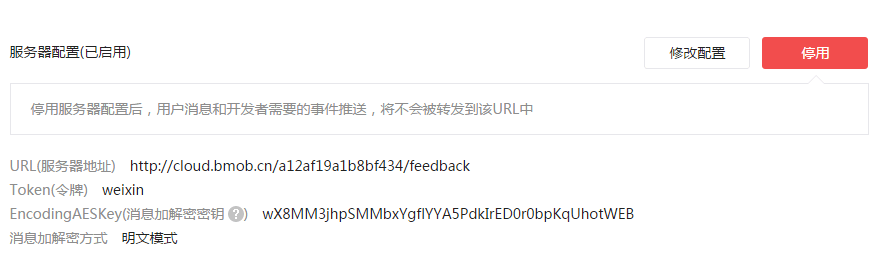

恭喜，你成功启用开发模式。

用户往该公众号发送消息后，用户收到的反馈内容如图27所示：


查看应用的后台，可看到接收的消息已存储在表message中，如图28所示：

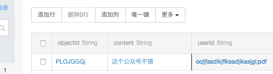

### 数据收发原理及消息数据格式

云端逻辑开发微信公众号有两个重要原理一定要弄明白：

- 变为开发模式时，微信公众号后台往配置的url发送校验请求，这个过程云端逻辑校验信息的原理。
- 云端逻辑收发微信公众号后台传递过来的消息的原理。

#### 变为开发模式时的消息校验原理

在开发者首次提交验证申请时，微信公众号后台将发送GET请求到填写的URL上，并且带上四个参数（signature、timestamp、nonce、echostr），开发者通过对签名（signature）的效验来判断此条消息的真实性。

这4个参数的含义如下：

- signature：微信加密签名，signature结合了开发者填写的token参数和请求中的timestamp参数、nonce参数。
- timestamp：时间戳。
- nonce：随机数
- echostr：随机字符串

此后，每次开发者接收用户消息的时候，微信公众号后台也都会带上前面三个参数（signature、timestamp、nonce）访问开发者设置的URL，开发者依然通过对签名的效验判断此条消息的真实性。效验方式与首次提交验证申请一致。

开发者通过检验signature对请求进行校验（下面有校验方式）。若确认此次GET请求来自微信公众号后台，请原样返回echostr参数内容，则接入生效，成为开发者成功，否则接入失败。

消息校验流程如下：

1. 将token、timestamp、nonce三个参数进行字典序排序。
2. 将三个参数字符串拼接成一个字符串进行sha1加密。
3. 开发者获得加密后的字符串可与signature对比，标识该请求来源于微信。

整个流程如图26所示：

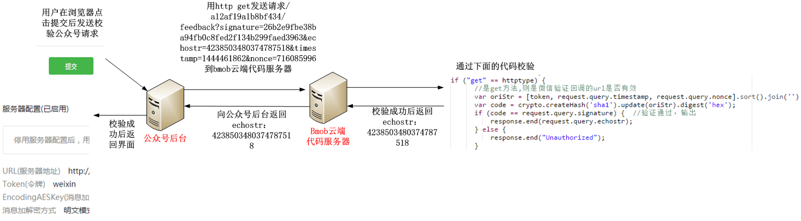

使用的云端逻辑如下：

```
        　//是get方法,则是微信验证回调的url是否有效
          var oriStr = [token, request.query.timestamp, request.query.nonce].sort().join('')
          var code = crypto.createHash('sha1').update(oriStr).digest('hex');
          if (code == request.query.signature) {　//验证通过，输出
              response.end(request.query.echostr);
          } else {
              response.end("Unauthorized");
          }
```

其中token的值是在微信公众号后台填入的token值：“weixin”。

在这个校验流程的云端逻辑中，使用oCrypto这个云端逻辑的加密对象模块，提供md5和sha1两种加密算法。通过这个模块，按照微信校验的流程完成校验。oCrypto更多的功能详细参考：https://www.npmjs.org/package/crypto

另外，云端逻辑使用了oHttptype模块获取当前的http调用方式。因为微信公众平台调用云端逻辑有两种方式：

- get方式，用于检验。
- post方式，用于转发订阅者往公众平台发送的消息。

通过oHttptype模块得知是用采用get方式调用云端逻辑，运行校验的代码并返回echostr参数。

#### 云端逻辑收发微信公众号后台传递过来的消息的原理
在上一节的演示中，订阅者往该公众号发送消息后，返回已收到反馈内容的消息。

这一原理的消息流程如图29所示：

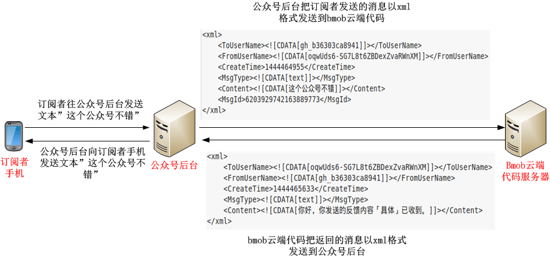

云端逻辑内部通过下面的代码处理用户发送的消息：
```
 		   //是post,接收定阅者发送过来的消息后返回，把反馈意见存储表“message”中。
            db.insert({
              "table":"message",             //表名
              "data":{"userId":request.body.xml.FromUserName,"content":request.body.xml.Content}           
            },function(err,data){         
              //构造公众号后台所需要的xml格式，并返回给公众号后台  
               var result = {
                    xml: {
                      ToUserName: request.body.xml.FromUserName,
                      FromUserName: request.body.xml.ToUserName ,
                      CreateTime: new Date().getTime(),
                      MsgType: 'text',
                      Content: '你好，你发送的反馈内容「' + request.body.xml.Content + '」已收到。'
                    }
                }
                var builder = new xml2js.Builder();
                var xml = builder.buildObject(result); //利用模块xml2js，把json对象转换为一个xml文本
                response.set('Content-Type', 'text/xml'); //设置返回的http header
                response.end(xml);
            });
```


从上图可以看出，用户在发送一个文本后，微信公众号后台将组装一个xml消息发送给云端逻辑服务器。当云端逻辑接收到http头部Content-Type为text/xml的请求后，云端逻辑自动把xml消息转换为一个对象放在request.body.xml中，通过获取request.body.xml对应的属性就能获取xml节点的值。

云端逻辑解析xml对象，根据节点信息，把发送者(request.body.xml.FromUserName)和消息内容（request.body.xml.Content）存储在表“message”后，然后通过一定的规则组装成一个xml文本回复给微信公众号后台，微信公众号后台再回复给用户。在这个收发过程中，发送方和接收方进行了调换(ToUserName和FromUserName值互换)，收发都是以xml格式在后台进行传输的。所以掌握各种消息类型的接收回复是进行微信公众平台开发的基础！

最常见的消息类型为文本的xml格式如下：
	                                         
```
<xml>
<ToUserName><![CDATA[gh_b36303ca8941]]></ToUserName>
<FromUserName><![CDATA[oqwUds6-SG7L8t6ZBDexZvaRWnXM]]></FromUserName>
<CreateTime>1444464955</CreateTime>
<MsgType><![CDATA[text]]></MsgType>
<Content><![CDATA[这个公众号不错]]></Content>
<MsgId>6203929742163889773</MsgId>
</xml>	                                         
```

XML格式讲解：

- ToUserName 消息接收方微信号，一般为公众平台账号微信号
- FromUserName 消息发送方微信号
- CreateTime 消息创建时间
- MsgType 消息类型；文本消息为text
- Content 消息内容
- MsgId 消息ID号

各种类型的消息详解，请查看微信开发文档：[http://mp.weixin.qq.com/wiki/14/89b871b5466b19b3efa4ada8e577d45e.html](http://mp.weixin.qq.com/wiki/14/89b871b5466b19b3efa4ada8e577d45e.html "公众号的各种消息类型")

## 总结

通过本教程，你得到了以下收获：

- 了解bmob应用和云端逻辑的功能。
- 在不需要搭建服务器，不需要懂得基本的运维知识下，使用bmob云端逻辑在30分钟内实现微信公众平台的开发，完了消息存储和消息自动回复这两个功能。

阅读本教程后，想了解云后端服务bmob可以实现哪些更酷的功能吗？点击[http://www.bmob.cn](http://www.bmob.cn "这里")，立刻进入bmob了解更多。


