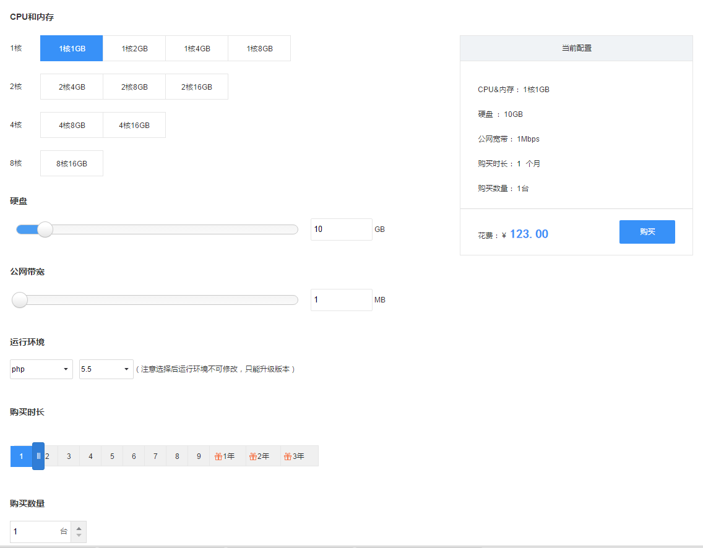
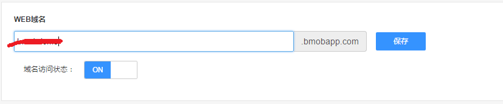
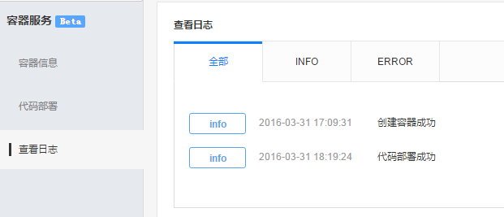
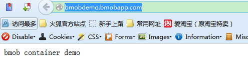

## 简介

您可以把代码部署到Bmob容器上运行。
目前容器支持PHP和Java的语言环境。
你可以将整个网站架设在Bmob容器之上，提供了网站托管服务。

只需要完成下面的两步，你就可以使用bmob的容器服务：

1.购买容器

2.代码部署

## 购买容器

点击“去购买”按钮进入容器购买页面，如下图所示：


在容器配置页面，你可以根据自身业务上的需要选择容器的配置，bmob目前提供如下的容器配置选项：



- CPU
- 内存
- 磁盘空间
- 公网带宽
- 运行环境：目前只支持java和php两种环境
- 购买时长：买满10个月送2个月
- 购买数量：可购买多个容器实例，系统使用负载均衡技术把发送到应用的请求分散到购买的多台主机上容器实例


在支付成功后，由于这时候容器还没启动成功，可看到容器的状态为“正在启动”，如下图：


当容器启动成功后，系统会把页面上的容器状态改为“正常运行”，如下图：


同时用户也可在日志中看到成功的信息，如下图：


接下来还需要用户把自身的代码部署到容器上，才能正常使用容器。


## 代码部署


为了让你的用户能访问你的容器，请你为容器设置一个访问域名，输入域名后点击“保存”按钮，如下图：



bmob采用拉取用户git代码的方式进行代码部署，下面以github上的一个php demo为例描述如何在容器中拉取github的代码。

1. 假设你代码的github地址是https://github.com/newjueqi/containerdemo，把github地址转化为下面的地址形式：

    
```
git clone git@github.com:newjueqi/containerdemo.git 
```

这个github项目的内容如下：


注意：

- 目前只能拉取 git@xxx.xxx:xxx/xxx.git这种形式地址的代码。

- 如果是拉取java代码，开发者请把java代码打包成一个war文件上传到github上，java容器中部署的tomcat会把自动解压war包，开发者部署成功后能以"http://xxx.bmobapp.com/war包名"的方式访问容器中的内容。

填入上面的地址后点击"保存"，在“Github代码地址”下面的“SSH Key”会生成一串sshkey的公钥，如下图所示：


注意：sshkey的公钥每个应用都不一样，请分开使用。

为了使容器系统有权限拉取github上的代码，在github->Settings->SSH keys，复制上图中的sshkey，点击“Add SSH Key”，如下图所示：


出现下面的界面就表示已经成功添加ssh key：


确认你要拉取的代码分支，在github项目页面上查看所拉取的代码分支，如下图所示，拉取的分支为"master"


假设所需要的分支为"master"，把这个分支的名称填入到代码部署页面，再点击“部署”按钮，系统开始拉取代码到容器中，如下图所示：


等待一段时间（这段时间的长久取决于下载github项目代码的时间），看到日志中出现下面的信息就表示代码部署已经成功：




同时查看“代码部署”栏，代码部署成功后出现“生产环境版本号”和“版本日志”，如下图所示：


最后访问域名“http://bmobdemo.bmobapp.com/”，网页输出如下：



index.php的源码如下：

```
<?php
echo "bmob container demo" ;
```

通过分析php文件的源码和输出结果可知部署已经成功。

