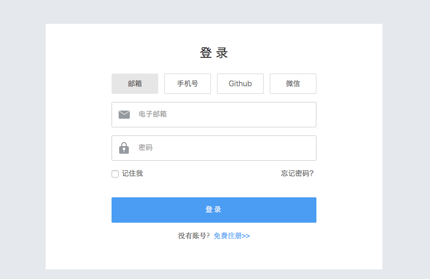

## 注册Bmob帐号

在网址栏输入www.bmob.cn或者在百度输入Bmob进行搜索，打开Bmob官网后，点击右上角的“注册”，在跳转页面填入你的姓名、邮箱、设置密码，确认后到你的邮箱激活Bmob账户，你就可以用Bmob轻松开发应用了。



## 网站后台创建应用

登录账号进入bmob后台后，点击后台界面左上角“创建应用”，在弹出框输入你应用的名称，然后确认，你就拥有了一个等待开发的应用。


## 获取应用密钥和下载SDK

选择你要开发的应用，进入该应用


在跳转页面，进入设置/应用密钥，点击复制，即可得到Application ID


获取Application ID后，下载SDK（下载地址：[https://www.bmob.cn/site/sdk#android_sdk](https://www.bmob.cn/site/sdk#android_sdk)）。


## SDK导入

### AndroidStudio配置

鉴于目前Google官方推荐使用 `Android Studio` 进行Android项目开发，自 `V3.4.2` 开始，Bmob Android SDK 可以使用Gradle来进行包依赖管理，如果你使用Android Studio来进行基于BmobSDK的项目开发，有两种方式：

### 自动导入(推荐)

请按照如下两个步骤进行：

1. 在 `Project` 的 `build.gradle` 文件中添加 `Bmob的maven仓库地址`，示例如下：（**注意文字说明部分**）：

		buildscript {
	    	repositories {
	    	    jcenter()
	    	}
	    	dependencies {
	    	    classpath 	'com.android.tools.build:gradle:1.2.3'
	    	}
		}
	
		allprojects {
	    	repositories {
	    	    jcenter()
				//Bmob的maven仓库地址--必填
	    	    maven { url "https://raw.github.com/bmob/bmob-android-sdk/master" }
	    	}
		}


2.  在`app`的`build.gradle`文件中添加`compile依赖文件`,示例如下：（**注意文字说明部分**）：

		apply plugin: 'com.android.application'
	
		android {
	    	compileSdkVersion 22
	    	buildToolsVersion '22.0.1'
	
			**兼容Android6.0系统所需，如果这句话报错，可在dependencies标签下使用compile 'cn.bmob.android:http-legacy:1.0'**
	    	useLibrary 'org.apache.http.legacy'
	
	    	...
		}
	
	
		dependencies {
	    	compile fileTree(dir: 'libs', include: ['*.jar'])
	
			//以下SDK开发者请根据需要自行选择
			//bmob-sdk：Bmob的android sdk包，包含了Bmob的数据存储、文件等服务，以下是最新的bmob-sdk:
	    	//3.5.5：请务必查看下面注释[1]
			compile 'cn.bmob.android:bmob-sdk:3.5.5'
	
	    	//bmob-push：Bmob的推送包
	    	compile 'cn.bmob.android:bmob-push:0.8'
	
			//bmob-im：Bmob的即时通讯包，注意每个版本的im依赖特定版本的bmob-sdk，具体的依赖关系可查看下面注释[2]
			compile 'cn.bmob.android:bmob-im:2.0.5@aar'
			compile 'cn.bmob.android:bmob-sdk:3.4.7-aar'
	
			//bmob-sms ：Bmob单独为短信服务提供的包
	    	compile 'cn.bmob.android:bmob-sms:1.0.1'
	
			//如果你想应用能够兼容Android6.0，请添加此依赖(org.apache.http.legacy.jar)
			compile 'cn.bmob.android:http-legacy:1.0'
		}


**注：**

**[1]、为了降低开发者的使用成本，自v3.4.7开始，同步提供`aar`格式的文件，此aar包含`libbmob.so、依赖jar包(okhttp、okio、rx、gson等)及自动更新组件所需要的资源文件`**。开发者再也不需要配置libbmob.so,不需要添加依赖jar，也不需要复制自动更新组件的资源文件啦，只需要添加以下依赖即可。

	compile 'cn.bmob.android:bmob-sdk:3.5.0'

注：由于`PermissionManager权限管理类`需要依赖`support-v4:23.2.1`的jar包,导致开发者认为SDK依赖文件较多，故分离出SDK。开发者如果需要兼容Android6.0系统，可以在下载的SDK的官方Demo的`com.example.bmobexample.permission`包下面查看该类源码。

**[2]、每个版本的im依赖特定版本的bmob-sdk：**

- `bmob-im:1.1.8--->bmob-sdk:3.3.5`
- `bmob-im:1.1.9--->bmob-sdk:3.4.3`
- `bmob-im:2.0.1--->bmob-sdk:3.4.6-0304`
- `bmob-im:2.0.2--->bmob-sdk:3.4.6-0304`
- `bmob-im:2.0.3--->bmob-sdk:3.4.6`
- `bmob-im:2.0.4--->bmob-sdk:3.4.6` 
- `bmob-im:2.0.5--->bmob-sdk:3.4.7-aar`
- `bmob-im:2.0.6--->bmob-sdk:3.5.0`

其中

- `bmob-sdk:3.4.6-0304`是Bmob Android SDK的过渡版本，主要用于NewIM_v2.0.1及v2.0.2
- `bmob-sdk:3.4.6`的相关依赖包可见注释[3]

**[3]、bmob-sdk:3.4.6依赖以下包：**
	
	compile 'cn.bmob.android:bmob-sdk:3.4.6'
	compile 'com.squareup.okhttp:okhttp:2.4.0'//CDN文件服务使用okhttp相关包进行文件的上传和下载（必填）
    compile 'com.squareup.okio:okio:1.4.0'

如果需要兼容Android6.0系统，请添加以下两项：

	compile 'com.android.support:support-v4:23.2.1'
	compile 'cn.bmob.android:http-legacy:1.0'

**[4]、bmob-sms适用于只需要使用Bmob短信功能的开发者，而bmob-sdk内部包含了bmob-sms的短信功能,请不要重复添加。**

**[5]、BmobSDK的官方仓库：[bmob-android-sdk](https://github.com/bmob/bmob-android-sdk)，开发者可到此仓库查看最新发布的各版本SDK，我们会尽量与官网发布的SDK保持同步更新。**

#### 手动导入

1. 开发者到[SDK下载中心](https://www.bmob.cn/downloads)下载 `数据服务` 的Android 版本的SDK，并将下载下来的`libs`文件夹里面的文件根据需要复制到工程的libs目录下(注意，自`v3.4.7`开始提供`libbmob.so`文件)； 

2. 在`app`的`buid.gradle`文件中添加SO库目录配置：

		android {
	        sourceSets {
	            main.jniLibs.srcDirs = ['libs']
	       }
		}

3. 点击Sync，同步配置。

### Eclipse导入

开发者到 [SDK下载中心](https://www.bmob.cn/downloads) 下载 `数据服务` 的Android 版本的SDK，在Eclipse工程的项目根目录中新建`libs`文件夹，将下载的jar包添加到此文件夹即可。

**注：**

1、若配置不成功，则需要额外增加以下步骤：

右键工程根目录，选择`Properties -> Java Build Path -> Libraries`，然后点击`Add External JARs...` 选择指向该libs文件夹下的jar的路径，点击OK即可

2、BmobSDK_v3.5.0需要依赖`rxjava（1.1.6）、rxandroid(1.2.0)、gson(2.6.2)、okhttp3（3.3.1）、okio（1.7.0）`及`libbmob.so`库；

3、BmobSDK_v3.4.7需要依赖`okhttp3（3.2.0）、okio（1.7.0）`及`libbmob.so`库；

4、BmobSDK_v3.4.6需要依赖`okhttp（2.4.0）、okio（1.4.0）`，如果需要兼容Android6.0系统，则还需要添加support-v4（23.2.1）及org.apache.http.legacy依赖包。

## 配置AndroidManifest.xml

在你的应用程序的`AndroidManifest.xml`文件中添加相应的权限：

```xml

<!--允许联网 --> 
<uses-permission android:name="android.permission.INTERNET" /> 
<!--获取GSM（2g）、WCDMA（联通3g）等网络状态的信息  --> 
<uses-permission android:name="android.permission.ACCESS_NETWORK_STATE" /> 
<!--获取wifi网络状态的信息 --> 
<uses-permission android:name="android.permission.ACCESS_WIFI_STATE" /> 
<!--保持CPU 运转，屏幕和键盘灯有可能是关闭的,用于文件上传和下载 -->
<uses-permission android:name="android.permission.WAKE_LOCK" /> 
<!--获取sd卡写的权限，用于文件上传和下载-->
<uses-permission android:name="android.permission.WRITE_EXTERNAL_STORAGE" />
<!--允许读取手机状态 用于创建BmobInstallation--> 
<uses-permission android:name="android.permission.READ_PHONE_STATE" />

```
```xml
<?xml version="1.0" encoding="utf-8"?>
    <manifest xmlns:android="http://schemas.android.com/apk/res/android"
    	package="cn.bmob.example"
    	android:versionCode="1"
    	android:versionName="1.0">

    <uses-sdk android:minSdkVersion="8" android:targetSdkVersion="17"/>

	<uses-permission android:name="android.permission.INTERNET" /> 
	<uses-permission android:name="android.permission.ACCESS_NETWORK_STATE" /> 
	<uses-permission android:name="android.permission.ACCESS_WIFI_STATE" /> 
	<uses-permission android:name="android.permission.WAKE_LOCK" /> 
	<uses-permission android:name="android.permission.WRITE_EXTERNAL_STORAGE" />
	<uses-permission android:name="android.permission.READ_PHONE_STATE" />

    <application
        android:allowBackup="true"
        android:icon="@drawable/ic_launcher"
        android:label="@string/app_name"
        android:theme="@style/AppTheme">
        <activity
            android:name="cn.bmob.example.MainActivity"
            android:screenOrientation="portrait"
            android:label="@string/app_name">
            
                <action android:name="android.intent.action.MAIN"/>
                <category android:name="android.intent.category.LAUNCHER"/>
            
        
        <activity
            android:name=".CreateActivity"
            android:screenOrientation="portrait">
        <activity
            android:name=".DeleteActivity"
            android:screenOrientation="portrait">
        <activity
            android:name=".UpdateActivity"
            android:screenOrientation="portrait">
        <activity
            android:name=".FindActivity"
            android:screenOrientation="portrait">
    </application>
</manifest>
```

## 初始化BmobSDK

在你应用程序启动的Activity的onCreate()方法中初始化Bmob功能。代码如下所示：

```java
package com.bmob.example;
import cn.bmob.v3.Bmob;
import android.app.Activity;
import android.os.Bundle;
public class MainActivity extends Activity {
	@Override
	protected void onCreate(Bundle savedInstanceState) {
	     // TODO Auto-generated method stub
	    super.onCreate(savedInstanceState);
	     //提供以下两种方式进行初始化操作：

		//第一：默认初始化
		Bmob.initialize(this, "Your Application ID");
		// 注:自v3.5.2开始，数据sdk内部缝合了统计sdk，开发者无需额外集成，传渠道参数即可，不传默认没开启数据统计功能
		//Bmob.initialize(this, "Your Application ID","bmob");

		//第二：自v3.4.7版本开始,设置BmobConfig,允许设置请求超时时间、文件分片上传时每片的大小、文件的过期时间(单位为秒)，
		//BmobConfig config =new BmobConfig.Builder(this)
		////设置appkey
		//.setApplicationId("Your Application ID")
		////请求超时时间（单位为秒）：默认15s
		//.setConnectTimeout(30)
		////文件分片上传时每片的大小（单位字节），默认512*1024
		//.setUploadBlockSize(1024*1024)
		////文件的过期时间(单位为秒)：默认1800s
		//.setFileExpiration(2500)
		//.build();
		//Bmob.initialize(config);
	}
}
```

## 添加一行数据

首先创建JavaBean（对应为Bmob后台的数据表，更详细的解释请[查看Android开发文档](https://docs.bmob.cn/data/Android/b_developdoc/doc/index.html)）

```java
public class Person extends BmobObject {
	private String name;
	private String address;

	public String getName() {
		return name;
	}
	public void setName(String name) {
		this.name = name;
	}
	public String getAddress() {
		return address;
	}
	public void setAddress(String address) {
		this.address = address;
	}
}
```

添加数据

```java
Person p2 = new Person();
p2.setName("lucky");
p2.setAddress("北京海淀");
p2.save(new SaveListener<String>() {
	@Override
	public void done(String objectId,BmobException e) {
		if(e==null){
			toast("添加数据成功，返回objectId为："+objectId);
		}else{
			toast("创建数据失败：" + e.getMessage());
		}
	}
});
```

如果toast出添加数据成功的消息，你会在Bmob对应Application Id的数据表中看到有一行新增的数据，如下图所示：


## 获取一行数据

```java
//查找Person表里面id为6b6c11c537的数据
BmobQuery<Person> bmobQuery = new BmobQuery<Person>();
bmobQuery.getObject("6b6c11c537", new >QueryListener<Person>() {
	@Override
	public void done(Person object,BmobException e) {
		if(e==null){
			toast("查询成功");
		}else{
			toast("查询失败：" + e.getMessage());
		}
	}
});
```

## 修改一行数据

```java
//更新Person表里面id为6b6c11c537的数据，address内容更新为“北京朝阳”
Person p2 = new Person();
p2.setAddress("北京朝阳");
p2.update("6b6c11c537", new UpdateListener() {
	
	@Override
	public void done(BmobException e) {
		if(e==null){
			toast("更新成功:"+p2.getUpdatedAt());
		}else{
			toast("更新失败：" + e.getMessage());
		}
	}

});
```

## 删除一行数据
```
Person p2 = new Person();
p2.setObjectId("6b6c11c537");
p2.delete(new UpdateListener() {
	
	@Override
	public void done(BmobException e) {
		if(e==null){
			toast("删除成功:"+p2.getUpdatedAt());
		}else{
			toast("删除失败：" + e.getMessage());
		}
	}

});
```

## 源码下载

[快速入门相关源码下载](https://www.bmob.cn/static/Bmob_android_quickstart.zip "快速入门相关源码下载")

案例教程和源码是快速入门的最简单方法，Bmob也为大家准备了相关的[案例教程和源码](https://docs.bmob.cn/data/Android/c_example/doc/index.html)，欢迎大家下载和查看。

为方便大家更好的理解Bmob SDK能够做的事情，我们还特意为大家提供了一些源码，大家可以下载之后，**嵌入Bmob的AppKey**，再打包运行。

**阅读源码是一种良好的习惯！！**

即时聊天案例源码：[https://github.com/bmob/BmobIMSDK4Android](https://github.com/bmob/BmobIMSDK4Android)

图文社区案例源码：[https://git.oschina.net/v7/Wonderful](https://git.oschina.net/v7/Wonderful)  这个案例是猿圈媛圈开发团队提供的。

校园小菜案例源码：[https://github.com/bmob/Shop](https://github.com/bmob/Shop) 这个案例是湖工大的朋友提供的。

社交分享案例源码：[https://github.com/bmob/bmob-android-social-share](https://github.com/bmob/bmob-android-social-share) 这个是金刚锁开发者提供的

第三方登录案例源码：[https://github.com/bmob/bmob-android-demo-thirdpartylogin](https://github.com/bmob/bmob-android-demo-thirdpartylogin)  包含第三方登录和登录后获取用户信息的源码

## 阅读更多的文档

1. 快速入门只是提供了最最基本的介绍，如果你想了解更多的功能，请查看我们的详细开发文档：[https://docs.bmob.cn/data/Android/b_developdoc/doc/index.html](https://docs.bmob.cn/data/Android/b_developdoc/doc/index.html)
2. 如果想看下SDK的类库文档，可以移步[这里](https://docs.bmob.cn/data/Android/i_doc/doc/index.html)


