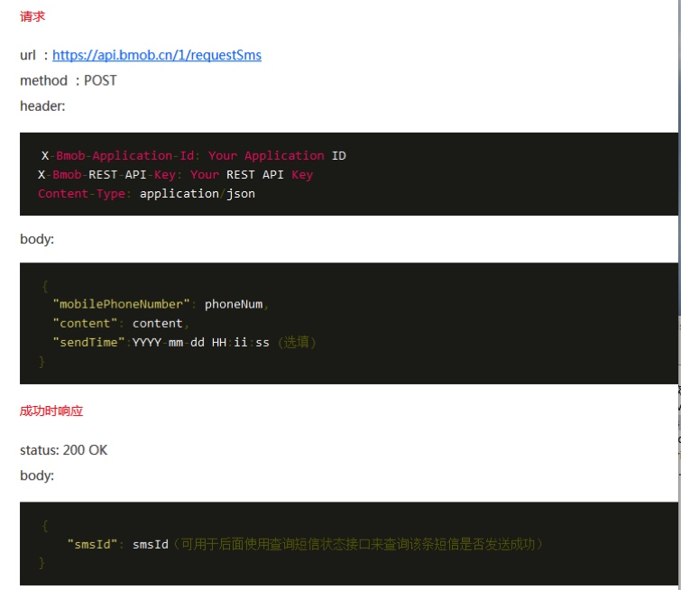
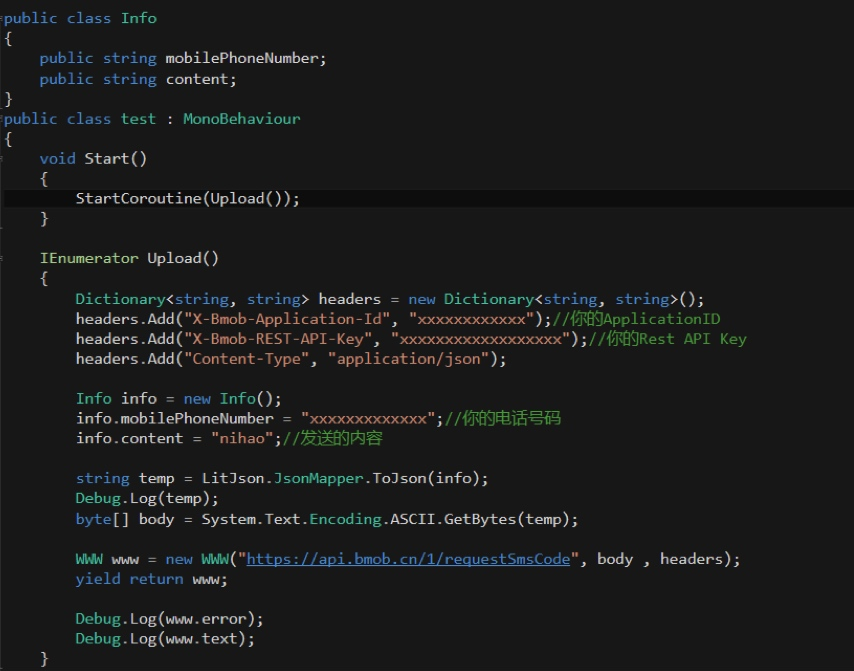

Q:为什么我调用支付应用无论是支付宝还是微信点击都没有反应呢(请教一下unity接支付)
A:目前暂不支持Unity支持

---

Q:unity端 查询表，会出现失败情况
失败原因 Failed to connect to api.bmob.cn port 443: Timed out, and response content is 
UnityEngine.MonoBehaviour:print(Object)
A:提示连接超时，先检查一下网络状况。

---

Q:unity不能缓存用户吗？
A:c#没有进行用户缓存

---

Q:Bmob能存放Unity的AssetBundle么
A:可以使用文件上传来存储～

---

Q:如何通过SDK删除用户表_User的数据
A:可以通过调用restful接口+master key来完成删除用户

---

Q:C#SDK，使用Find功能，我自己封装一层查询的方法，想要获得bool的返回值，应该怎么实现
A:不能返回，只能使用回调，因为Find方法是异步执行的．

---

Q:请问在c#sdk可以使用master key吗？还是说要自己重新写？
A:不可以直接使用的，只有Restful api可以使用master key，你可以使用C#的http请求api来调用restful api

---

Q:Bmob如何实现两张表的关联呢?
比如我需要将User表与Role表进行关联，登录用户后，系统可以通过User的帐号来获取与之相应的Role表里面的信息？
A:可以，用列的pointer或者relation类型，具体用法看文档

---

Q:Unity可以使用短信验证么，为什么找不到API
A:可以使用Unity的网络访问接口，调用restful来使用短信验证～

---

Q:bmob sdk for unity3D 在unity3d5.3 下转il2cpp无法使用
用 unity3D 5.3 打il2cpp 转c++ 后会报错：
Unsupported internal call for IL2CPP:DynamicMethod::create_dynamic_method - System.Reflection.Emit is not supported.
应该c++静态代码是不支持 System.Reflection.Emit 的反射类，能有其他解决方法吗？
A:这个目前还没有好的解决方法，JSON很多操作都用了反射～

---

Q:unity3d bomb sdk 打包到IOS上.请求返回缺少404里面的数据.
A:升级u3d版本至5.3.2f以上。

---

Q:怎么做点赞的用户唯一性
要做点赞，可以用原子计数器，但是无法知道是哪个用户点的赞，而且每个用户只能最多加一个赞，用Array来存用户objectid可以，但是存在多用户同时点赞相互覆盖对方的objectid的情况，请问有什么办法可以解决吗？
A:可以重新建立一张表，两个pointer字段一个指向点赞用户，一个指向被点赞的内容。
 
---

Q:怎样把github上下载的unitysdk注入到unity project里面
A:官网的文档比较老没有同步更新。直接看下案例（接下来把文档整理下）：

https://github.com/bmob/bmob-demo-csharp/tree/master/examples/bmob-unity-demo

libs路径：

https://github.com/bmob/bmob-demo-csharp/tree/master/examples/bmob-unity-demo/Assets/libs

---

Q:untiy 开发怎么集成周围的人功能
untiy 开发怎么集成周围的人功能 可以做这个功能吗 大概怎么个思路 有相关的文档吗？
A:可以采用地理位置来实现，我们有现成的api返回一定范围内的用户记录。

---

Q:C# BmobRelation做粉丝和关注怎么做
A:看RoleTest这个例子,https://github.com/bmob/BmobSharp/blob/master/BmobTest/BmobTask.cs

---

Q:unity5中，最新版的bmob什么地方可以输入Application ID？
A:https://github.com/bmob/bmob-demo-csharp/tree/master/examples/bmob-unity-demo

---

Q:unity下，我如何传递参数到云端代码，然后获取云端运行后的回调呢？
A:

```
云端代码：
function onRequest(request, response, modules) {
var res = {"value": "just string..."} ;
response.end(JSON.stringify(res));
} 

C#调用代码：

[TestMethod()]
public void EndpointParamAndStringTest()
{
var p = new Dictionary<String, Object>();

var future = Bmob.EndpointTaskAsync<Object>("testString", p);
FinishedCallback(future.Result, null);
}

```

---

Q:bmob查询时记录返回值的表必须是自己新建的表吗？c#里不能用datatable吗？
A:返回值都是你创建的表，不一定是新的。这样C#才能映射到对应的object中去，让你对象化调用。

---

Q:bmob使用指定列查询时会多出几种数据,分别是_type,，createdAt等。
A:是的，这些是默认的系统列，一定要有的。

---

Q:
1.unity里面必须使用BmobUnity Bmob = gameObject.GetComponent<BmobUnity>();
来获取bmob对象吗 ？能不能 用C#DLL里面的 new方法呢？因为BmobUnity继承了mono所以不能new这个很麻烦，毕竟数据操作是模型层干的事情
2.在查找数据的时候，Main.Bmob.Find方法不在主线程 ，也没有回调，导致后面的代码在结果出来之前优先执行了。
3.以上两面我看c#的SDK完美解决了，可惜unity里面不能用c#的bmob.dll

A:
1.不能用new的方式，bmob异步请求用了MonoBehaviour#StartCoroutine
2.没有回调？？自己先查看下API。
3.Unity和C#不同的，Unity是一个封装的版本，需要兼容各个平台的东西。


---

Q:c# sdk 只可以用Unity开发吗？visual c#可以用这SDK么？
A:C# SDK可以用来开发Unity、visual c#，wp8这几类的程序。

---

Q:unity中调用restapi方法分享
A:





