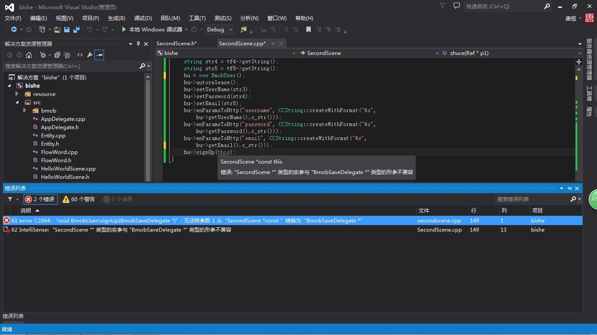

Q:BmobQuery查询 怎么查看返回的data？
A:CCLOG("%s",(const char*)data);或者是BmobLog::bmob_log()

---

Q:要添加头文件？

A:不是添加文件的问题，是你的SecondScene没有实现BmobSaveDelegate接口，你实现BmobSaveDelegate接口就好了．

---

Q:bmob中的cocos2d-x怎么不提供静态和动态库！而且里面还存在多种编码格式！请提供一下bmob coocs2d-x的动态库和静态库。或告知相信解决办法。
A:目前暂不提供。

---
 

