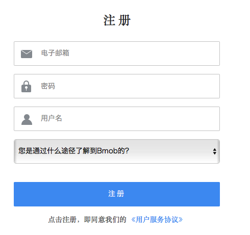
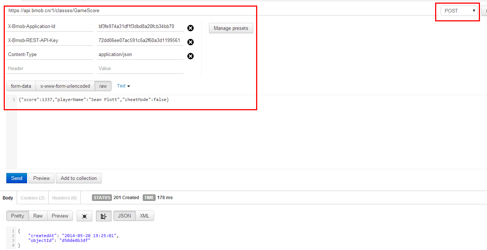

## 注册Bmob帐号
在网址栏输入www.bmob.cn或者在百度输入Bmob搜索，打开[Bmob官网](http://www.bmob.cn/ "Bmob移动后端云服务平台")后，点击右上角的“注册”，在跳转页面填入你的姓名、邮箱、设置密码，确认后到你的邮箱激活[Bmob](http://www.bmob.cn/ "Bmob移动后端云服务平台")账户，你就可以用Bmob轻松开发应用了。

## 网站后台创建应用

登录账号进入bmob后台后，点击后台界面左上角“创建应用“，在弹出框输入你应用的名称后确认，你就拥有了一个等待开发的应用。


## 获取应用密钥

选择你要开发的应用，进入该应用


在跳转页面，进入设置/应用密钥，点击复制，即可得到Application ID以及REST API Key


获取Application ID和REST API Key后，这两个Key将在后面用于REST API请求中作为HTTP头部的X-Bmob-Application-Id 和
X-Bmob-REST-API-Key的值传到接口。


## 添加一行数据
```
curl -X POST \
    -H "X-Bmob-Application-Id: Your Application ID" \
    -H "X-Bmob-REST-API-Key: Your REST API Key" \
    -H "Content-Type: application/json" \
    -d '{"score":1337,"playerName":"Sean Plott","cheatMode":false}' \
    https://api.bmob.cn/1/classes/GameScore
```

### RestAPI调试工具

这里给大家介绍一个简单的工具chrome浏览器的插件[postman](https://chrome.google.com/webstore/detail/postman-rest-client/fdmmgilgnpjigdojojpjoooidkmcomcm?utm_source=chrome-ntp-icon "Postman")，方便调试Restful。操作界面如下所示：



**注意：建议大家用postman插件或者在linux系统环境下调试，curl在windows环境下请求存在数据格式转换的问题。**


## 获取一行数据
查找GameScore表里面id为e1kXT22L的数据
```
curl -X GET \
    -H "X-Bmob-Application-Id: Your Application ID" \
    -H "X-Bmob-REST-API-Key: Your REST API Key" \
    https://api.bmob.cn/1/classes/GameScore/e1kXT22L

```

## 修改一行数据
更新GameScore表里面id为e1kXT22L的数据，score内容更新为73453
```
curl -X PUT \
    -H "X-Bmob-Application-Id: Your Application ID" \
    -H "X-Bmob-REST-API-Key: Your REST API Key" \
    -H "Content-Type: application/json" \
    -d '{"score":73453}' \
    https://api.bmob.cn/1/classes/GameScore/e1kXT22L
```

## 删除一行数据
```
curl -X DELETE \
    -H "X-Bmob-Application-Id: Your Application ID" \
    -H "X-Bmob-REST-API-Key: Your REST API Key" \
    https://api.bmob.cn/1/classes/GameScore/e1kXT22L
```


