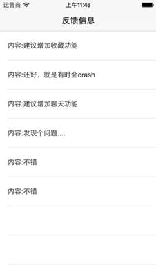

## 失物招领案例教程

### 需求描述

为演示Bmob提供的云数据库的功能，本文制作了一个失物招领的简单案例，实现物品的发布和呈现，展示如何使用Bmob快速开发一个有后端数据库的应用软件。使用场景如下：用户捡到物品，打开手机软件，填写物品的招领信息（标题、描述和联系方式）；用户丢失物品，打开手机软件，填写物品的丢失信息（标题、描述和联系方式）；任何人都可以查看到失物和招领的信息列表。

**说明一点的是，因为是演示案例，所以信息的添加并没有进行用户身份验证。**

本案例将使用到Bmob的如下功能：

1、	添加数据
添加失物/招领信息到服务器中。

2、	查找数据

在列表中显示所有用户发布的失物/招领信息。

本案例最终实现的部分界面效果如下：

 

失物招领软件闪图

 

 招领列表页
 
 

 添加失物信息

### 数据结构设计

本案例的数据结构非常简单，只需要设计两个表，一个是失物表（Lost表），一个是招领表（Found表），对应的数据结构如下（省略对常用默认字段objectId、createAt、updateAt的描述，对于还不知道怎么创建应用和添加数据表的开发朋友请先移步[快速入门指南](http://docs.bmob.cn/data/iOS/a_faststart/doc/index.html "快速入门指南")查看相关教程）：


<table>
	<tr>
        <td colspan=3 align=center>失物表（Lost）</td>
    </tr>
    <tr>
        <td>字段名</td><td>类型</td><td>描述</td>
    </tr>
	<tr>
        <td>describe</td><td>String</td><td>失物的描述信息</td>
    </tr>
	<tr>
        <td>phone</td><td>String</td><td>联系的手机号码</td>
    </tr>
	<tr>
        <td>title</td><td>String</td><td>失物的标题信息</td>
    </tr>
</table>

> 

<table>
	<tr>
        <td colspan=3 align=center>招领表（Found）</td>
    </tr>
    <tr>
        <td>字段名</td><td>类型</td><td>描述</td>
    </tr>
	<tr>
        <td>describe</td><td>String</td><td>招领的描述信息</td>
    </tr>
	<tr>
        <td>phone</td><td>String</td><td>联系的手机号码</td>
    </tr>
	<tr>
        <td>title</td><td>String</td><td>招领的标题信息</td>
    </tr>
</table>

### 初始化SDK

Bmob为每个应用都提供了一个唯一标识（对应为开发者后台应用中的“应用密钥->Application ID”），使用Bmob开发的应用都要首先使用这个Application ID”进行初始化。对应代码如下（详细代码实现参看main.m文件）：

```java
int main(int argc, char * argv[])
{
    
    @autoreleasepool {
        //registerWithAppKey需要使用Application ID进行初始化
        [Bmob registerWithAppKey:@"e9bbe5f23a1aa1d60d525871e1d7db99"];
        return UIApplicationMain(argc, argv, nil, NSStringFromClass([AppDelegate class]));
    }
}
```

### 添加失物及招领信息

用户填写了失物信息之后，只需要构造一个BmobObject实例，然后简单调用setObject方法就可以将信息添加到云数据库中，实现代码如下（详细代码实现参看AddViewController.m文件）：

```java
		//创建BmobObject对象，指定对应要操作的数据表名称
		BmobObject *obj = [[BmobObject alloc] initWithClassName:className];
        //设置字段值
        [obj setObject:titleTextField.text forKey:@"title"];
        [obj setObject:phoneTextField.text forKey:@"phone"];
        [obj setObject:desTextField.text forKey:@"describe"];
        //执行保存操作
        [obj saveInBackgroundWithResultBlock:^(BOOL isSuccessful, NSError *error) {
           
            if (!error) {
                //其他代码
            }
            
        }];
```

### 获取失物及招领列表

Bmob提供了复杂和简单的查询方法，可以对查询结果进行排序，可以对结果进行缓存。本案例只使用到Bmob提供的最简单的查询和排序功能，直接调用BmobQuery类的findObjects方法和orderByDescending方法来获取失物列表，实现代码如下（详细代码实现参看MainActivity类）：

```java
    //创建BmobQuery实例，指定对应要操作的数据表名称
	BmobQuery *query = [BmobQuery queryWithClassName:className];
	//按updatedAt进行降序排列
    [query orderByDescending:@"updatedAt"];
	//返回最多20个结果
    query.limit = 20;
	//执行查询
    [query findObjectsInBackgroundWithBlock:^(NSArray *array, NSError *error) {
        //处理查询结果
        for (BmobObject *obj in array) {
            News *info    = [[News alloc] init];
            if ([obj objectForKey:@"title"]) {
                info.title    = [obj objectForKey:@"title"];
            }
            if ([obj objectForKey:@"describe"]) {
                info.content  = [obj objectForKey:@"describe"];
            }
            if ([obj objectForKey:@"phone"]) {
                info.phoneNum = [obj objectForKey:@"phone"];
            }
            info.time     = [_dateFormatter stringFromDate:obj.updatedAt];
            [_infoMutableArray addObject:info];
        }
        
        [_tableView reloadData];
    }];
```


### 后记

本案例只是演示如何用Bmob进行快速的数据添加和查询，在真实的应用环境下，你还可能还需要使用到用户系统、文件服务、更复杂的数据结构和服务，这些都可以使用Bmob就可以实现。如果想要获取更多的信息，请各位查看Bmob的[开发文档](http://docs.bmob.cn/data/iOS/b_developdoc/doc/index.html "开发文档")或者联系技术客服。欢迎砸砖，欢迎提出更多的意见和建议帮助Bmob更好的发展。谢谢～

### 案例下载
[失物招领案例下载](https://github.com/bmob/bmob-app-demo-show/blob/master/download/Bmob_Sample_lost_found_ios.zip "失物招领案例下载")


## 推送案例教程

### 推送案例需求描述
用户反馈是移动开发中最常见的功能，可以用来收集我们的用户对软件的意见和建议。通常在开发用户反馈功能时，我们都会将用户反馈的信息保存到服务器中，定期登录后台管理系统查看，这样很难做到实时查看用户反馈信息。本文结合Bmob推送服务和数据存储服务开发用户反馈功能，实现用户提交反馈信息保存在Bmob云数据库的同时，也将用户的反馈信息推送到运营/研发人员的设备中。

本案例将使用到Bmob的如下功能：

1、	推送服务

将用户的反馈信息实时推送到订阅了接收反馈信息的设备中，实现端到端的消息传递。

2、	数据存储服务

添加和查看反馈信息，使用到了添加、查询和按时间排序的功能。

本案例最终实现的界面效果如下：

 

发送反馈截图

 

 查看反馈意见截图

### 推送案例数据结构设计
在Bmob开发者后台创建一个应用（还不知道怎么创建应用和添加数据表的开发朋友请先移步快速入门指南查看相关教程），添加两个表，分别是Feedback（用户反馈信息表，存储用户提交的反馈信息）和Installation（设备安装表，存储需要接收推送信息的设备信息）。以下是对这两个表的数据结构的详细描述（省略对常用默认字段objectId、createAt、updateAt的描述）

<table>
	<tr>
        <td colspan=3 align=center>Feedback表</td>
    </tr>
    <tr>
        <td>字段名</td><td>类型</td><td>描述</td>
    </tr>
	<tr>
        <td>Contact</td><td>String</td><td>用户的联系方式</td>
    </tr>
	<tr>
        <td>deviceType</td><td>String</td><td>系统字段，是一个必须的字段, 必须被设置为 "ios" 或者 "android", 而且自这个对象生成以后就不能变化</td>
    </tr>
    <tr>
        <td>content</td><td>String</td><td>反馈内容</td>
    </tr>
</table>

<table>
	<tr>
        <td colspan=3 align=center>Installation表</td>
    </tr>
	<tr>
        <td>字段名</td><td>类型</td><td>描述</td>
    </tr>
	<tr>
        <td>installationId</td><td>String</td><td>系统字段，是一个Bmob生成的字符串标志, 而且如果 deviceType 是 android 的话是一个必填字段, 如果是 ios 的话则可选. 它只要对象被生成了就不能发生改变, 而且对一个 app 来说是不可重复的</td>
    </tr>
	<tr>
        <td>deviceToken</td><td>String</td><td>系统字段，是一个 Apple 生成的字符串标志, 在 deviceType 为 ios 上的设备是必须的, 而且自对象生成开始就不能改动, 对于一个 app 来说也是不可重复的</td>
    </tr>
	<tr>
        <td>badge</td><td>Number</td><td>系统字段，表示iOS 设备最新已知的应用badge</td>
    </tr>
	<tr>
        <td>timeZone</td><td>String</td><td>系统字段，表示安装的这个设备的系统时区</td>
    </tr>
	<tr>
        <td>channels</td><td>Array</td><td>系统字段，表示这个安装对象的订阅频道列表</td>
    </tr>
	<tr>
        <td>appIdentifiter</td><td>String</td><td>iOS应用的Bundle identifier</td>
    </tr>
	<tr>
        <td>isDeveloper</td><td>Boolean</td><td>是否是开发者（是的话则用于接收推送信息）</td>
    </tr>
</table>

###  推送案例安装和初始化

还不知道怎么安装使用Bmob数据存储Sdk的开发朋友请先移步快速入门指南查看相关教程。

推送服务的SDK初始化和Bmob数据存储SDK一样，只需要在main.m调用registerWithAppKey方法即可：

```java
int main(int argc, char * argv[])
{

    //可更换为您的应用的key
    [Bmob registerWithAppKey:@"3124f50157a5df138aba77a85e1d8909"];
    
    @autoreleasepool {
        return UIApplicationMain(argc, argv, nil, NSStringFromClass([AppDelegate class]));
    }
}
```
### 发送反馈功能的开发

这里要实现的是当用户点击“发送”反馈按钮之后，先把用户的反馈信息上传到Bmob云数据库中，然后发送一条推送信息到Installation表中isDeveloper为true的设备中去。

为实现将数据保存到云数据库的功能，你需要先创建BmobObject对象，该对象通过initWithClassName方法与云端数据库的Feedback表对应起来，然后通过setObject方法设置数据对象。实现代码如下：

```java
BmobObject *feedbackObj = [[BmobObject alloc] initWithClassName:@"Feedback"];

//联系方式
[feedbackObj setObject:contactTextfield.text forKey:@"contact"];

//反馈内容
    [feedbackObj setObject:ncTextView.text forKey:@"content"];
```

接着，你就可以直接调用BmobObject对象的saveInBackgroundWithResultBlock方法，将数据插入到云数据库中了。实现代码如下：

```java
//保存反馈信息到Bmob云数据库中
[feedbackObj saveInBackgroundWithResultBlock:^(BOOL isSuccessful, NSError *error) {
if (isSuccessful) {
  		NSLog(@”保存成功”);
 	}else{
NSLog(@”保存失败”);
}
}];
```

保存成功之后，你可以推送一条信息到BmobInstallation安装表中isDeveloper字段值为true的设备中。实现代码如下：


```java
/**
 * 推送反馈信息给isDeveloper的设备
 * @param message 反馈信息
 */

-(void)sendPush:(NSString*) message {
    //发送推送
    BmobPush *push = [BmobPush push];
    BmobQuery *query = [BmobInstallation query];
    //条件为isDeveloper是true
    [query whereKey:@"isDeveloper" equalTo:[NSNumber numberWithBool:YES] ];
    [push setQuery:query];
    //推送内容为反馈的内容
    [push setMessage: message];
    [push sendPushInBackgroundWithBlock:^(BOOL isSuccessful, NSError *error) {
        NSLog(@"push error =====>%@",[error description]);
    }];
}
```

### 查看反馈功能的开发

为了接收用户端推送过来的反馈信息，需要在AppDelegate类中注册通知功能（application类registerForRemoteNotificationTypes方法）、设置推送消息到达之后的处理方法（BmobPush类handlePush方法），当然了，还需要将接收推送信息的当前机器信息添加到云端数据库中的设备安装表中（BmobInstallation）。实现代码如下：

```java
- (BOOL)application:(UIApplication *)application didFinishLaunchingWithOptions:(NSDictionary *)launchOptions
{
	//注册通知功能
[application registerForRemoteNotificationTypes:UIRemoteNotificationTypeAlert|
UIRemoteNotificationTypeBadge|
UIRemoteNotificationTypeSound];
    ……
    return YES;
}

//接收推送信息的处理服务
-(void)application:(UIApplication *)application didReceiveRemoteNotification:(NSDictionary *)userInfo{
    NSLog(@"userInfo %@",[userInfo description]);
    [BmobPush handlePush:userInfo];
}

//往云端数据库中的设备表注册信息
-(void)application:(UIApplication *)application didRegisterForRemoteNotificationsWithDeviceToken:(NSData *)deviceToken{
    BmobInstallation    *installation = [BmobInstallation currentInstallation];
    [installation setDeviceTokenFromData:deviceToken];
    //设置isDeveloper为true
    [installation setObject:[NSNumber numberWithBool:YES] forKey:@"isDeveloper"];
    [installation saveInBackground];
}
```

查看反馈列表的功能实现很简单，只需要调用BmobQuery的findObjectsInBackgroundWithBlock方法就可以了，实现代码如下：

```java
//创建BmobQuery查询对象，对应查询云端数据库中的Feedback表
BmobQuery *query = [BmobQuery queryWithClassName:@"Feedback"];
//按updatedAt降序排列
[query orderByDescending:@"updatedAt"];
[query findObjectsInBackgroundWithBlock:^(NSArray *array, NSError *error) {
        //处理查询结果
        for (BmobObject *obj in array) {
            NSMutableDictionary *dic = [NSMutableDictionary dictionary];
            [dic setObject:[obj objectForKey:@"content"] forKey:@"content"];
            [dic setObject:[obj objectForKey:@"contact"] forKey:@"contact"];
            [dic setObject:obj.createdAt forKey:@"time"];
            [_feedbacksArray addObject:dic];
            [_feedbackTableView reloadData];
        }
 }];
```


### 推送案例后记
当然了，实际使用过程的反馈功能可能并没有那么简单，或许你需要实现能够直接跟用户对话的反馈功能，或许你想要实现智能化的机器回答，这些都可以使用Bmob移动云服务平台进行快速设计和开发的。欢迎各位砸砖，欢迎提出更多的意见和建议帮助Bmob更好的发展。谢谢～

### 推送案例下载
[反馈案例下载](https://github.com/bmob/bmob-ios-demo "反馈案例下载")

## 其他案例

快速入门相关源码:[https://github.com/bmob/bmob-ios-demo](https://github.com/bmob/bmob-ios-demo)

数据关联章节Demo下载:[https://github.com/bmob/bmob-ios-demo/tree/master/BmobSDK/BmobRelationDemo](https://github.com/bmob/bmob-ios-demo/tree/master/BmobSDK/BmobRelationDemo)

第三方登录Demo:[https://github.com/bmob/bmob-ios-demo](https://github.com/bmob/bmob-ios-demo)

文件管理Demo:[https://github.com/bmob/bmob-ios-demo/tree/master/BmobSDK/BmobFileDemo](https://github.com/bmob/bmob-ios-demo/tree/master/BmobSDK/BmobFileDemo)

数据实时更新Demo:[https://github.com/bmob/bmob-ios-demo/blob/master/BmobDataDemo_iOS.zip](https://github.com/bmob/bmob-ios-demo/blob/master/BmobDataDemo_iOS.zip)

BmobIMSDK源代码：[https://github.com/bmob/bmob-iOS-im-sdk](https://github.com/bmob/bmob-iOS-im-sdk)

Swift使用BmobSDK案例源码:[https://github.com/bmob/bmob-app-demo-show/blob/master/download/BmobSwift.zip](https://github.com/bmob/bmob-app-demo-show/blob/master/download/BmobSwift.zip)

踢球吧源码[https://github.com/bmob/BmobTiQiuBa](https://github.com/bmob/BmobTiQiuBa)

mexiQQ开发者实现的iOS实践案例[https://github.com/bmob/VReader-iOS](https://github.com/bmob/VReader-iOS)

iOS云端逻辑案例:[https://github.com/bmob/bmob-ios-demo/blob/master/CloudFunction.zip](https://github.com/bmob/bmob-ios-demo/blob/master/CloudFunction.zip)

iOS BmobSDK API使用案例:[https://github.com/bmob/bmob-ios-demo/blob/master/BmobStorageDemo.zip](https://github.com/bmob/bmob-ios-demo/blob/master/BmobStorageDemo.zip)


