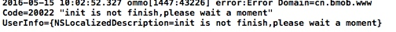

## 对象

Q:查询表内容时不能获取到objectId的值
通过[obj objectForKey:@"objectId"]获取到的是空值，其他字段是正常的
A:BmobObject有一些基本属性，objectId，createdAt，updatedAt等，直接获取就可以了,如bmobObject.objectId。

---

Q:查询时可以设置只从本地缓存获取，但是创建和保存时是否能够只保存到本地缓存呢？
A:只有查询有缓存，其它操作没有缓存。

---

Q:iOS 怎么获取到创建日期啊
A:NSLog(@"%@",[NSString stringWithFormat:@"%@", Myobject.createdAt]);

---

Q:bmob 怎样用代码写唯一键 
A:唯一键只能在控制台设置

---
Q:我的bmob对象中有一个属性是boolean属性，请问在ios代码中怎么设置它？
A:BOOL cheatMode = [[object objectForKey:@"cheatMode"] boolValue];
isStudent = [NSNumber numberWithBool:NO];
用以上的方法来设置。

---

Q:ios开发初始化一个对象指定一个id但是保存成功之后却不再是这个id了
A:objectId系统生成的，并不是你来生成的，你用的下面这个方法，是用来构造已经存在的对象，然后对该对象进行更新删除操作的。
```
BmobObject *gameScore = [BmobObject objectWithoutDatatWithClassName:@"GameScore" objectId:@"a"]；
```

---

Q:原子计数器怎么用
A:查看[http://docs.bmob.cn/data/iOS/b_developdoc/doc/index.html#对象](http://docs.bmob.cn/data/iOS/b_developdoc/doc/index.html#对象)原子计算器小节。

---

Q:在iOS中 在代码中如何创建一个空表 只包含各列的属性 而不创建具体的一条数据。
A:该需求无法可以通过在web控制台添加列来实现。

---

Q:如何删除表中所有的数据？(只知道表名的情况下)
A:先查询该表所以数据，获得数据后遍历删除～

--- 

Q:可不可以批量创建数据
A:可以,[批量数据操作](http://docs.bmob.cn/data/iOS/b_developdoc/doc/index.html#批量数据操作)

---

Q:如何存储比较复杂的数据类型？比如数组里包含字典，字典里再包含数据
A:一般的数据类型使用使用JSON格式都可以存储的，可以多了解一下JSON格式

---

Q:'Invalid type in JSON write (CLPlacemark)' CLPlacemark类型熟悉无法写入
A:对象类型属性是无法写入的

---

## 查询

Q:iOS端集成 查询单条数据，只知道某个value的具体值，如何查询相应的该条数据的其他值？
A:使用多条查询并加上你的约束条件就可以了

---

Q:iOS 查询条件是boolean 应该怎样设置？
A:类似于以下形式
```
[bquery whereKey:@"playerName" notEqualTo:[NSNumber numberWithBool:NO]];
```

---

Q:我想让模糊查询的条件key为所关联的_User表中的username 怎么弄
A:你好，文档中有关于模糊查询的介绍[查询](http://docs.bmob.cn/data/iOS/b_developdoc/doc/index.html#查询)

---

Q:BmobQuery查询多条数据时，查询结果无法传出
A:查询是异步的，可以采用通知机制来传递返回的数据，或者是把操作逻辑放在block里

---

Q:user表查询返回的没有自定义列的数据，只有username自带属性
A:注意使用objectForKey来读取数据，而不是valueForKey。

---

Q:iOS 如何判断表内存在某列存在某项值 然后作为类方法返回值返回呢？
A:查看以下文档中的“列值是否存在”小节[http://docs.bmob.cn/data/iOS/b_developdoc/doc/index.html#查询](http://docs.bmob.cn/data/iOS/b_developdoc/doc/index.html#查询)

---
Q:支持一次可以查找多张结构类似的表吗
A:不支持

---

## 数组

Q:IOS 如何 查询 数组
A:

```
BmobQuery   *bquery = [BmobQuery queryWithClassName:@"GameScore"];
//查找GameScore表所有数据
[bquery findObjectsInBackgroundWithBlock:^(NSArray *array, NSError *error) {
    for (BmobObject *obj in array) {
        //打印array
        NSLog(@"obj.array = %@", [obj objectForKey:@"array"]);
}
}];
```

---

Q:删除array数据类型的一个元素
A:[删除数组元素](http://docs.bmob.cn/data/iOS/b_developdoc/doc/index.html#数组)

---

## 数据关联


Q:怎么获取relation中的数据? 

A:假设你有一个帖子(Post)类和一个系统默认的用户(User)类, 而每一个帖子(Post)都可以被不同的用户(User)所喜欢。 如果帖子(Post)类下面有一个Key名为likes，且是 Relation 类型, 存储了喜欢这个帖子(Post)的用户(User)。那么你可以找到喜欢过同一个指定的帖子(Post)的所有用户：

	BmobQuery *bquery = [BmobQuery queryForUser];
	[bquery orderByDescending:@"updatedAt"];
	BmobObject *obj = [BmobObject objectWithoutDatatWithClassName:@"Post" objectId:@"a1419df47a"];
	[bquery whereObjectKey:@"likes" relatedTo:obj];
	[bquery findObjectsInBackgroundWithBlock:^(NSArray *array, NSError *error) {
	}];

---

Q:如何查询多个关联关系
A:如果查询多个关联关系，可以使用以下方法，使用逗号(,)操作来使查询中包含多个属性
```
[bquery includeKey:@"column1,column2,..."];
```
---

Q:iOS-如何判断列值Pointer类型里的数据不为空
A:可以用下面的方法来实现～
```
//设置查询中该字段是有值的结果
-(void)whereKeyExists:(NSString *)key;
//设置查询中该字段是没有值的结果
-(void)whereKeyDoesNotExist:(NSString *)key;
```

---

Q:Relation关系，如何进行逆向查询？
基于User可以点赞Post，我现在在Post表中建立了一个Relation关系，指向User；借此我可以知道，喜欢了某一篇Post的User都有谁。

现在我还需要知道某一个User喜欢了哪些Post，也就是利用User的ObjectID查询Post表的内容。貌似Bmob的Relation关系与数据库里面的多对多关系（借用建立中间表实现多对多）不同，不知道该怎样实现我所要的查询？
A:这个没法直接逆向查询的，你可以使用pointer来完成你的需求，重新建立一个表，两个字段，一个指向点赞者，一个指向点赞人

---

Q:iOS中怎样同时查询两张表，做到获取两张表的内容，不是一张表的内容
A:可以采用pointer类型，使得一张表指向另一张表，再使用include接口可以来获得

---

## 用户管理

Q:注册的时候如何给User表自定义的字段插值？
 
A:有个`BmobUser`类用来操作用户相关的数据  
	BmobUser *bUser = [[BmobUser alloc] init];  
	[bUser setUserName:@"小明"];  
	[bUser setPassword:@"123456"];  
	//age 为自定义  
	[bUser setObject:@18 forKey:@"age"];  
	[bUser signUpInBackground];
	
---

Q:打开了邮箱验证功能，注册成功后未验证也能登录成功？
A:Bmob SDK中，邮箱的验证和用户的注册登录是异步的关系，也就是说，即使用户没有点击邮箱验证功能，也是一样可以登录成功的。如果需要限制用户的登录或者只能查看到登录后的部分功能，可以使用`[[[BmobUser getCurrentUser] objectForKey:@"emailVerified"] boolValue]`方法。

---

Q:Bomb邮箱认证是只需要开启邮箱认证就可以了吗？里面的内容要不要设置啊，比如发送给谁，邮箱地址什么的？
A:开启就可以了使用了。内容可以不用设置，发送给谁、邮箱地址是什么是由SDK注册的时候用户填写的。

---
Q:ios注册的时候如何给User表自定义的字段插值
A:有个BmobUser类用来操作用户相关的数据
```
BmobUser *bUser = [[BmobUser alloc] init];
[bUser setUserName:@"小明"];
[bUser setPassword:@"123456"];
//age 为自定义
[bUser setObject:@18 forKey:@"age"];
[bUser signUpInBackground];
```

---

Q:第三方用户授权注册登录后，如何绑定手机号呢？
A:可以使用该绑定手机号的功能[手机号相关功能](http://docs.bmob.cn/data/iOS/b_developdoc/doc/index.html#手机号相关功能)

---

Q:退出登录接口
A:[BmobUser logout];

---

Q:手机号是用户名，在忘记密码这一块，用什么来方法来查询用户名？用什么回调方法去判断用户是否已经注册
A:可以直接使用条件查询来判断是否已经存在该用户

---

Q:用第三方登录时,怎么将用户头像存入BmobUser中
A:再建一个字段，将头像url存进去

---

Q:我做了两个页面（viewcontroller）,在注册页面用[BmobUser setUsername:]等方法保存了用户账号密码的信息，成功之后使用[BmobUser loginWithUsernameInBackground:,**]这个方法保存后台，但是我在另一个页面，登录页面提取数据进行账号密码对比验证的时候，使用[BmobUser getCurrentUser]提取当前的账号密码，发现他的账号内容保存了下来，而密码的内容是NULL。不知道这是为什么
A:密码是不能提取的，登录要用文档给定的接口

---

Q:ios中 ，怎么判断用户注册或是登陆的时候 处于联网状态还是非联网状态
A:可以使用网络状态监听，这方面的资料有很多的～http://www.cnblogs.com/wendingding/p/3950114.html

---

Q:请问每次登录后都会缓存用户的信息，但是好像没有缓存密码，那怎么实现缓存登录，也就是下次自动登录。
A:密码是不会保存的，启动应用时直接使用下面代码判断用户是否已经登录
```
BmobUser *bUser = [BmobUser getCurrentObject];
if (bUser) {
//进行操作
}else{
//对象为空时，可打开用户注册界面
}
密码是不会保存的，启动应用时直接使用下面代码判断用户是否已经登录
BmobUser *bUser = [BmobUser getCurrentObject];
if (bUser) {
//进行操作
}else{
//对象为空时，可打开用户注册界面
}
密码是不会保存的，启动应用时直接使用下面代码判断用户是否已经登录
BmobUser *bUser = [BmobUser getCurrentObject];
if (bUser) {
//进行操作
}else{
//对象为空时，可打开用户注册界面
}
```

---

## 数据实时功能

Q:客户端监控某个表或某一行数据，会使客户端电量或网络流量增加吗？如果表数据有变化时，是通过推送机制来通知客户端的吗？
A:不会消耗多少网络流量的，是用websocket机制来通知客户端，不是通过推送，也没有离线消息的概念，一旦socket连接关闭，就不会收到后续消息。

---

## ACL和角色

Q:如果每个用户都有写入权限，安全应该怎么做？ 
A:可以设置ACL，详情请查看文档[ACL和角色](http://docs.bmob.cn/data/iOS/b_developdoc/doc/index.html#index_ACL和角色)。

---


Q:ios安全问题，如果每个用户都有写入权限，安全应该怎么做？
A:可以使用ACL来限制读写权限。

---

Q:关于ACL安全控制的几个问题
1.在后台设置了某个表的权限为只读，那么app上调用setPublicWriteAccess，是不是对该表无效？
2.app上是否有acl的api改变表是只读还是acl控制？ 
3.下面代码是不是对该应用中所有表进行acl权限设置？
BmobACL *acl = [BmobACL ACL];
//设置所有人读权限为true
[acl setPublicReadAccess];
//设置所有人写权限为true
[acl setPublicWriteAccess];
如果只是对blog表权限设置，在上面的基础上加上blog.ACL= acl;即可？但是我觉得这样好像有点矛盾，因为如果前面的代码成立，那么后面的后面代码没有达到“只是对blog表”的权限修改的目标，反而到时所有表的权限都被修改了。
4.setPublicWriteAccess是对所有表的权限设置，有没有只针对某个表所有行的权限设置的api？
5.开发文档中的关于发表一篇不公开的日志的例子，我理解为是对表中都一条单独的数据进行acl权限控制，这种理解是否正确？
6.ACL能不能控制某个字段（也就是列）的访问权限？

A:
1.调用应该是有效的，这个你只需要简单测试一下就可以了。
2.除了只读后，其它情况都是acl控制。
3.不是对所有表进行设置，那个代码只是设置了权限，必须显示对某个表应用才行。
4.同3，并不是针对所有表进行设置。
5.是的
6.不能，只能控制表的访问。

---

## 文件

Q:iOS上传文件只支持路径上传吗，不支持iOS的NSData或者image对象上传吗
A:支持路径和NSData上传，可以查看BmobFile的头文件，里面有相关注释

---

Q:file字段中如何上传多张图片？
A:一个file字段只能保存一个图片文件，多个图片可以使用数组将图片url保存下来

---

Q:File类型是视频文件，能不能在ios端直接通过File的地址播放视频呢？
A:支持

---

Q:iOS 从相册获取到视频 然后如何上传
A:直接通过路径或者NSData都可以

---

Q:上传视频失败

A:这种情况是初始化没有完成就开始进行请求导致的，可以监听kBmobInitSuccessNotification通知，监听到该事件后再上传即可

---

Q:在ipv6下.无法获取到资源文件
A:先看看ipv6的环境是否设置正确[设置方法](https://developer.apple.com/library/mac/documentation/NetworkingInternetWeb/Conceptual/NetworkingOverview/UnderstandingandPreparingfortheIPv6Transition/UnderstandingandPreparingfortheIPv6Transition.html#//apple_ref/doc/uid/TP40010220-CH213-SW1),再看看相应的下载库是否支持ipv6。

---

Q:1.69 SDK 文件服务更换为CDN上传是指什么？文档在哪里？
A:原接口不变，只是服务器换了，服务会更稳定的

---

## 地理位置

Q:地理位置查询 返回的结果是已经排序的
A:是排序好的，由近到远的顺序。

---

Q:想查询10KM内的所有用户，并且按用户的某个字段属性排序，应该怎么做呢？因为发现只要按地理位置设置了条件，不管排序条件怎么设，最终都是按距离远近进行排序的...
A:做不了的，有地理位置条件的时候都是按从近到远排序的。距离相同再按别的排序

---

## 其它问题

Q:有iOS 点赞功能的demo吗？
A:有的，[Bmob点赞案例](https://github.com/limaofuyuanzhang/BmobLikeDemo) 实现的用户注册、用户登录、发贴、显示所有帖子资料以及对帖子进行点赞的功能 。

---

Q:请问有对应的swift开发方法吗？
A:Swift项目中使用BmobSDK可以看这个文档：[Swift项目中使用BmobSDK](http://docs.bmob.cn/data/iOS/l_swift/doc/index.html)

---

Q:支持什么编译器
A:Bmob完全支持iOS 64bit/32bit的真机和模拟器调试。

---
Q:数据库中file字段无法导出吗？
A:暂时只支持7种基本类型的导出：字符串(String)、数字(Number)、布尔值(Boolean)、
数组（Array）、对象（Object）、日期（Date）和地理位置（GeoPoint）


---

Q:iOS开发restAPI中条件查询如何拼接请求
A:写在url上面，可以先了解一下html中get和post的区别，get请求的参数都是写的url上的~

---

Q:bmob有iOS国际化文件没有
A:国际化是需要你自己在本地做的，和Bmob无关。

---

Q:出现错误"msg":"authorization has expired","code":40300006
A:应用太久没有请求导致的，先在控制台恢复一下应用数据就可以

---

Q:等到查询成功得到结果后再执行下一步怎么办？
A:需要放在block中进行。

---

Q:出现错误Error Domain=cn.bmob.www Code=20002 "connect failed!" UserInfo={NSLocalizedDescription=connect failed!
A:网络问题，连接失败了，请尝试更换网络再次进行连接。

---

Q:The dependency `BmobSDK` is not used in any concrete target.
A:你好，应该是你的cocoapod升级了，新版本的需要指定下载的库给特定的target使用，如下，把CocoapodsDemo换成你的target名即可～

```
target “CocoapodsDemo” do
pod ‘BmobSDK’
end
```

---

Q:想迁移一个app的某个表数据到另一个app，怎么实现
A:可以直接使用A应用的备份数据生成新应用提供给B应用使用，点击进入应用，设置-备份还原，选择最近一次备份生成新应用即可

---

Q:怎样往一张表里面直接添加图片，不用代码
A:web上传

---

Q:os 用户删除 tableView 某一个单元格的数据，我怎么拿到用户点击的 index.row 去找到该行数据相应的 objectId？
A:显示的时候是把bmobobject放在一个数组中显示,直接根据row找到对应的bmobobject，里面就有objectid

---

Q:：错误Error Domain=cn.bmob.www Code=100 "db stopped" UserInfo={NSLocalizedDescription=db stopped}
A:应用可能太久没使用被停止了，到控制台对应的应用的设置那里恢复一下数据

---

Q:Cocoapod集成后打开报错，提示缺失库。
A:打开后缀xcworkspace的文件，而不是后缀xcodeproj 的文件

---

Q:哪里可以看到错误码
A:请查看iOS开发文档中的[错误代码列表](http://docs.bmob.cn/data/iOS/g_errorcode/doc/index.html)。

---

