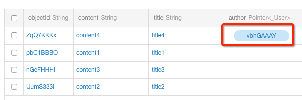
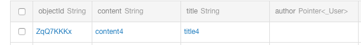
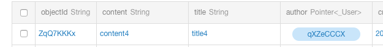
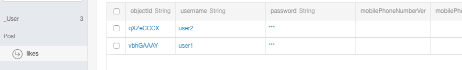
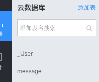

## 简介

Bmob平台为您的移动应用提供了一个完整的后端解决方案，我们提供轻量级的SDK开发包，让开发者以最小的配置和最简单的方式使用Bmob平台提供的服务，进而完全消除开发者编写服务器代码以及维护服务器的操作。

## 安装

### 使用CocoaPods安装BmobSDK

如何使用CocoaPods安装BmobSDK可查看我们提供的文档: [https://github.com/bmob/bmob-ios-sdk/blob/master/InstallCocoaPods.md](https://github.com/bmob/bmob-ios-sdk/blob/master/InstallCocoaPods.md)

### 兼容iOS9

iOS9默认不允许进行http请求，所以在使用SDK的过程中需要往Info.plist添加一些内容，

1. 完全取消http请求限制

```
<key>NSAppTransportSecurity</key> 
<dict>
<key>NSAllowsArbitraryLoads</key>
<true/>
</dict>
```
2. 指定部分网址支持http

```
<key>NSAppTransportSecurity</key> 
<dict>
   <key>NSExceptionDomains</key>
      <dict>     
      		<key>yourserver.com</key>    
       	<dict>      
       	 	<key>NSIncludesSubdomains</key>
         		<true/>
				<key>NSTemporaryExceptionAllowsInsecureHTTPLoads</key>
				<true/>             
			 	<key>NSTemporaryExceptionMinimumTLSVersion</key>       
			 	<string>TLSv1.1</string>    
			</dict>   
		</dict>
 </dict>
```

另外，最新版的sdk已支持bitcode。

其他一些需要注意兼容iOS9的地方可以参照这里：https://github.com/ChenYilong/iOS9AdaptationTips

### 应用程序

在Bmob平台注册的每个账户都可以创建多个应用程序，每个应用程序都有其独自的应用程序ID，在后续程序编写中，所有的应用程序将凭其ID来使用Bmob SDK。同一个应用可以分别在测试环境和生产环境中部署不同的版本。

### 应用安全

请大家在使用Bmob开发应用程序之前，认真阅读我们给大家提供的“数据与安全”的文档，确保你的应用在发布时安全。文档的链接地址是：[https://docs.bmob.cn/other/Other/n_datasafety/doc/index.html](https://docs.bmob.cn/other/Other/n_datasafety/doc/index.html)

## 对象

### 数据对象

Bmob存储的数据是建立在BmobObject基础上的，每个BmobObject包含键(Key)-值(value)对的JSON兼容数据。这个数据是无模式的，这意味着不需要提前指定每个BmobObject存在什么键。你只需要设置你想要的键值对让我们在后端存储。

例如，假设你要记录一个游戏的得分。一个单一的BmobObject对象可能包含：score: 1337, playerName: "Sean Plott", cheatMode: false。键必须是字母、数字的字符串。值可以是字符串、数字、布尔值、Json数组、和BmobObject对象等。

每个BmobObject有一个ClassName，它对应后台的表名。例如，我们可以调用的游戏分数对象的ClassName为GameScore，那么它在后台对应的表名就是GameScore。

### 特殊对象

为了提供更好的服务，BmobSDK中提供了BmobUser、BmobInstallation两个特殊的BmobObject对象来完成不同的功能，在这里我们统一称为特殊对象。
BmobUser对象主要是针对应用中的用户功能而提供的，它对应着web端的User表，使用BmobUser对象可以很方便的在应用中实现用户的注册、登录、邮箱验证等功能，具体的使用方法可查看文档的`用户`部分。
BmobInstallation对象主要用于应用的安装设备管理中，它对应着web端的Installation表，任何安装了你应用的设备都会在此表中产生一条数据标示该设备。结合Bmob提供的推送功能，还可以实现将自定义的消息推送给不同的设备终端，具体的使用方法可查看文档的`消息推送`部分。

### 数据类型

目前为止，我们支持的数据类型有String、Number、NSDate、Array、Dictionary以及BmobObject及其子类对象类型。对应后台的类型为String、Number、Date、Array、Object以及Pointer。

### 创建BmobObject对象

BmobObject提供以下几种方法对BmobOjbect进行初始化：

```
/**
 *	创建一个带有className的BmobObject对象
 *
 *	@param	className	表示对象名称(类似数据库表名)
 *
 *	@return	BmobObject
 */
BmobObject(className: String)


/**
 *  创建一个带有className 和objectId的BmobObject对象
 *
 *  @param className 表名
 *  @param objectId  对象的id
 *
 *  @return BmobObject对象
 */
BmobObject(outDatatWithClassName: String, objectId: String)

/**
 *  从字典创建BmobObject
 *
 *  @param dictionary 字典
 *
 *  @return BmobObject 对象
 */
BmobObject(dictionary: Dictionary);
```


### 添加数据

添加一条数据有两步，第一步是构造数据，第二步是保存数据至服务器上，有以下两种方法：

```
/**
 *	后台保存BmobObject对象，没有返回结果
 */
saveInBackground();
```

```
/**
 *	后台保存BmobObject对象，返回保存的结果
 *
 *	@param	block	返回保存的结果是成功还是失败
 */
saveInBackgroundWithResultBlock { (isSuccessful, error) in

};
```

比如，在一个游戏的应用中，当需要保存游戏分数、玩家信息到服务器中的时候，就可以创建GameScore表来添加数据，添加数据的形式类型与iOS中的NSMutableDictionary对象类似，如下：

```
    let gamescore:BmobObject = BmobObject(className: "GameScore")
    //score为1200
    gamescore.setObject(1200, forKey: "score")
    //设置playerName为小明
    gamescore.setObject("小明", forKey: "playerName")
     //设置cheatMode为false
    gamescore.setObject(false, forKey: "cheatMode")
    //设置age为18
    gamescore.setObject(18, forKey: "age")
    gamescore.saveInBackgroundWithResultBlock { [weak gamescore] (isSuccessful, error) in
        if error != nil{
            //发生错误后的动作
            print("error is \(error.localizedDescription)")
        }else{
            //创建成功后会返回objectId，updatedAt，createdAt等信息
            //创建对象成功，打印对象值
            if let game = gamescore {
                print("save success \(game)")
            }
        }
    }

```

运行完以上代码后，数据即可保存到服务器端了。为了确认数据是否真的已经保存成功，你可以在Bmob服务器端你的应用程序的数据浏览项目中查看。你应该看到类似这样的结果：

```
	objectId: "0c6db13c", score: 1200, playerName: "小明", cheatMode: false, createdAt:"2012-03-29 10:32:54", updatedAt:"2012-03-29 10:32:54"
```

这里需要注意几点：

+ 在运行以上代码时，如果服务器端你创建的应用程序中已经存在GameScore数据表和相应的score、playerName、cheatMode等字段，那么你此时添加的数据和数据类型也应该和服务器端的表结构一致，否则将保存数据失败。
+ 如果服务器端不存在GameScore数据表，那么Bmob将根据你第一次(也就是运行的以上代码)保存的GameSocre对象在服务器为你创建此数据表并插入相应数据。
+ 每个BmobObject对象有几个默认的键(数据列)是不需要开发者指定的，objectId是每个保存成功数据的唯一标识符。createAt和updateAt代表每个对象(每条数据)在服务器上创建和最后修改的时间。这些键 (数据列)的创建和数据内容是由服务器端来完成的。
+ 在 `[gameScore saveInBackgroundWithResultBlock:^(BOOL isSuccessful, NSError *error)`中，成功创建后，error返回的是nil，可以通过 error.localizedDescription 查看返回的错误信息，之后的类似于 `xxInBackground` 中的error也是一样的结构。
+ objectId，updatedAt，createdAt这些系统属性在调用创建函数（saveInBackground）的时候不需要进行设置，创建成功后，会返回objectId，updatedAt，createdAt。


上述方法中每添加一条数据需要设置一次键值对，如果觉得过于繁琐，可以通过一个NSDictionary来添加数据，利用以下方法即可:

```
    saveAllWithDictionary([NSObject : AnyObject]!);
```  
这个函数。

如:

```
    let gamescore:BmobObject = BmobObject(className: "GameScore")
     //设置playerName列的值为小黑和age列的值18
    gamescore.saveAllWithDictionary(["playerName":"小黑","score":18])
    gamescore.saveInBackgroundWithResultBlock { [weak gamescore] (isSuccessful, error) in
        if error != nil{
            //发生错误后的动作
            print("error is \(error.localizedDescription)")
        }else{
            //创建对象成功，打印对象值
            if let game = gamescore {
                print("save success \(game)")
            }
        }
    }
```

### 更新数据

更新一个对象也是非常简单的，首先获取到要更新的BmobObject对象，进行修改值后再更新数据。例如：

```
func updateObject(){
	let gamescore:BmobObject = BmobObject(className: "GameScore")
     //设置playerName列的值为小黑和age列的值18
    gamescore.setObject(1200, forKey: "score")
    gamescore.saveInBackgroundWithResultBlock { [weak gamescore] (isSuccessful, error) in
        if error != nil{
            //发生错误后的动作
            print("error is \(error.localizedDescription)")
        }else{
            //创建对象成功，打印对象值
            //创建成功后会返回objectId，updatedAt，createdAt等信息
            if let game = gamescore {
                print("save success \(game)")
                game.setObject(110, forKey: "score")
                game.updateInBackgroundWithResultBlock({ (isSuccessful, error) in
                    if isSuccessful {
                        print("update successfully");
                    }else{
                        print("update error is \(error.localizedDescription)")
                    }
                })
            }
        }
    }

```

如果列存储的是符合JSON格式的字符串对象，可以单独修改该对象的某个值，如有一列名为userAttibute，其值是: {"name":"John", "gender":"男"}，如果要修改name为Mike，可以使用以下代码

```
func  updateObjectJSONField(){
    //创建一条数据，并上传至服务器
    let gamescore:BmobObject = BmobObject(className: "GameScore")
    let json:Dictionary = ["name":"John","gender":"man"]
    gamescore.setObject(json, forKey: "userAttibute")
    gamescore.saveInBackgroundWithResultBlock { [weak gamescore] (isSuccessful, error) in
        if error != nil{
            //发生错误后的动作
            print("error is \(error.localizedDescription)")
        }else{
            //创建对象成功，打印对象值
            //创建成功后会返回objectId，updatedAt，createdAt等信息
            if let game = gamescore {
                print("save success \(game)")
                let updatedGame = BmobObject(outDatatWithClassName: game.className, objectId: game.objectId)
                updatedGame.setObject("Mike", forKey: "userAttibute.name")
                updatedGame.updateInBackgroundWithResultBlock({ (isSuccessful, error) in
                    if isSuccessful {
                        print("update successfully");
                    }else{
                        print("update error is \(error.localizedDescription)")
                    }
                })
            }
        }
    }
```

此处要注意一点，就是在上传 `gameScore` 之后，如果要再次进行更新，请重新构造对象，因为此时的 `gameScore` 对象还含有`userAttibute` 的值，下面是错误的代码：

```    
	//创建一条数据，并上传至服务器
    let gamescore:BmobObject = BmobObject(className: "GameScore")
    let json:Dictionary = ["name":"John","gender":"man"]
    gamescore.setObject(json, forKey: "userAttibute")
    gamescore.saveInBackgroundWithResultBlock { [weak gamescore] (isSuccessful, error) in
        if error != nil{
            //发生错误后的动作
            print("error is \(error.localizedDescription)")
        }else{
            //创建对象成功，打印对象值
            //创建成功后会返回objectId，updatedAt，createdAt等信息
            if let game = gamescore {
                print("save success \(game)")
                game.setObject("Mike", forKey: "userAttibute.name")
                game.updateInBackgroundWithResultBlock({ (isSuccessful, error) in
                    if isSuccessful {
                        print("update successfully");
                    }else{
                        print("update error is \(error.localizedDescription)")
                    }
                })
            }
        }
    }
```

运行后查看log，我们可以看到，除了userAttibute属性外，gameScore对象还有userAttibute.gender属性上传至服务器，这样服务器就无法区分客户端到底是要更新 userAttibuteg还是只更新userAttibute中的gender，从而报错。

```
2015-12-14 20:45:55.417 BmobSDKDemo[16867:1430005] 创建成功,以下为对象值
2015-12-14 20:45:55.418 BmobSDKDemo[16867:1430005] 
className = GameScore;
objectId = 0f3d45dbc5;
createdAt = 2015-12-14 12:45:55 +0000;
updatedAt = 2015-12-14 12:45:55 +0000;
date = {
    userAttibute =     {
        gender = man;
        name = John;
    };
};
2015-12-14 20:45:55.419 BmobSDKDemo[16867:1430005] 上传前的gameScore对象值

className = GameScore;
objectId = 0f3d45dbc5;
createdAt = 2015-12-14 12:45:55 +0000;
updatedAt = 2015-12-14 12:45:55 +0000;
data = {
    userAttibute =     {
        gender = man;
        name = John;
    };
    "userAttibute.name" = Mike;
};
```

#### 原子计数器

为了存储一个计数器类型的数据，Bmob提供对任何数字字段进行原子增加(或者减少)的功能，所以我们可以让score像下面一样增加一个固定的值:

```
    //创建一条数据，并上传至服务器
    let gamescore:BmobObject = BmobObject(className: "GameScore")
    gamescore.setObject(0, forKey: "atomicCounter")
    gamescore.saveInBackgroundWithResultBlock { [weak gamescore] (isSuccessful, error) in
        if error != nil{
            //发生错误后的动作
            print("error is \(error.localizedDescription)")
        }else{
            //创建对象成功，打印对象值
            //创建成功后会返回objectId，updatedAt，createdAt等信息
            if let game = gamescore {
                print("save success \(game)")
                let updatedGame = BmobObject(outDatatWithClassName: game.className, objectId: game.objectId)
                //自增1
                updatedGame.incrementKey("atomicCounter")
                updatedGame.updateInBackgroundWithResultBlock({ (isSuccessful, error) in
                    if isSuccessful {
                        print("update successfully");
                    }else{
                        print("update error is \(error.localizedDescription)")
                    }
                })
            }
        }
    }
```

也提供了

```
//列的值增加amount
incrementKey(key: String!, byAmount:Int)
//列的值减去一
decrementKey(key: String!)
//列的值减去amount
decrementKey(key: String!, byAmount:Int)
```
注意：需要调用更新函数才能完成计数器原子增加(或者减少)。

### 删除数据

从服务器删除对象：

```
    let gamescore:BmobObject = BmobObject(outDatatWithClassName: "GameScore", objectId: "baaf9cfa1b")
    gamescore.deleteInBackgroundWithBlock { (isSuccessful, error) in
        if (isSuccessful) {
            //删除成功后的动作
            print ("success");
        }else{
            print("delete error \(error.localizedDescription)")
        }
    }
```

### 批量数据操作
Bmob提供了批量操作的类BmobObjectsBatch,使用该类，可以批量增加，修改，删除数据，但一次请求不能超过50条数据。下面是例子程序：

```
	let batch = BmobObjectsBatch()
    //在GameScore表中创建一条数据
    batch.saveBmobObjectWithClassName("GameScore", parameters:["aveScore":["数学":90],"score":78])
    //在GameScore表中更新objectId为27eabbcfec的数据
    batch.updateBmobObjectWithClassName("GameScore", objectId: "27eabbcfec", parameters: ["score":85])
    //在GameScore表中删除objectId为30752bb92f的数据
    batch.deleteBmobObjectWithClassName("GameScore", objectId: "30752bb92f")
    batch.batchObjectsInBackgroundWithResultBlock { (isSuccessful, error) in
        if error != nil {
            print("error \(error.localizedDescription)")
        }
    }
```

## 查询

### 查询单条数据

在某些情况下，如果知道某条数据的objectId，而且想得知该条数据的内容，可以使用Bmoquery检索得到一个完整的BmobObject：

```
	//查找GameScore表
    let query:Bmoquery = Bmoquery(className: "GameScore")
    query.getObjectInBackgroundWithId("0c6db13c") { (obj, error) in
        if error != nil {
            //进行错误处理
        }else{
            if obj != nil{
                //得到playerName和cheatMode
                let playerName = obj.objectForKey("playerName") as? String
                let cheatMode  = obj.objectForKey("cheatMode") as? Bool
                print("playerName \(playerName),cheatMode \(cheatMode)")
                //打印objectId,createdAt,updatedAt
                print("objectid   \(obj.objectId)")
                print("createdAt  \(obj.createdAt)")
                print("updatedAt  \(obj.updatedAt)")
            }
        }
    }
```

### 查询多条数据

在某些情况下，当需要查询表中多条元素的时候，可以直接使用findObjectsInBackgroundWithBlock函数获取查询结果，默认100条。

```
	//查找GameScore表
    let query:Bmoquery = Bmoquery(className: "GameScore")
    query.findObjectsInBackgroundWithBlock { (array, error) in
        for i in 0..<array.count{
            let obj = array[i] as! BmobObject
            let playerName = obj.objectForKey("playerName") as? String
            //打印玩家名
            print("playerName \(playerName)")
            //打印objectId,createdAt,updatedAt
            print("objectid   \(obj.objectId)")
            print("createdAt  \(obj.createdAt)")
            print("updatedAt  \(obj.updatedAt)")
        }
    }
``` 

**这里需要注意的是：**

1.默认情况下，系统实际上并不会返回所有的数据，而是默认返回10条数据记录，你可以通过setLimit方法设置返回的记录数量。更多细节可[点击查看查询](https://docs.bmob.cn/data/iOS/b_developdoc/doc/index.html#查询)一节中的分页查询。

2.当查询的是用户表这种系统表的时候，返回的是BmobUser的数组，设备表，角色表也是这样的。

`3.查询用户表，设备表、角色表为：`

```
let query:Bmoquery = BmobUser.query() //用户表
let query:Bmoquery = BmobInstallation.query() //设备表
let query:Bmoquery = BmobRole.query() //角色表
```

### 条件查询

#### 比较查询
当然了，在大多数情况下，开发者还是会通过特定的条件来筛选，过滤某些数据来进行查询。Bmoquery也提供了对应的查询方法。

如果要过滤特定键的值可以使用`whereKey(key: String!, notEqualTo: AnyObject!)`。比如需要查询playerName不等于”小明”的数据时可以这样写：

当然，你也可以在你的查询操作中添加多个约束条件，来查询符合要求的数据。

```
let query:Bmoquery = Bmoquery(className: "GameScore")
query.whereKey("playerName", notEqualTo: "小明")
```
各种不同条件的比较查询，还有

```
各种不同的比较查询：
query.whereKey("age", lessThan: 18)//age小于18
query.whereKey("age", lessThanOrEqualTo: 18) //age小于或等18
query.whereKey("age", greaterThan: 18) //age大于18
query.whereKey("age", greaterThanOrEqualTo: 18) //age大于或等于18
```
这里有点需要注意的是

**时间搜索的话，等于的情况因为服务器是精确到微秒值，所以比较的值要加1秒。**

#### 子查询

如果你想查询匹配几个不同值的数据，如要查询“小明”，“小红”，“小白”三个人的信息是，可以使用
	
```
whereKey(key:String!, containedIn: [AnyObject]!)
```
函数，如下面所示：

```
query.whereKey("playerName", containedIn: ["小明","小红","小白"])
```

如果是关联关系，直接在数组里面填写objectId即可，如下

```
query.whereKey("author", containedIn: ["063a2d739e","b97ca382c3"])
```

相反，要排除这几个人的信息可以用

```
whereKey(key:String!, notContainedIn: [AnyObject]!)
```
函数，如下所示：

```
query.whereKey("playerName", notContainedIn: ["小明","小红","小白"])
```

#### 列值是否存在

其他的约束条件有

```
//设置查询中该字段是有值的结果
whereKeyExists(key:String!)
//设置查询中该字段是没有值的结果
whereKeyDoesNotExist(key:String!)
```

例如:

```
//查询表中score列有值的数据
query.whereKeyExists("score")
```
```
//查询表中score列没有值的数据
query.whereKeyDoesNotExist("score")
```

#### 模糊查询

对字符串值的模糊查询 比如查询包含字符串的值，有几种方法。如下：

```
//使用正则表达式查询
whereKey(String!, matchesWithRegex: String!)
//查询以特定字符串开头的值
whereKey(String!, startWithString: String!)
//查询以特定字符串结尾的值
whereKey(String!, endWithString: String!)
```

#### 分页查询
有时，在数据比较多的情况下，你希望查询出的符合要求的所有数据能按照多少条为一页来显示，这时可以使用limit方法来限制查询结果的数据条数来进行分页。默认情况下，Limit的值为100，最大有效设置值1000（设置的数值超过1000还是视为1000）。

```
query.limit = 3;//限制得到的结果条数为3条
```
在数据较多的情况下，在limit的基础上分页显示数据是比较合理的解决办法，skip属性可以做到跳过查询的前多少条数据来实现分页查询的功能。默认情况下Skip的值为100。

```
query.skip = 3;//跳过3条数据
```

#### 排序

对应数据的排序，如数字和字符串，可以使用升序或降序的方式来控制查询数据的结果顺序：

```
// 升序
orderByAscending(String!)
// 降序
orderByDescending(String!)
```

例如，分数由高到低的排序可以写成

```
query.orderByDescending("score")
```

当需要组合排序的时候可以这样处理

```
//先按照年龄升序排序，年龄一样再按照更新时间降序排序
query.orderByAscending("age")
query.orderByDescending("updatedAt")
```

### 复合查询
当简单的查询条件，不能满足查询要时，Bmoquery也提供了2种复合查询的方法。

```
//并查询
addTheConstraintByAndOperationWithArray([AnyObject]!)
//或查询
addTheConstraintByOrOperationWithArray([AnyObject]!)
```

数组里面存的是若干个条件字典，其格式为

```
@{@"列名":条件值}
```

例如：

```
//查询score列中值等于5且姓名为Mike的数据
let array = [["score":5],["name":"Mike"]]
query.addTheConstraintByAndOperationWithArray(array)
```

支持的条件符号有

|   Key       |  	Operation        
| ----------  |  --------------      
|$lt	      |        小于           
|$lte	      |      小于等于         
|$gt	      |       大于
|$gte	      |     大于等于
|$ne	      |       不等于
|$in	      |      在数组中
|$nin	      |    不在数组中
|$exists	  |     值不为空
|$or	      |  合成查询中的或查询
|$and	      | 合成查询中的与查询
|$regex     | 匹配PCRE表达式


例如:

```
//查询score列中值大于150或者小于5的数据
let array =  [["score":["$gt":150]],["score":["$lt":5]]]
query.addTheConstraintByOrOperationWithArray(array)
```

```
//查询score列中值大于5和小于150的数据
let array =  [["score":["$gt":5]],["score":["$lt":150]]];
query.addTheConstraintByAndOperationWithArray(array)
```

需要注意的是，如果是要查找条件为等于的数据的话，直接构造成{@"列名":条件}即可，例如下面的例子:

```
//查找分数为90分跟分数为150分的数据
let array =  [["score":90],["score":150]]
query.addTheConstraintByOrOperationWithArray(array)

//查找名字为张三跟李四的数据
let array =  [["name":"张三"],["name":"李四"]]
query.addTheConstraintByOrOperationWithArray(array)
```

其中日期类型和pointer类型构造的方法比较特殊。
例如要查询要个时间段的数据，可以构造时间

```
//createdAt大于或等于 2014-07-15 00:00:00
let condiction1 = ["createdAt":["$gte":["__type": "Date", "iso": "2014-07-15 00:00:00"]]]
//createdAt小于 2014-10-15 00:00:00
let condiction2 = ["createdAt":["$lt":["__type": "Date", "iso": "2014-10-15 00:00:00"]]]
let array =  [condiction1,condiction2]
//作用就是查询创建时间在2014年7月15日到2014年10月15日之间的数据
query.addTheConstraintByAndOperationWithArray(array)
```

如果查询的条件刚好是pointer类型的话，例如要查询某篇文章的作者是A或者B的话，可以这样构造数据:

```
let query:BmobQuery = BmobQuery(className: "Post")
//列author为pointer类型，指向用户表
//假设用户A的objectId为aaaa ,其中classname为表名
let condiction2 = ["author":["__type":"Pointer","className":"_User","objectId":"aaaa"]]
//假设用户b的objecId为bbbb
let condiction2 = ["author":["__type":"Pointer","className":"_User","objectId":"bbbb"]]
let array =  [condiction1,condiction2]
//查找作者为用户A或者作者为用户B的数据
query.addTheConstraintByAndOperationWithArray(array)
query.findObjectsInBackgroundWithBlock { (array, error) in
}
```

另外我们还封装了以下方法，方便开发者使用，以下是与查询，注意add之前的查询只能添加一个条件，如果是或查询，将` [main andOperation];`换成` [main orOperation];`

```
	let query:BmobQuery = BmobQuery(className: "GameScore_LT")
    query.whereKey("score", equalTo: 10.3)

    let query1:BmobQuery = BmobQuery(className: "GameScore_LT")
    query1.whereKey("playerName", equalTo: "test")

    let main:BmobQuery = BmobQuery(className: "GameScore_LT")
    main.add(query)
    main.add(query1)
    main.andOperation()
    main.findObjectsInBackgroundWithBlock { (array, error) in
        for i in 0..<array.count{
            let obj = array[i] as! BmobObject
            let name = obj.objectForKey("playerName")
            //打印名字
            print("playerName \(name)")
        }
    }
```

### 返回指定列

有的时候，一张表的数据列比较多，而我们只想查询返回某些列的数据时，我们可以使用以下方法来只返回需要的列的值

```
//设置查询后返回的字段数组	
selectKeys([AnyObject]!)
```

```
//指定返回查询的结果包括score和playerName两列的数据
query.selectKeys(["score","playerName"])
```

### 查询结果计数

如果你只是想统计满足查询对象的数量，你并不需要获取所有匹配的对象的具体数据信息，可以直接使用count替代find。例如，查询一个特定玩家玩的游戏场数：

```
	let query:BmobQuery = BmobQuery(className: "GameScore")
    query.whereKey("playerName", equalTo: "Barbie")
    query.countObjectsInBackgroundWithBlock { (count, error) in
        print("count is \(count)")
    }
```

### 统计查询
如果你想对表进行统计查询，可以采用以下方法。

#### 统计查询方法
统计方法共有以下几种,分别用于计算总和、平均值、最大值、最小值

```
sumKeys([AnyObject]!)
averageKeys([AnyObject]!)
maxKeys([AnyObject]!)
minKeys([AnyObject]!)
```

设置完成后使用下面的方法来返回结果。

```
- (void)calcInBackgroundWithBlock { (array, error) in
}
```

例如，如果我们要计算GameScore表所有玩家的得分总和，可以使用以下代码：

```
    let query:BmobQuery = BmobQuery(className: "GameScore")
    query.sumKeys(["score"])
    query.calcInBackgroundWithBlock { (array, error) in
        if error != nil{

        }else{
            if array != nil && array.count > 0{
                print("result \(array)")
                let result = array as Array
                let dic = result[0]
                let sumCount = dic["_sumScore"] as! Int
                print("sum of score \(sumCount)")
            }
        }
    }
```

计算总和只对Number类型的列有效，列名使用数组存放。返回的字典key值为_sum+首字母大写的列名，其它计算方法与sum类似，其返回的字典key值见下表

|关键字|key值|例子|
|------|-----|----|
|sum   |_sum+首字母大写|_sumScore|
|average|_avg+首字母大写|_avgScore|
|max   |_max+首字母大写|_maxScore|
|min   |_min+首字母大写|_minScore|

#### 分组统计
分组可用于获取并不复杂的列值，如我想知道playerName列中有多少个不同的玩家名字，可使用以下代码：

```
	let query:BmobQuery = BmobQuery(className: "GameScore")
    query.groupbyKeys(["playerName"])
    query.calcInBackgroundWithBlock { (array, error) in
        if error != nil{

        }else{
            if array != nil && array.count > 0{
                for obj in array{
                    let playerName = obj["playerName"]
                    print("playerName \(playerName)")
                }
            }
        }
    }
```

另外，groupby可以结合计算函数来使用，比如我想统计每个玩家的总分，可以使用以下代码：

```
    let query:BmobQuery = BmobQuery(className: "GameScore")
    query.groupbyKeys(["playerName"])
    query.sumKeys(["score"])
    query.calcInBackgroundWithBlock { (array, error) in
        if error != nil{

        }else{
            if array != nil && array.count > 0{
                for obj in array{
                    let playerName = obj["playerName"]
                    let sum = obj["_sumScore"]
                    print("playerName \(playerName)")
                    print("sum \(sum)")
                }
            }
        }
    }
```

##### 分组记录数
有时候，我们还想知道分组统计时每个分组有多少条记录，设置isGroupcount为YES即可,如下：

```
    query.isGroupcount = YES;
```

这样在返回的结果中就会包含类似于以下的键值对：

```
_count = 10
```

#### 添加过滤条件
利用计算方法返回来的值可以通过限制条件来获取我们想关注的结果。添加条件使用以下方法。

```
 -(void)constructHavingDic:(NSDictionary *)havingDic
```
该方法通过构造havingDic来添加限制条件，其使用方法与复杂查询类似。

例如，我们统计每个玩家的总分，但我们只需要得到总分大于50的玩家，可以使用以下代码得到：

```
	let query:BmobQuery = BmobQuery(className: "GameScore")
    query.groupbyKeys(["playerName"])
    query.sumKeys(["score"])
    let condiction = ["$gt":50]
    query.constructHavingDic(["_sumScore":condiction])
    query.calcInBackgroundWithBlock { (array, error) in
        if error != nil{

        }else{
            if array != nil && array.count > 0{
                for obj in array{
                    let playerName = obj["playerName"]
                    let sum = obj["_sumScore"]
                    print("playerName \(playerName)")
                    print("sum \(sum)")
                }
            }
        }
    }
```

### 缓存查询
缓存查询通常是将查询结果缓存在磁盘上，当用户的设备处于离线状态时，就可以从缓存中获取数据来显示。或者在应用界面刚刚启动，从网络获取数据还未得到结果时，先使用缓存数据来显示。这样可以让用户不必在按下某个按钮后进行枯燥的等待。 默认的查询操作是没有启用缓存的，开发者可以通过设置BmobCachePolicy来启用缓存功能。例如：优先从网络获取数据，如果获取失败时再从缓存获取数据，这种情况通常用在网络不可用的情况下。
```
query.cachePolicy = kBmobCachePolicyNetworkElseCache;
query.findObjectsInBackgroundWithBlock { (array, error) in
}
```

BmobSDK提供几种不同的缓存策略，以使用不同应用场景的需求。

- kBmobCachePolicyIgnoreCache

只从网络获取数据，且数据不会缓存在本地，这是默认的缓存策略。

- kBmobCachePolicyCacheOnly

只从缓存读数据，如果缓存没有数据，返回一个空数组。

- kBmobCachePolicyNetworkOnly

只从网络获取数据，同时会在本地缓存数据。

- kBmobCachePolicyCacheElseNetwork

先从缓存读取数据，如果没有再从网络获取。

- kBmobCachePolicyNetworkElseCache

先从网络获取数据，如果没有，再从缓存读取。

- kBmobCachePolicyCacheThenNetwork

先从缓存读取数据，无论结果如何都会再次从网络获取数据，在这种情况下，Block将产生两次调用。通常这种做法是先快速从缓存读取数据显示在界面，然后在后台连接网络获取最新数据，取到后再更新界面。

|检查是否存在当前查询条件的缓存数据

```
query.hasCachedResult()
```	
存在返回true，否则返回false
|清除当前查询的缓存数据

```
query.clearCachedResult()
```	
|清除所有查询结果的缓存数据

```
BmobQuery.clearAllCachedResults()
```
|设置缓存有限时间，单位为秒

```
query.maxCacheAge = 10000;
```

### BQL查询

`Bmob Query Language`（简称 BQL）是 Bmob 自 `BmobSDK V1.5.7` 版本开始，为查询 API 定制的一套类似 SQL 查询语法的子集和变种，主要目的是降低大家学习 Bmob 查询 API 的成本，可以使用传统的 SQL 语法来查询 Bmob 应用内的数据。

具体的 BQL 语法，请参考 [Bmob Query Language 详细指南](https://docs.bmob.cn/other/Other/m_bql/doc/index.html)。

#### 基本BQL查询
可以通过以下方法来进行SQL查询：

例如：需要查询所有的游戏得分记录

```
	let query = BmobQuery()
    let bql = "select * from GameScore_BQL"
    query.queryInBackgroundWithBQL(bql) { (result, error) in
        if error != nil{

        }else{
            print("\(result.resultsAry)")
        }
    }
```

其中result.resultsAry为BmobObject数组。

如果需要查询个数，则可以这样：

```
    let query = BmobQuery()
    let bql = "select count(*) from GameScore_BQL"
    query.queryInBackgroundWithBQL(bql) { (result, error) in
        if error != nil{

        }else{
            print("\(result.count)")
        }
    }
```

`其中result.count为记录条数，需要注意的是如果没有使用count关键字进行查询的话，对象result的count属性是没有意义的。`

#### 统计BQL查询

由于统计查询的结果是不定的，故BQL提供了另外一种查询方法来进行统计查询，可以使用  `statisticsInBackgroundWithBQL(bql) { (result,error) in }` 方法来进行。

```
	let query = BmobQuery()
    let bql = "select sum(score) from GameScore_BQL group by playerName"
    query.statisticsInBackgroundWithBQL(bql) { (result,error) in
        if error != nil{

        }else{
            print("\(result)")
        }
    }
```

目前统计查询支持的关键字如下表所示，即如果在sql语句中包含以下关键字时，则需要使用统计查询方法才能返回正确结果：

|key|Operation|
|:--|:--------|
|group by|分组操作|
|groupcount|返回每个分组的总记录|
|having|分组中的过滤条件|
|sum|计算总和|
|average|计算平均值|
|max|计算最大值|
|min|计算最小值|

#### 占位符查询

在更多的时候，一个查询语句中间会有很多的值是可变值，为此，我们也提供了类似 Java JDBC 里的 `PreparedStatement` 使用占位符查询的语法结构。

`注：目前只有where和limit关键字以及内置函数支持使用占位符。`

#### 普通查询

```
    let query = BmobQuery()
    let bql = "select * from GameScore_BQL where playerName = ? and score = ?"
    let placeholderArray = ["name2",9]
    query.queryInBackgroundWithBQL(bql, pvalues: placeholderArray) { (result, error) in
        if error != nil{

        }else{
            print("\(result.resultsAry)")
        }
    }
```

数组中的数据会依次替换bql中的问号。

#### 内置函数

对于包含`内置函数`的占位符查询，比较特殊，请使用`Bmob Query Language 详细指南`中的`内置函数`中[占位符查询用到的内置函数](https://docs.bmob.cn/other/Other/m_bql/doc/index.html#内置函数介绍)用到的内置函数列出的形式进行查询操作：

举例：我想查询在 '2015-05-14 14:56:30' 后的创建的记录，可以这样：

```
	let query = BmobQuery()
    let bql = "select * from GameScore_BQL where createdAt > date(?)"
    let placeholderArray = ["2015-05-14 14:56:30"]
    query.queryInBackgroundWithBQL(bql, pvalues: placeholderArray) { (result, error) in
        if error != nil{

        }else{
            print("\(result.resultsAry)")
        }
    }
```

注

1、我们更推荐使用占位符语法，理论上会降低 BQL 转换的性能开销；

2、同样的，统计查询也支持占位符,只需要`statisticsInBackgroundWithBQL(String!, pvalues: [AnyObject]) { ([AnyObject]!, NSError!) in}`方法即可。

#### BQL缓存策略
如果要使用缓存策略，可用 `queryBQLCanCacheInBackgroundWithblock{(result, error) in}` 方法，样例代码如下：

```
    let query = BmobQuery()
    let bql = "select * from GameScore_BQL where createdAt > date(?)"
    let placeholderArray = ["name1"]
    query.cachePolicy = kBmobCachePolicyNetworkOnly
    query.setBQL(bql)
    query.setPlaceholder(placeholderArray)
    query.queryBQLCanCacheInBackgroundWithblock { (result, error) in
        if error != nil{

        }else{
            print("actual :\(result)")
        }
    }
```

注意：

 - BQL查询方法中，只有 `queryBQLCanCacheInBackgroundWithblock{(result, error) in}` 才能使用缓存策略，其它方法即使设置了缓存策略也无缓存效果；
 - 使用`queryBQLCanCacheInBackgroundWithblock{(result, error) in}`进行查询时，通过 `-setBQL(String!);` 和 `setPlaceholder([AnyObject]!);` 来设置BQL语句和占位符。


缓存策略只对普通查询有效，统计查询只支持从网络进行查询。具体使用可参考iOS开发文档中的[查询](https://docs.bmob.cn/data/iOS/b_developdoc/doc/index.html#查询)缓存查询小节。

## 数组

为了存储数组型数据，[Bmob](https://www.bmob.cn/ "Bmob移动后端云服务平台")提供了3种操作来原子性地更改一个数组字段:

**Add** 在一个数组字段的后面添加一些指定的对象(包装在一个数组内)

**AddUnique** 只会在原本数组字段中没有这些对象的情形下才会添加入数组，插入数组的位置不固定的

**Remove** 从一个数组字段的值内移除指定的数组中的所有对象

### 添加数组数据
添加一行记录时创建一个普通的类似于列表的数组类型字段，可以使用以下方法添加：

```
	let gameScore = BmobObject(outDataWithClassName: "GameScore", objectId: "xxxx")
    gameScore.addObjectsFromArray(["P1","P2"], forKey: "skill")
    gameScore.updateInBackgroundWithResultBlock { (isSuccessful, error) in

    }
```

### 删除数组数据
当需要移除数组里的数据时可以使用

```
removeObjectsInArray([AnyObject]!, forKey: String!)
```

如下面就移除了P3这个元素:

```
	let gameScore = BmobObject(outDataWithClassName: "GameScore", objectId: "xxxx")
    gameScore.removeObjectsInArray(["P3"], forKey: "skill")
    gameScore.updateInBackgroundWithResultBlock { (isSuccessful, error) in

    }
```

### 更新数组数据
每一种方法都会有一个objects，即包含了这些方法将被添加或删除的对象列表，举个例子，技能skills是一个类似于集合的数组类型，那么我们可以在skills中加入一些对象，只有在skills原来的对象中不包含这些值的情况下才会被加入:

```
	let gameScore = BmobObject(outDataWithClassName: "GameScore", objectId: "xxxx")
    gameScore.addUniqueObjectsFromArray(["P3"], forKey: "skill")
    gameScore.updateInBackgroundWithResultBlock { (isSuccessful, error) in

    }
```

### 查询数组数据

对于Key的类型是数组的情况，可以查找Key的数组值中包含有P1的对象。代码如下：

```
	//查询数组中包含某个元素的记录
   let query = BmobQuery(className: "GameScore")
    query.whereKey("skill", equalTo: "P1")
    query.findObjectsInBackgroundWithBlock { (array, error) in
        if error != nil{

        }else{
            for obj in array{
                print("\(obj)")
            }
        }
    }
```

你同样可以使用"$all"操作符来找到类型为数组的Key的值中同时包含有P1和P2的对象:

```
    //查询数组中包含某些元素的记录
    let query = BmobQuery(className: "GameScore")
    let array = ["P1","P2"]
    query.whereKey("skill", equalTo: ["$all":array])
    query.findObjectsInBackgroundWithBlock { (array, error) in
        if error != nil{

        }else{
            for obj in array{
                print("\(obj)")
            }
        }
    }
```

当然，你也可以使用我们封装好的方法来查找

```
    //查询数组中包含某些元素的记录
   let query = BmobQuery(className: "GameScore")
    let array = ["P1","P2"]
    query.whereKey("skill", containsAll: array)
    query.findObjectsInBackgroundWithBlock { (array, error) in
        if error != nil{

        }else{
            for obj in array{
                print("\(obj)")
            }
        }
    }
```

如果要查找包含P1或P2的对象，可以使用复杂查询中的或查

```
    let query = BmobQuery(className: "GameScore")
    let condition = ["skill":["$all":"P1"]]
    let condition1 = ["skill":["$all":"P2"]]
    query.addTheConstraintByOrOperationWithArray([condition,condition1])
    query.findObjectsInBackgroundWithBlock { (array, error) in
        if error != nil{

        }else{
            for obj in array{
                print("\(obj)")
            }
        }
    }
```

#### 使用索引和对象key修改数组中的对象

比如你当前行有一列叫用户的工作经验projectExperiences，是一个Array数组列，里面包含了多个对象值：[{"name":"项目名称","descr":"项目描述"，"startTime":"开始时间"，"endTime":"结束时间"}, ...]

那么我们要修改projectExperiences数组中第一个对象的name值：

```
	let gameScore = BmobObject(outDataWithClassName: "Project", objectId: "xxxx")
    gameScore.setObject("项目名称2", forKey: "projectExperiences.0.name")
    gameScore.updateInBackgroundWithResultBlock { (isSuccessful, error) in
	
    }
```

## 数据关联
[数据关联章节Demo下载](https://github.com/bmob/bmob-ios-demo/tree/master/BmobSDK/BmobRelationDemo)

### 关联关系描述
在程序设计中，不同类型的数据之间可能存在某种关系。分别是以下三种：
1. 一对一，比如车队给司机分车，1个司机对应1台车；
2. 一对多，比如1个作者会对应多篇贴子；
3. 多对多，比如1篇帖子会有多个喜欢的读者，而每个读者也会有多篇喜欢的帖子。
前面的两种关系我们提供Pointer类型来表示，而最后一种关系我们使用Relation类型来表示

在下面的讲解中我们可能会使用到以下的两张表，其表结构如下：

_User

|字段|类型|含义|
|:---|:---|:---|
|objectId|string||
|username|string|用户名，用户可以是作者发帖子，也可以是读者发评论|

Post

|字段|类型|含义|
|:---|:---|:---|
|objectId|string||
|title|string|帖子标题|
|content|string|帖子内容|
|author|Pointer(_User)|作者|
|likes|Relation(_User)|喜欢帖子的读者|

预先在后台添加记录
_User表


Post表


---

### Pointer的使用

#### 添加关系

例如，user1写了一篇帖子，需要在Post表中添加一条记录，并且该记录包含一个关联author1记录的字段数据，可采用以下代码：

```
	let post = BmobObject(className: "Post")
    //设置帖子的标题和内容
    post.setObject("title4", forKey: "title")
    post.setObject("content4", forKey: "content")
    
    //设置帖子关联的作者记录
    let author = BmobUser(outDataWithClassName: "_User", objectId: "vbhGAAAY")
    post.setObject(author, forKey: "author")
    
    //异步保存
    post.saveInBackgroundWithResultBlock { (isSuccessful, error) in
        if isSuccessful {
            print("objectId \(post.objectId)")
        }else{
            print("error \(error)")
        }
    }
```

添加成功后在后台的结果如下图所示，我们可以看到，author列的值是用圆框框起来的，表示这是一个Pointer，显示的值，为对应记录的objectId,点击它可以进入_User表中：



我们可以这么理解关联关系，它就是一个类型为指针的字段，利用它可以指向其它表的某条记录。

#### 删除关系
如果需要删除某篇帖子关联的作者可以使用

```
deleteForKey(String!)
```
具体代码如下：

```
    let post = BmobObject(outDataWithClassName: "Post", objectId: "ZqQ7KKKx")
    //将author列的值置为空
    post.deleteForKey("author")
    post.updateInBackgroundWithResultBlock { (isSuccessful, error) in

    }
```

结果如下，可以看到，author列已经被置空



#### 修改关系
如果需要修改某篇帖子关联的作者，可以使用以下代码:

```
    let post = BmobObject(outDataWithClassName: "Post", objectId: "ZqQ7KKKx")
    let author = BmobUser(outDataWithClassName: "_User", objectId: "qXZeCCCX")
    //设置作者
    post.setObject(author, forKey: "author")
    post.updateInBackgroundWithResultBlock { (isSuccessful, error) in

    }
```

可以看到关联记录已经被修改：



#### 查询关系

查询某个特定作者的帖子，可以用 `whereKey(String!, equalTo: AnyObject!)`,具体代码如下

```
	//查询帖子表
    let query = BmobQuery(className: "Post")
    //构建objectId为vbhGAAAY 的作者
    let author = BmobUser(outDataWithClassName: "_User", objectId: "vbhGAAAY")
    //添加作者是objectId为vbhGAAAY条件
    query.whereKey("author", equalTo: author)
    query.findObjectsInBackgroundWithBlock { (array, error) in
        if error != nil{

        }else{
            for obj in array{
                print("\(obj)")
            }
        }
    }
```

如我们需要查询帖子，并且需要将该帖子关联的作者的信息（objectId,username）打印出来，我们可以使用以下代码：

```
	//查询帖子表
    let query = BmobQuery(className: "Post")
    query.includeKey("author")
    query.getObjectInBackgroundWithId("ZqQ7KKKx") { (object, error) in
        //打印文章标题，内容
        print("title \(object.objectForKey("title"))")
        print("content \(object.objectForKey("content"))")
        if let user = object.objectForKey("author") {
            //取得文章的关联作者对象
            let author = user as! BmobUser
            //打印文章的关联作者对象的相关信息
            print("objectId \(author.objectId)")
            print("username \(author.username)")
        }
    }
```

查询关系的核心在于查询前需要将关联的列名include进来，使用下列方法即可

```
includeKey(String!)
```

如果查询多个关联关系，可以使用以下方法，使用逗号(,)操作来使查询中包含多个属性

```
query.includeKey("column1,column2,...")
```

如果关联关系存在嵌套，可以使用以下英文字符点号(.)来操作，如下：

```
query.includeKey("column1.column2")
```

另外，include 时可以指定返回的字段，如下：

```
//只返回likes列的数据
query.includeKey("post[likes]")

//返回title和content列数据
query.includeKey("post[title|content]")
```

#### 约束关联对象值查询

我们可以对关联对象的值进行约束，来进行匹配查询。例如，如果我们想找查询出所有关联了user2的文章，可以使用以下代码

```
	//查询帖子表
    let query = BmobQuery(className: "Post")
	//构造约束条件
    let inQuery = BmobUser.query()
    inQuery.whereKey("username", equalTo: "user2")
    //匹配查询
    query.whereKey("author", matchesQuery: inQuery)
    query.findObjectsInBackgroundWithBlock { (array, error) in
        if error != nil{

        }else{
            for  obj in array {
                let post = obj as! BmobObject
                print("\(post.objectForKey("title"))");
            }
        }
    }
```

如果想要查询找所有没有关联user1的文章，则将

```
query.whereKey("author", matchesQuery: inQuery)
```
替换成

```
query.whereKey("author",  doesNotMatchQuery: inQuery)
```
即可。

#### Pointer本质
Pointer可以用来表示一对一或者一对多的关系，其实可以看成是我们将一个指向某条记录的指针记录下来，我们查询时可以通过该指针以获得另外关联的对象。当然，我们也可以给这些指针指向的关联记录进行约束，只查询出符合特定条件的记录。

### Relation的使用

#### 添加关联关系

如果我们需要在Post表中添加一个字段以记录喜欢该贴子的读者，我们可以使用以下代码：

```
    //获取要添加关联关系的post
    let post = BmobObject(outDataWithClassName: "Post", objectId: "ZqQ7KKKx")
    //新建relation对象
    let relation = BmobRelation()
    relation.addObject(BmobObject(outDataWithClassName: "_User", objectId: "vbhGAAAY"))
    relation.addObject(BmobObject(outDataWithClassName: "_User", objectId: "qXZeCCCX"))
    //添加关联关系到likes列中
    post.addRelation(relation, forKey: "likes")
    //异步更新obj的数据
    post.updateInBackgroundWithResultBlock { (isSuccessful, error) in

    }
```
可以看到添加了一个 `likes` 列，点击进去可以查看到该列里面存在哪些数据。

Post表：


从Post表中的title4记录点击关联关系框进去后查看的结果：



#### 删除关联关系

如果要从刚刚的添加的likes列中删去其中一个读者，可采用以下代码。

```
	//获取要添加关联关系的post
    let post = BmobObject(outDataWithClassName: "Post", objectId: "ZqQ7KKKx")
    //新建relation对象
    let relation = BmobRelation()
    relation.removeObject(BmobObject(outDataWithClassName: "_User", objectId: "vbhGAAAY"))
    //添加关联关系到likes列中
    post.addRelation(relation, forKey: "likes")
    //异步更新obj的数据
    post.updateInBackgroundWithResultBlock { (isSuccessful, error) in

    }
```

从Author表中的author1记录点击关联关系框进去后查看的结果：


#### 修改关联关系

如果需要给objectId为ZqQ7KKKx的帖子添加多一个喜欢该帖子的读者可以使用以下代码

```
    //获取要添加关联关系的post
    let post = BmobObject(outDataWithClassName: "Post", objectId: "ZqQ7KKKx")
    //新建relation对象
    let relation = BmobRelation()
    relation.removeObject(BmobObject(outDataWithClassName: "_User", objectId: "J6RU888L"))
    //添加关联关系到likes列中
    post.addRelation(relation, forKey: "likes")
    //异步更新obj的数据
    post.updateInBackgroundWithResultBlock { (isSuccessful, error) in

    }
```

运行代码后，从Author表中的author1记录点击关联关系框进去后查看的结果：


#### 查询关联关系

如果我们需要查询喜欢objectId为ZqQ7KKKx的帖子的所有读者，可以采用下列代码：

```
    //关联对象表
    let query = BmobUser.query()
    //需要查询的列
    let post = BmobObject(outDataWithClassName: "Post", objectId: "ZqQ7KKKx")

    query.whereObjectKey("likes", relatedTo: post)
    query.findObjectsInBackgroundWithBlock { (array, error) in
        for user in array {
            let liker = user as! BmobUser
            print("username \(liker.username)")
        }
    }
```

`注意：跟Pointer不同的是，这里本质上查询的是_User表。`

#### Relation约束关联对象值查询

上面的查询是查找喜欢某篇帖子的所有读者，如果反过来，需要查找某个读者喜欢的所有帖子又要怎么做呢？可以参考以下代码：

```
	//关联对象表
    let query = BmobQuery(className: "Post")
    //构造约束条件
    let inQuery = BmobUser.query()
    inQuery.whereKey("username", equalTo: "user3")
    //匹配查询
    query.whereKey("likes", matchesQuery: inQuery)
    query.findObjectsInBackgroundWithBlock { (array, error) in
        if error == nil {
            for obj in array {
                let post = obj as! BmobObject
                print("\(post.objectForKey("title"))")
            }
        }
    }
```

#### Relation的本质

Relation可以理解为其存储的是一个对象，而这个对象中存储的是多个指向其它记录的指针。


## 用户管理

### 属性
BmobUser除了从BmobObject继承的属性外，还有几个特定的属性：
	
1. username: 用户的用户名（必需）。
2. password: 用户的密码（必需）。
3. email: 用户的电子邮件地址（可选）。

BmobUser自动处理用户账户管理所需的功能。

```
username/用户名，必需
password//密码，必需
email//设置邮箱
setObject(AnyObject!, forKey: String!)//设置某个属性的值
objectForKey(AnyObject!)//得到某个属性的值
```

### 注册

应用很常见的一个功能就是，注册用户，使用BmobUser注册用户也不复杂，如下的例子所示

```
	let user = BmobUser()
    user.username = "小明"
    user.password = "123456"
    user.setObject(18, forKey: "age")
    user.signUpInBackgroundWithBlock { (isSuccessful, error) in
        if isSuccessful {
            print("Sign up successfully")
        }else{
            print("Sign up error\(error)")
        }
    }
```

**需要有两点需要注意的是：**

- 有些时候你可能需要在用户注册时发送一封邮件，以确认用户邮箱的真实性。这时，你只需要登录自己的应用管理后台，在应用设置->邮件设置（下图）中把“邮箱验证”功能打开，Bmob云后端就会在用户注册时自动发动一封验证给用户。


- username字段是大小写敏感的字段，如果你希望应用的用户名不区分大小写，请在注册和登录时进行大小写的统一转换。

### 登录

当用户注册成功后，需要让他们以后能够登录到他们的账户使用应用。要做到这点可以使用
```
BmobUser.loginWithUsernameInBackground("小明", password: "123456")
```
	
也可以使用
```
+ (void)loginWithUsernameInBackground:(NSString *)username
							  password:(NSString *)password
								 block:(BmobUserResultBlock)block;
```								 


Bmob还提供了用户、email、手机号码均可作为账号进行登录的功能。使用以下方法即可

```
    BmobUser.loginInbackgroundWithAccount(accout, andPassword: password) { (user, error) in
	    if user != nil {
	        print("\(user)")
	    }else{
	        print("error \(error)")
	    }
	}
```

### 获取当前用户

每次你登录成功，都会在本地磁盘中有一个缓存的用户对象作为当前用户，可以获取这个缓存的用户对象来进行登录：

```
	let user = BmobUser.getCurrentUser()
    if user != nil {
        //进行操作
    }else{
        //对象为空时，可打开用户注册界面
    }
```

当然，你也可以用如下的方法清除缓存用户对象：

```
BmobUser.logout()
```

1.这个用户对象缓存了基本的数据，所以可以通过-(id)objectForKey:(id)key; 这个方法来得到某一列的值

2.BmobUser.getCurrentObject() 跟 BmobUser.getCurrentUser()功能作用是一样的，因版本升级的原因才保留了BmobUser.getCurrentObject()

3.由于是缓存的数据，所以web端的修改，本地是不会更新的!!!需要重新登录才会更新本地缓存数据

### 更新用户

当用户登录成功后，在本地有个缓存的用户对象，如果开发者希望更改当前用户的某个属性可按如下代码操作:

```
	let user = BmobUser.getCurrentUser()
    user.setObject(30, forKey: "number")
    user.updateInBackgroundWithResultBlock { (isSuccessful, error) in

    }
```

一般来说，使用当前用户对象来进行资料更新可能会遇到一个问题。如果当前用户上次登录的时间距离当前时间过长，存放在本地的Token就有可能会过期，导致用户更新资料失败，这是需要重新登录，登录成功后才能更新资料。

**在更新用户信息时，如果用户邮箱有变更并且在管理后台打开了邮箱验证选项的话，Bmob云后端同样会自动发动一封邮件验证信息给用户。**

### 查询用户
查询用户和查询普通对象一样，只需指定BmobUser类即可，如下：

```
    let query = BmobUser.query()
    query.whereKey("username", equalTo: "xiaolv")
    query.findObjectsInBackgroundWithBlock { (array, error) in
        for obj in array {
            let user  = obj as! BmobUser
            print("objectId \(user.objectId)")
        }
    }
```

浏览器中查看用户表

User表是一个特殊的表，专门存储BmobUser对象。在浏览器端，你会看到一个User表旁边有一个小人的图标。



### 修改密码
从 `v1.6.3` 开始，我们提供使用旧密码来重置新密码的接口，示例如下：

```
    let user = BmobUser.getCurrentUser()
    let oldPassword:String = ""
    let newPassword:String = ""
    let account:String  = ""

    user .updateCurrentUserPasswordWithOldPassword(oldPassword, newPassword: newPassword, block:{ (isSuccessful, error) in
        if isSuccessful {
            BmobUser.loginInbackgroundWithAccount(account, andPassword: newPassword, block: { (user1, err) in
                if err != nil {
                    print("\(user1)")
                }else{
                    print("login error \(err)")
                }
            })
        }
    })
```

### 找回密码

为方便大家了解如何用Bmob开发找回密码的功能，我们为大家准备了另外一份文档，详细见我们在Github中的文档：

[https://github.com/bmob/bmob-cloudcode-demo/blob/master/HOW-TO-FIND-PASSWORD.md](https://github.com/bmob/bmob-cloudcode-demo/blob/master/HOW-TO-FIND-PASSWORD.md)

### 邮箱

#### 邮箱验证

设置邮件验证是可选的一个应用设置, 这样可以对已经确认过邮件的用户提供一部分保留的体验，邮件验证功能会在用户(User)对象中加入emailVerified字段, 当一个用户的邮件被新添加或者修改过的话，emailVerified会默认被设为false，如果应用设置中开启了邮箱认证功能，Bmob会对用户填写的邮箱发送一个链接, 这个链接可以把emailVerified设置为 true.

```
	let user = BmobUser.getCurrentUser()
    //应用开启了邮箱验证功能
    if let verified = user.objectForKey("emailVerified"){
        let isVerified = verified as! Bool
        if !isVerified {
            [user .verifyEmailInBackgroundWithEmailAddress("xxxxxxxxxx")]
        }
    }

```

#### 邮箱修改密码

一旦你引入了一个密码系统，那么肯定会有用户忘记密码的情况。对于这种情况，我们提供了一种方法，让用户安全地重置起密码。

重置密码的流程很简单，开发者只需要求用户输入注册的电子邮件地址即可：

```
BmobUser.requestPasswordResetInBackgroundWithEmail("xxxxxxx@qq.com")
```
	
密码重置流程如下：

1. 用户输入他们的电子邮件，请求重置自己的密码。
2. Bmob向他们的邮箱发送一封包含特殊的密码重置连接的电子邮件。
3. 用户根据向导点击重置密码连接，打开一个特殊的Bmob页面，根据提示，他们可以输入一个新的密码。
4. 用户的密码已被重置为新输入的密码。

### 第三方账号登录
Bmob提供了非常简单的方法来实现使用第三方账号登陆的功能，目前支持新浪微博、手机QQ账号以及微信账号的登陆。以下是我们提供的一个demo[ThirdPartyLogin](https://github.com/bmob/bmob-ios-demo)

#### 新浪微博账号注册登录
在[新浪微博开放平台](http://open.weibo.com/)注册应用，然后根据[新浪微博 iOS SDK使用说明](https://github.com/sinaweibosdk/weibo_ios_sdk)安装SDK以及获取，开发者通过新浪微博提供的SDK得到用户的信息后，就可以调用BmobUser提供的方法来注册登录到应用。

```
	//得到的新浪微博授权信息，请按照例子来生成NSDictionary
	let dic = ["access_token":token,"uid":uid,"expirationDate":date]
	//通过授权信息注册登录
	BmobUser.loginInBackgroundWithAuthorDictionary(dic, platform: BmobSNSPlatformSinaWeibo) { (user, error) in
	    print("objectid \(user.objectId)")
	}
```

#### 手机QQ账号登录

同样的，开发者通过QQ授权得到用户的信息后，同样可以调用BmobUser提供的方法来注册登录到应用。下面的例子是通过QQ提供的SDK授权得到的信息，进行登录的：

```
	//得到的qq授权信息，请按照例子来生成NSDictionary
	let dic = ["access_token": _tencentOauth.accessToken,"uid":_tencentOauth.openId,"expirationDate":_tencentOauth.expirationDate]
	//通过授权信息注册登录
	BmobUser.loginInBackgroundWithAuthorDictionary(dic, platform: BmobSNSPlatformQQ) { (user, error) in
	    print("objectid \(user.objectId)")
	}
```

#### 微信账号登录

```
	let dic = ["access_token": accessToken,"uid":openId,"expirationDate":expirationDate]
	BmobUser.loginInBackgroundWithAuthorDictionary(dic, platform: BmobSNSPlatformWeiXin) { (user, error) in
	    print("objectid \(user.objectId)")
	}
```

#### 第三方账号与BmobUser绑定
如果你的应用中有其他功能已经使用到了相关第三方平台的功能，比如社交分享功能，那么你可以将已经得到的用户授权信息传递给BmobSDK来便捷地与BmobUser进行绑定。以下代码展示了将第三方账号和已经存在的BmobUser对象进行绑定：

```
//新浪微博账号关联到当前用户
	let dic = ["access_token":token,"uid":uid,"expirationDate":date]
	let  user = BmobUser.getCurrentUser()
	user.linkedInBackgroundWithAuthorDictionary(dic, platform: BmobSNSPlatformSinaWeibo) { (isSuccessful, error) in
	    print("error \(error)")
	}
```

```
//手机qq账号关联到当前用户
	let dic = ["access_token": _tencentOauth.accessToken,"uid":_tencentOauth.openId,"expirationDate":_tencentOauth.expirationDate]
	BmobUser *user = [BmobUser getCurrentUser];
	let  user = BmobUser.getCurrentUser()
    user.linkedInBackgroundWithAuthorDictionary(dic, platform: BmobSNSPlatformQQ) { (isSuccessful, error) in
        print("error \(error)")
    }
```

```
//微信账号关联到当前用户
	let dic = ["access_token": accessToken,"uid":openId,"expirationDate":expirationDate]
	let  user = BmobUser.getCurrentUser()
    user.linkedInBackgroundWithAuthorDictionary(dic, platform: BmobSNSPlatformWeiXin) { (isSuccessful, error) in
        print("error \(error)")
    }
```

#### 解除绑定
解除绑定的账号，也是很简单的。下面是例子：

```
	//当前用户解除关联的微博账号
	let  user = BmobUser.getCurrentUser()
    user.cancelLinkedInBackgroundWithPlatform(BmobSNSPlatformSinaWeibo) { (isSuccessful, error) in
        print("error \(error)")
    }
```

```
	//当前用户解除关联的手机QQ账号
	let  user = BmobUser.getCurrentUser()
    user.cancelLinkedInBackgroundWithPlatform(BmobSNSPlatformQQ) { (isSuccessful, error) in
        print("error \(error)")
    }                                                                       
```

```
	//当前用户取消关联微信账号
    let  user = BmobUser.getCurrentUser()
    user.cancelLinkedInBackgroundWithPlatform(BmobSNSPlatformWeiXin) { (isSuccessful, error) in
        print("error \(error)")
    }
```

### 手机号相关功能

从 `v1.5.8` 开启Bmob加入了手机注册登录及密码重置等功能。以下介绍的功能可参考我们提供的[BmobSmsDemo](https://github.com/bmob/bmob-ios-demo/tree/master/BmobSmsDemo)（使用前请先在Appdelegate.m中填入你的app id）

`注：以下的新功能如果需要填入验证码参数的，请先调用请求验证码方法。`

#### 手机号注册

可使用以下代码进行一键注册并登录的操作。在使用前必须先请求手机验证码，注册成功后将以当前的手机号码作为用户名，并且会缓存用户信息在本地，可使用 `BmobUser.getCurrentUser()` 获取。

```
	BmobUser.signOrLoginInbackgroundWithMobilePhoneNumber(mobilePhoneNumber, andSMSCode: smsCode) { (user, error) in
        if user != nil{
            print("\(user)")
        }else{
            print("\(error)")
        }
    }
```

如果希望在用手机注册时为用户添加密码或者其它信息，可以使用以下代码实现：

```
	let user = BmobUser()
    user.mobilePhoneNumber = "15123456789"
    user.password = "123456"
    user.email = "123456@qq.com"
    user.signUpOrLoginInbackgroundWithSMSCode("6位验证码") { (isSuccessful, error) in
        if error == nil{
            print("\(user)")
        }else{
            print("\(error)")
        }
    }
```

#### 手机号登录

Bmob除了提供手机号验证码一键注册登录功能外，还另外提供了希望只给已存在用户用手机号进行登录的功能。代码如下：

```
	BmobUser.loginInbackgroundWithMobilePhoneNumber("手机号码", andSMSCode: "验证码") { (user, error) in
        if user != nil{
            print("\(user)")
        }else{
            print("\(error)")
        }
    }
```

#### 绑定手机号


绑定手机号的基本思路为，先获取验证码，验证取得的验证码后再更新 `mobilePhoneNumber` 和 `mobilePhoneNumberVerified` 即可，这是我们推荐的做法。当然，你也可以不通过验证码，直接使用用户输入的手机号来更新 `mobilePhoneNumber` 来进行绑定，不过这种方法并不推荐。

```
    //验证
	BmobSMS.verifySMSCodeInBackgroundWithPhoneNumber("手机号码", andSMSCode: "验证码") { (isSuccessful, error) in
        if isSuccessful {
            let user = BmobUser.getCurrentUser()
            //修改绑定手机
            user.mobilePhoneNumber = "手机号码"
            user.setObject(true, forKey: "mobilePhoneNumberVerified")
            user.updateInBackgroundWithResultBlock({ (successful, err) in
                if successful {
                    print("\(user)")
                }else{
                    print("\(err)")
                }
            })
        }
    }
```

#### 手机号修改密码

通过请求验证码和输入验证码从而进行账号密码重置，代码如下：

```
	BmobUser.resetPasswordInbackgroundWithSMSCode("手机验证码", andNewPassword: "新密码") { (isSuccessful, error) in
        if isSuccessful{
            print("重置密码成功")
        }else{
            print("\(error)")
        }
    }
```

## 子类化

很多时候BmobObject并不能满足用户的需求，用户可能需要继承BmobOject来定制自己的需求。但是当用户需要保存继承类的属性至后台时，还需要做一些额外的处理。因此，我们推出子类化BmobObject的选项，以让用户的代码具备更好的扩展性。

### 子类化的使用

先来定义一个BmobObject的子类。

Test.swift

```
import UIKit

class Player: BmobObject {
    var title:String? = nil
    var name:String? = nil
    var isStudent:Bool = false
    var age:Int = 0


    static func convert(obj:BmobObject)->Player{
        let test = Player.convertWithObject(obj)
        //不支持转化Bool，Int，Float类型,所以 需要手动设置
        if let isStudent = obj.objectForKey("isStudent") {
            test.isStudent = isStudent as! Bool
        }

        if let age = obj.objectForKey("age") {
            test.age = age as! Int
        }

        return test
    }

    override func sub_saveInBackgroundWithResultBlock(block: BmobBooleanResultBlock!) {
        //转化后的表名有问题，需要手动设置
        self.className = "Player"
        //不支持转化Bool，Int，Float类型,所以 需要手动设置
        self.setObject(isStudent, forKey: "isStudent")
        self.setObject(age, forKey: "age")
        super.sub_saveInBackgroundWithResultBlock(block)
    }
}
```

后面你就可以像以下形式那样使用Player类了

```
	let player = Player()
    player.title = "前锋"
    player.name = "Jhon Smith"
    player.isStudent = true
    player.age = 18
    player.sub_saveInBackgroundWithResultBlock { (isSuccessful, error) in
        if error != nil {
            print("\(error)")
        }else{
            print("join in")
        }
    }
```

注意：
1.当用到添加与更新操作时，要使用类似于sub_XXX的方法，而其它方法保持不变，与BmobObject一致。
2.子类的方法使用对象类型，不要使用基本类型。例如，要使用整型时，可以声明为NSNumber。

### 针对BmobUser的特别说明

如果要使用继承BmobUser的子类来进行登录，在构造其子类时，应用类似于以下的形式。

```
	let user = User(fromBmobObject: BmobUser.getCurrentUser())
    user.email = "xxxxx@qq.com"
    user.sub_updateInBackgroundWithResultBlock { (isSuccessful, error) in
        if isSuccessful{
            print("更新成功")
        }else{
            print("\(error)")
        }
    }

```

### 查询

查询后需要使用以下方法以得到子类的对象。

```
	let query = BmobQuery(className: "Player")
    query.findObjectsInBackgroundWithBlock { (array, error) in
        for obj in array {
            let player = Player.convert(obj as! BmobObject)
            print("title \(player.title)")
            print("age \(player.age)")
        }
    }
```

## 文件管理
[文件管理章节Demo](https://github.com/bmob/bmob-ios-demo/tree/master/BmobSDK/BmobFileDemo)

### 创建文件对象

BmobFile可以让你的应用程序将文件存储到服务器中，比如常见的文件类型图像文件，影像文件、音乐文件和任何其他二进制数据都可以使用。当文件上传成功后，可以通过url属性来获取文件的地址。

### 上传文件
`1.6.9版本之后，上传服务使用CDN服务`

#### 上传文件方法

如下图的例子，是将cs.txt的文本文件保存到服务器端：

```
-(void)saveInBackground:(BmobBooleanResultBlock)block;
```			

可以在block里面把文件添加到gameScore里面，建议使用异步上传的方法，再在block进行操作。如下面的例子：

```
	var path = NSBundle.mainBundle().bundlePath
    path.appendContentsOf("/test.txt")
    let obj = BmobObject(className: "Movie")
    let  file = BmobFile(filePath: path);
    file.saveInBackground { [weak file] (isSuccessful, error) in
        if isSuccessful {
            //如果文件保存成功，则把文件添加到file列
            let weakFile = file
            obj.setObject(weakFile, forKey: "file")
            obj.setObject("helloworld", forKey: "name")
            obj.saveInBackgroundWithResultBlock({ (success, err) in
                if err != nil {
                    print("save \(error)")
                }
            })
        }else{
            print("upload \(error)")
        }
    }
```

#### 上传文件进度

在上传文件时，有时会需要获取上传文件进度的需求。这时，可以使用

```
saveInBackground({ (isSuccessful, error) in}) { (progress) in }
```

如在下面的例子中，打印上传的进度

```
	var path = NSBundle.mainBundle().bundlePath
    path.appendContentsOf("/test.txt")

    let obj = BmobObject(className: "Movie")
    let  file = BmobFile(filePath: path);
    file.saveInBackground({ (isSuccessful, error) in
        if isSuccessful {
            //如果文件保存成功，则把文件添加到file列
            let weakFile = file
            obj.setObject(weakFile, forKey: "file")
            obj.setObject("helloworld", forKey: "name")
            obj.saveInBackgroundWithResultBlock({ (success, err) in
                if err != nil {
                    print("save \(error)")
                }
            })
        }else{
            print("upload \(error)")
        }
    }) { (progress) in
        print("progress \(progress)")
    }
```

### 批量上传文件
有时，开发者需要一次性上传多个文件，这是可以使用SDK提供的多个上传文件的方法来使用

```
	var path = NSBundle.mainBundle().bundlePath
    path.appendContentsOf("/test.txt")

    var path2 = NSBundle.mainBundle().bundlePath
    path2.appendContentsOf("/nv.jpg")

    let obj = BmobObject(className: "Movie")
    BmobFile .filesUploadBatchWithPaths([path,path2], progressBlock: { (index, progress) in
            print("index \(index),progress \(progress)")
        }, resultBlock: { (array, isSuccessful, error) in
            for i  in 0..<array.count{
                var key = "userFile"
                 key.appendContentsOf(String(i))
                obj.setObject(array[i], forKey:key)

            }
            obj.saveInBackgroundWithResultBlock({ (success, err) in
                if err != nil {
                    print("save \(error)")
                }else{
                    print("save success")
                }
            })
    })
```

### 下载文件

获取文件对象只需通过objectForKey(AnyObject!)来得到，例如，

```
let  file = obj.objectForKey("file") as? BmobFile
```
可用通过file的url属性(file.url)，来得到文件的地址进行下载。

### 删除文件

`删除文件接口只能删除1.6.9版本之后上传的文件`

如果需要删除文件，使用以下接口即可

```
/**
 *  异步请求删除文件
 *
 *  @param 返回删除结果与信息，如果删除成功，则无返回信息
 */
deleteInBackground { (isSuccessful, error) in}
```

当开发者需要一次性删除多个文件的时候，可以调用批量删除文件的接口

```
	let array = ["http://bmob-cdn-1.b0.upaiyun.com/jpg/579c8dc6676e460b82d83c8eb5c8aaa5.jpg","http://bmob-cdn-1.b0.upaiyun.com/jpg/59e3817d6cec416ba99a126c9d42768f.jpg"]
    BmobFile.filesDeleteBatchWithArray(array) { (arr, isSuccessful, error) in
        print("fail delete array \(arr)")
        print("error \(error)")
        print("isSuccessful \(isSuccessful)")
    }
```


## 数据实时功能
Bmob提供了数据实时功能，当开发者监听某个变化事件，例如监听表更新时，表的内容一旦变化，服务器就会通知SDK，SDK提供了相应回调函数来给开发者使用。当然开发者也可以取消相对应的监听，这样就不会收到数据变化的消息了。

### 监听功能
SDK提供了两个方法来监听数据变化，其中一个方法是针对表，另一个则针对行。

```
listenTableChange(BmobActionType, tableName: String!)
```
这个函数可以监听到表更新（包括该表的行数据的变化）、表删除的行为。例如:

```
-(void)listen{
	event = BmobEvent.defaultBmobEvent()
    event?.delegate = self
    event?.start()
}
```
在代理的函数，进行操作

```
extension ViewController:BmobEventDelegate{
    func bmobEventDidConnect(event: BmobEvent!) {

    }
	//监听Post表更新
    func bmobEventCanStartListen(event: BmobEvent!) {
        self.event?.listenTableChange(BmobActionTypeUpdateTable, tableName: "Post")
    }
	//接收到得数据
    func bmobEvent(event: BmobEvent!, didReceiveMessage message: String!) {
        print("didReceiveMessage \(message)")
    }

    func bmobEvent(event: BmobEvent!, error: NSError!) {

    }

    func bmobEventDidDisConnect(event: BmobEvent!, error: NSError!) {

    }
}
```

相对的，也有监听行更新。行删除的函数：

```
listenRowChange(BmobActionType, tableName: String!, objectId: String!)
```

当然了表删除，行更新，行删除等行为也可以在代理函数-(void)bmobEventCanStartListen:(BmobEvent *)event上进行监听。例如：

```
	func bmobEventCanStartListen(event: BmobEvent!) {
	    //监听Test表删除事件
	    self.event?.listenTableChange(BmobActionTypeDeleteTable, tableName: "Test")
	    //监听Post表中objectId为a1419df47a 的行更新事件
	    self.event?.listenRowChange(BmobActionTypeUpdateRow, tableName: "Post", objectId: "a1419df47a")
	    //监听Post表中objectId为wb1o000F 的行删除事件
	    self.event?.listenRowChange(BmobActionTypeDeleteRow, tableName: "Post", objectId: "wb1o000F")
	}
```

需要注意的是，监听事件后，接收到的数据是json格式的字符串，可以序列化为NSDictionary。

### 取消监听功能
当开发者想取消监听某个行为时，可以使用下面的函数

```
//取消订阅表的变化事件,包括表更新，表删除
cancelListenTableChange(BmobActionType, tableName: String!)
```
和

```
//取消订阅行的变化事件
cancelListenRowChange(BmobActionType, tableName: String!, objectId: String!)
```

这里有个[实例](https://github.com/bmob/bmob-ios-demo/blob/master/BmobDataDemo_iOS.zip)可以参考下。

## ACL和角色

大多数应用程序需要对不同的数据进行灵活的访问和控制，这就可以使用Bmob提供的ACL模式来实现。例如：

* 对于私有数据，读写权限可以只局限于数据的所有者。
* 对于一个论坛，会员和版主有写的权限，一般的游客只有读的权限。
* 对于日志数据只有开发者才能够访问，ACL可以拒绝所有的访问权限。
* 属于一个被授权的用户或者开发者所创建的数据，可以有公共的读的权限，但是写入权限仅限于管理者角色。
* 一个用户发送给另外一个用户的消息，可以只给这些用户赋予读写的权限。
用Bmob SDK，你可以对这些数据设置一个默认的ACL，这样，即使黑客反编译了你的应用，获取到Application Key，也仍然无法操作和破坏你的用户数据，确保了用户数据的安全可靠。而作为开发者，当你需要对这些数据进行管理时，可以通过超级权限Key（Master Key）进行。

### 默认访问权限

在没有显示指定的情况下，每一个BmobObject(表)中的ACL(列)属性的默认值是所有人可读可写的。在客户端想要修改这个权限设置，只需要简单简单调用BmobACL的setPublicReadAccess方法和setPublicWriteAccess方法，即：

```
	let acl = BmobACL()
    //设置所有人读权限为true
    acl.setPublicReadAccess()
    //设置所有人写权限为true
    acl.setPublicWriteAccess()
```

注意：可读可写是默认的权限，不需要写额外的代码。

### 指定用户的访问权限

假如你想实现一个分享日志类的应用时，这可能会需要针对不同的日志设定不同的访问权限。比如，公开的日志，发布者有更改和修改的权限，其他用户只有读的权限，那么可用如下代码实现：

```
	let blog = BmobObject(className: "blog")
    blog.setObject("论电影的七个元素", forKey: "title")
    blog.setObject("这是blog的具体内容", forKey: "content")

    let acl = BmobACL()
    //设置所有人可读
    acl.setPublicReadAccess()
    //设置只有当前用户可写
    acl.setWriteAccessForUser(BmobUser.getCurrentUser())
    blog.ACL = acl;

    blog.saveInBackgroundWithResultBlock { (isSuccessful, error) in
        if isSuccessful {
            print("success")
        }else{
            print("error \(error)")
        }
    }
```

有时，用户想发表一篇不公开的日志，这种情况只有发布者才对这篇日志拥有读写权限，相应的代码如下：

```
	let blog = BmobObject(className: "blog")
    blog.setObject("论电影的七个元素", forKey: "title")
    blog.setObject("这是blog的具体内容", forKey: "content")

    let acl = BmobACL()
    //设置只有当前用户可读
    acl.setReadAccessForUser(BmobUser.getCurrentUser())
    //设置只有当前用户可写
    acl.setWriteAccessForUser(BmobUser.getCurrentUser())
    blog.ACL = acl;

    blog.saveInBackgroundWithResultBlock { (isSuccessful, error) in
        if isSuccessful {
            print("success")
        }else{
            print("error \(error)")
        }
    }
```

### 角色管理
上面的指定用户访问权限虽然很方便，但是对于有些应用可能会有一定的局限性。比如一家公司的工资系统，员工和公司的出纳们只拥有工资的读权限，而公司的人事和老板才拥有全部的读写权限。要实现这种功能，你也可以通过设置每个用户的ACL权限来实现，如下：

```
	//创建公司某用户的工资对象
    let wageinfo = BmobObject(className: "wageinfo")
    wageinfo.setObject(2000, forKey: "wage")
    //这里创建四个用户对象，分别为老板、人事小张、出纳小谢和自己
    let boss = BmobUser(outDataWithClassName: "", objectId: "xxxxxx")
    let hr_zhang = BmobUser(outDataWithClassName: "", objectId: "xxxxxx")
    let cashier_xie = BmobUser(outDataWithClassName: "", objectId: "xxxxxx")
    let me = BmobUser(outDataWithClassName: "", objectId: "xxxxxx")

    let acl = BmobACL()
    //4个用户对象均可读
    acl.setReadAccessForUser(boss)
    acl.setReadAccessForUser(hr_zhang)
    acl.setReadAccessForUser(cashier_xie)
    acl.setReadAccessForUser(me)

    //设置boss跟hr_zhang 写的权限
    acl.setWriteAccessForUser(boss)
    acl.setWriteAccessForUser(hr_zhang)

    wageinfo.ACL = acl;
    wageinfo.saveInBackgroundWithResultBlock { (isSuccessful, error) in
        if isSuccessful {
            print("success")
        }else{
            print("error \(error)")
        }
    }
```

但是，一个公司的人事、出纳和员工不仅仅只有一个人，同时还会有离职、调换岗位以及新员工加入等问题存在。如果用上面的代码对公司的每个人进行一一设置的话是不现实的，既麻烦也很难维护。针对这个问题，我们可以利用BmobRole来解决。我们只需要对用户进行分类，每个分类赋予不同的权限。如下代码实现：

```
	//创建公司某用户的工资对象
    let wageinfo = BmobObject(className: "wageinfo")
    wageinfo.setObject(2000, forKey: "wage")
    //这里创建四个用户对象，分别为老板、人事小张、出纳小谢和自己
    let boss = BmobUser(outDataWithClassName: "", objectId: "xxxxxx")
    let hr_zhang = BmobUser(outDataWithClassName: "", objectId: "xxxxxx")
    let hr_luo = BmobUser(outDataWithClassName: "", objectId: "xxxxxx")
    let cashier_xie = BmobUser(outDataWithClassName: "", objectId: "xxxxxx")
    let me = BmobUser(outDataWithClassName: "", objectId: "xxxxxx")
    //创建HR和Cashier两个用户角色（这里为了举例BmobRole的使用，将这段代码写在这里，正常情况下放在员工管理界面会更合适）

    let hr = BmobRole(name: "HR")
    let cashier = BmobRole(name: "Cashier")
    //将hr_zhang和hr_luo归属到hr角色中
    let hrRelation = BmobRelation()
    hrRelation.addObject(hr_zhang)
    hrRelation.addObject(hr_luo)
    hr.addRolesRelation(hrRelation)
    //保存到云端角色表中（web端可以查看Role表）
    hr.saveInBackground()
    //将cashier_xie归属到cashier角色中
    let cashierRelation = BmobRelation()
    cashierRelation.addObject(cashier_xie)
    cashier.addRolesRelation(cashierRelation)
    cashier.saveInBackground()


    let acl = BmobACL()
    //4个用户对象均可读
    acl.setReadAccessForUser(boss)
    acl.setReadAccessForUser(me)
    acl.setReadAccessForRole(hr)
    acl.setReadAccessForRole(cashier)


    //设置boss跟hr_zhang 写的权限
    acl.setWriteAccessForUser(boss)
    acl.setWriteAccessForRole(hr)

    wageinfo.ACL = acl;
    wageinfo.saveInBackgroundWithResultBlock { (isSuccessful, error) in
        if isSuccessful {
            print("success")
        }else{
            print("error \(error)")
        }
    }
```
需要说明一点的是，Web端的Role表也具有ACL的列，你可以将角色管理的权限赋予某些用户。

### 角色之间的从属关系
下面我们来说一下角色与角色之间的从属关系。用一个例子来说明下：一个互联网企业有移动部门，部门中有不同的小组，如Android开发组和IOS开发组。每个小组只拥有自己小组的代码读写权限，但这两个小组同时拥有核心库代码的读权限。

```
    //创建MobileDep（移动研发部）、AndroidTeam（android开发组）和iOSTeam（ios开发组）三个角色
    let mobileDep = BmobRole(name: "MobileDep")
    let androidTeam = BmobRole(name: "AndroidTeam")
    let iosTeam = BmobRole(name: "iOSTeam")
    //保存AndroidTeam和iosTeam角色到云端
    androidTeam.saveInBackground()
    iosTeam.saveInBackground()
    //将androidTeam和iosTeam两种角色添加到移动部门角色中
    let relation = BmobRelation()
    relation.addObject(androidTeam)
    relation.addObject(iosTeam)
    mobileDep.addRolesRelation(relation)
    // 假设创建三个代码数据对象
    let coreCode = BmobObject(className: "Code")
    let androidCode = BmobObject(className: "Code")
    let iosCode = BmobObject(className:"Code")
    //......此处省略一些具体的属性设定
    coreCode.saveInBackground()
    androidTeam.saveInBackground()
    iosTeam.saveInBackground()
    //设置androidTeam角色对androidCode对象的读和写的权限
    androidCode.ACL.setReadAccessForRole(androidTeam)
    androidCode.ACL.setWriteAccessForRole(androidTeam)
    //设置iosTeam角色对iosCode对象的读和写的权限
    iosCode.ACL.setReadAccessForRole(iosTeam)
    iosCode.ACL.setWriteAccessForRole(iosTeam)
    //设置mobileDep角色可以对coreCode对象进行读操作
    coreCode.ACL.setReadAccessForRole(mobileDep)
```

## 地理位置
Bmob允许用户根据地球的经度和纬度坐标进行基于地理位置息的信查询。你可以在BmobObject的查询中添加一个BmobGeoPoint的对象查询。你就可以实现轻松查找出离当前用户最接近的信息或地点的功能。

### 地理位置对象
首先需要创建一个BmobGeoPoint对象。例如，创建一个-东经116.39727786183357度北纬39.913768382429105度的BmobGeoPoint对象：
```
let point = BmobGeoPoint(longitude: 116.39727786183357, withLatitude: 39.913768382429105)
```
添加地理信息
```
gameScore.setObject(point, forKey: "location")
```
### 地理查询

现在，你的数据表中有了一定的地理坐标对象的数据，这样可以测试找出最接近某个点的信息了。你可以使用Bmoquery对象的whereNear方法来这样做：
	
```
	let point = BmobGeoPoint(longitude: 116.39727786183357, withLatitude: 39.913768382429105)

    let query = BmobQuery(className: "GameScore")
    query.whereKey("location", nearGeoPoint: point)
    query.limit = 10
    query.findObjectsInBackgroundWithBlock { (array, error) in
		//进行操作
    }
```
要限制查询指定距离范围的数据可以使用whereWithinKilometers(公里)、whereWithinMiles(英里)或whereWithinRadians(弧度)方法。 要查询一个矩形范围内的信息可以使用whereWithinGeoBox来实现：
``` 
    let southwestOfSF = BmobGeoPoint(longitude: 116.39727786183357, withLatitude: 39.913768382429105)
    let northeastOfSF = BmobGeoPoint(longitude: 116.39727786183357, withLatitude: 40.913768382429105)
    let query = BmobQuery(className: "GameScore")
    query.whereKey("location", withinGeoBoxFromSouthwest: southwestOfSF, toNortheast: northeastOfSF)
    query.limit = 10
    query.findObjectsInBackgroundWithBlock { (array, error) in

    }
```

**注意事项**
目前有几个需要注意的地方：

1. 每个BmobObject数据对象中`只能`有一个BmobGeoPoint对象。

2. 地理位置的点不能超过规定的范围。`纬度的范围`应该是在`-90.0到90.0`之间。`经度的范围`应该是在`-180.0到180.0`之间。如果您添加的经纬度超出了以上范围，将导致程序错误。

3. 地理位置查询最大的距离根据表数据的不同有不同的限制，使用query.whereKey(String!, nearGeoPoint: BmobGeoPoint!);默认`100KM`。当需要指定距离时，最好指定一下最大距离。
 
## 其它功能

### 获取服务器时间

获取服务器时间戳可以直接调用[Bmob getServerTimestamp]，例如：

```
	let queue = dispatch_get_global_queue(DISPATCH_QUEUE_PRIORITY_DEFAULT, 0)
    dispatch_async(queue) { 
        let dateFormatter = NSDateFormatter()
        dateFormatter.timeZone = NSTimeZone(name: "Asia/Shanghai")
        dateFormatter.dateFormat = "yyyy-MM-dd hh:mm:ss"

        let timeString = Bmob.getServerTimestamp()
        let date = dateFormatter.dateFromString(timeString)
        let dateStr = dateFormatter.stringFromDate(date!)
        print("北京时间\(dateStr)")
    }
    
```

### 设置API网络请求超时时间
 
使用 `setBmobRequestTimeOut(CGFloat)` 方法可以设置API中网络请求的超时时间，例如，想要设置访问Bmob后台时超过15s就返回超时错误，可以这样写.

```
Bmob.setBmobRequestTimeOut(15)

```

BmobSDK默认是20s后得不到回复就提示超时，如果没有特别的需求，建议不要设置该时间。

### 获取表结构

从 `v1.6.1` 开始，我们开放获取表结构的接口。

#### 获取特定表的结构

可通过表名来获取特定表的结构，样例代码如下：

```
    Bmob.getTableSchemasWithClassName("_User") { (bmobTableSchema, error) in
        if error != nil {
            print("error \(error)")
        }else{
            //直接用description来查看表结构
            print("\(bmobTableSchema.description)")
            /*
             分别打印表结构
             */
            //打印表名
            print("表名:\(bmobTableSchema.className)")
            //打印表结构
            let fields = bmobTableSchema.fields
            let allKey = fields.keys
            for key in allKey {
                print("列名:\(key)")

                let fieldStrcut = fields[key]
                let type = fieldStrcut!["type"] as! String
                print("列类型\(type)")

                if type == "Pointer"{
                    print("关联关系指向的表名\(fieldStrcut!["targetClass"])")
                }
            }
        }
    }
```

#### 获取所有表的结构

可通过以下代码得到所有表的结构

```
    Bmob.getAllTableSchemasWithCallBack { (array, error) in
        for tableSchema in array {
            let bmobTableSchema = tableSchema as! BmobTableSchema
            //直接用description来查看表结构
            print("\(bmobTableSchema.description)")
            /*
             分别打印表结构
             */
            //打印表名
            print("表名:\(bmobTableSchema.className)")
            //打印表结构
            let fields = bmobTableSchema.fields
            let allKey = fields.keys
            for key in allKey {
                print("列名:\(key)")

                let fieldStrcut = fields[key]
                let type = fieldStrcut!["type"] as! String
                print("列类型\(type)")

                if type == "Pointer"{
                    print("关联关系指向的表名\(fieldStrcut!["targetClass"])")
                }
            }
        }
    }
```

#### 返回数据说明

表结构以 `BmobTableSchema` 对象的形式返回，其中属性 `className` 表示表名，而属性 `fields` 是一个字典，里面包含了所有列的类型，其结构如下：

```
["列名1":dic,“列名2”:dic]
```
而dic的结构为：

```
["type":"typeName","targetClass":"tableName"]
```

其中 `type` 指的是该类的类型， 而 `targetClass` 指的是指向的表名，只有在 `type` 为 `Pointer` 或者 `Relation` 时才有值。

具体形式如下：

```
{
    ACL =     {
        type = Object;
    };
    author =     {
        targetClass = "_User";
        type = Pointer;
    };
    content =     {
        type = String;
    };
    createdAt =     {
        type = Date;
    };
    likes =     {
        targetClass = "_User";
        type = Relation;
    };
    objectId =     {
        type = String;
    };
    skill =     {
        type = Array;
    };
    title =     {
        type = String;
    };
    updatedAt =     {
        type = Date;
    };
};
```


