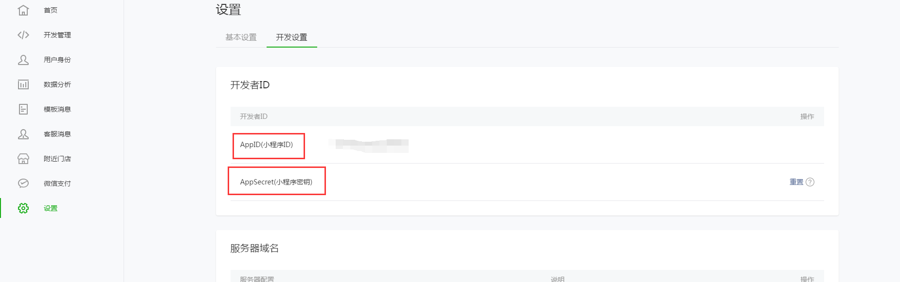
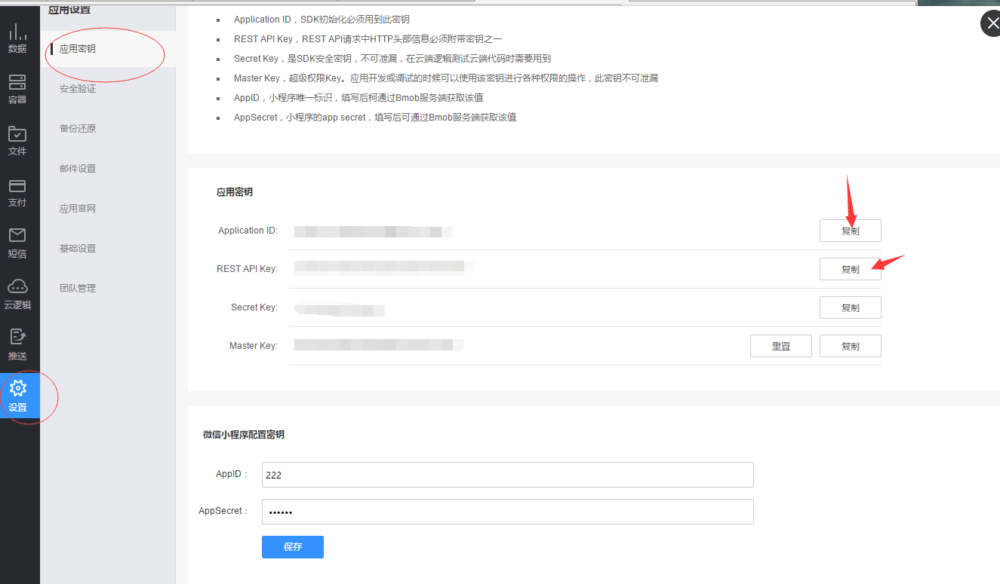
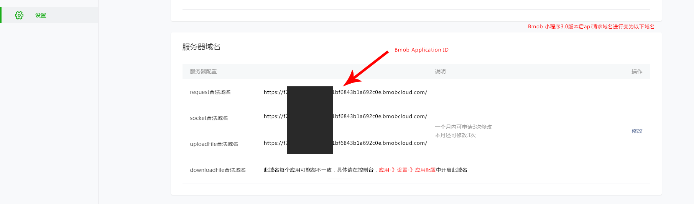

## 注册Bmob帐号
在网址栏输入www.bmob.cn或者在百度输入Bmob进行搜索，打开Bmob官网后，点击右上角的“注册”，在跳转页面填入你的姓名、邮箱、设置密码，确认后到你的邮箱激活Bmob账户，你就可以用Bmob轻松开发应用了。


## 网站后台创建应用

登录账号进入bmob后台后，点击后台界面左上角“创建应用”，在弹出框输入你应用的名称，然后确认，你就拥有了一个等待开发的应用。


## 配置小程序密钥和获取应用密钥

选择你要开发的应用，进入该应用


在跳转页面，进入设置/应用密钥，将你的AppID(小程序ID)和AppSecret(小程序密钥)填写到Bmob中




在下图位置点击复制，即可得到Application ID和REST API Key



获取Application ID和REST API Key后，下载SDK。

## 配置安全域名

在你的微信小程序后台配置你的服务器域名



## 下载和安装BmobSDK

一、把"bmob-min.js"和"underscore.js"放到相应的文件，例如放到utils中，在其他页面添加以下代码

```
var Bmob = require('../../utils/bmob.js');
```


二、接着是在app.js中加入下面两行代码进行全局初始化

```
var Bmob = require('utils/bmob.js');
Bmob.initialize("你的Application ID", "你的REST API Key");

```

## 添加一行数据

添加数据
```

      var Diary = Bmob.Object.extend("diary");
      var diary = new Diary();
      diary.set("title","hello");
      diary.set("content","hello world");
      //添加数据，第一个入口参数是null
      diary.save(null, {
        success: function(result) {
          // 添加成功，返回成功之后的objectId（注意：返回的属性名字是id，不是objectId），你还可以在Bmob的Web管理后台看到对应的数据
			console.log("日记创建成功, objectId:"+result.id);
        },
        error: function(result, error) {
          // 添加失败
          console.log('创建日记失败');
          
        }
      });
```

## 获取一行数据


```

    var Diary = Bmob.Object.extend("diary");
    var query = new Bmob.Query(Diary);
    query.get("4edc3f6ee9", {
      success: function(result) {
        // The object was retrieved successfully.
        console.log("该日记标题为"+result.get("title"));
      },
      error: function(result, error) {
        console.log("查询失败");
      }
    });
```

## 修改一行数据

```

    var Diary = Bmob.Object.extend("diary");
    var query = new Bmob.Query(Diary);
    // 这个 id 是要修改条目的 id，你在生成这个存储并成功时可以获取到，请看前面的文档
    query.get("4edc3f6ee9", {
        success: function(result) {
          // 回调中可以取得这个 diary 对象的一个实例，然后就可以修改它了
          result.set('title',"我是title");
          result.set('content',"我是content");
          result.save();
          // The object was retrieved successfully.
        },
        error: function(object, error) {

        }
    });
```

## 删除一行数据

```

    var Diary = Bmob.Object.extend("diary");
    var query = new Bmob.Query(Diary);
    query.get(objectId, {
      success: function(object) {
        // The object was retrieved successfully.
        object.destroy({
          success: function(deleteObject) {
            console.log('删除日记成功');
          },
          error: function(object, error) {
            console.log('删除日记失败');
          }
        });
      },
      error: function(object, error) {
        alert("query object fail");
      }
    });
```


## 源码下载

[快速入门相关源码下载](http://www.bmob.cn/sdk/bmob-wechatApp-v0.3.zip "快速入门相关源码下载")


