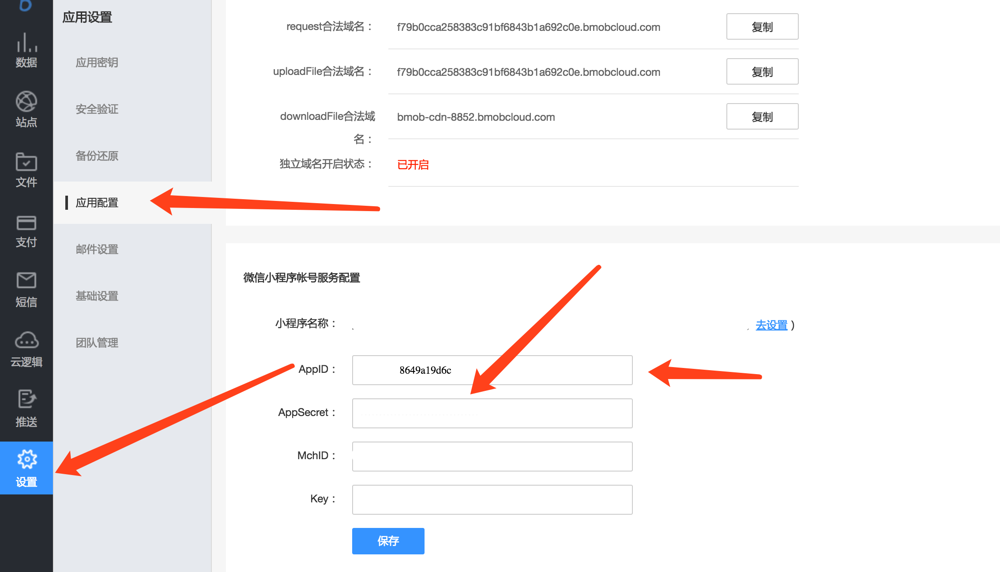

## 注册Bmob帐号
在网址栏输入www.bmob.cn或者在百度输入Bmob进行搜索，打开Bmob官网后，点击右上角的“注册”，在跳转页面填入你的姓名、邮箱、设置密码，确认后到你的邮箱激活Bmob账户，你就可以用Bmob轻松开发应用了。


## 网站后台创建应用

登录账号进入bmob后台后，点击后台界面左上角“创建应用”，在弹出框输入你应用的名称，然后确认，你就拥有了一个等待开发的应用。


## 配置小程序密钥和获取应用密钥

选择你要开发的应用，进入该应用


在跳转页面，进入设置/应用密钥，将你的AppID(小程序ID)和AppSecret(小程序密钥)填写到Bmob中





在下图位置点击复制，即可得到Application ID和REST API Key


获取Application ID和REST API Key后，下载SDK。

## 配置安全域名

在你的微信小程序后台配置你的服务器域名


## 下载和安装BmobSDK

一、把"bmob-min.js"和"underscore.js"放到相应的文件，例如放到utils中，在其他页面添加以下代码

```
var Bmob = require('../../utils/bmob.js');
```


二、接着是在app.js中加入下面两行代码进行全局初始化

```
var Bmob = require('utils/bmob.js');
Bmob.initialize("你的Application ID", "你的REST API Key");

```

## 添加一行数据

添加数据
```

      var Diary = Bmob.Object.extend("diary");
      var diary = new Diary();
      diary.set("title","hello");
      diary.set("content","hello world");
      //添加数据，第一个入口参数是null
      diary.save(null, {
        success: function(result) {
          // 添加成功，返回成功之后的objectId（注意：返回的属性名字是id，不是objectId），你还可以在Bmob的Web管理后台看到对应的数据
			console.log("日记创建成功, objectId:"+result.id);
        },
        error: function(result, error) {
          // 添加失败
          console.log('创建日记失败');
          
        }
      });
```

## 获取一行数据


```

    var Diary = Bmob.Object.extend("diary");
    var query = new Bmob.Query(Diary);
    query.get("4edc3f6ee9", {
      success: function(result) {
        // The object was retrieved successfully.
        console.log("该日记标题为"+result.get("title"));
      },
      error: function(result, error) {
        console.log("查询失败");
      }
    });
```

## 修改一行数据

```

    var Diary = Bmob.Object.extend("diary");
    var query = new Bmob.Query(Diary);
    // 这个 id 是要修改条目的 id，你在生成这个存储并成功时可以获取到，请看前面的文档
    query.get("4edc3f6ee9", {
        success: function(result) {
          // 回调中可以取得这个 diary 对象的一个实例，然后就可以修改它了
          result.set('title',"我是title");
          result.set('content',"我是content");
          result.save();
          // The object was retrieved successfully.
        },
        error: function(object, error) {

        }
    });
```

## 删除一行数据

```

    var Diary = Bmob.Object.extend("diary");
    var query = new Bmob.Query(Diary);
    query.get(objectId, {
      success: function(object) {
        // The object was retrieved successfully.
        object.destroy({
          success: function(deleteObject) {
            console.log('删除日记成功');
          },
          error: function(object, error) {
            console.log('删除日记失败');
          }
        });
      },
      error: function(object, error) {
        console.log("query object fail");
      }
    });
```

## WebSocket 通讯（聊天）
一、把"bmobSocketIo.js"放到相应的文件，例如放到utils中，接着是在app.js中加入下面两行代码进行全局初始化
```
var BmobSocketIo = require('utils/bmobSocketIo.js').BmobSocketIo;
BmobSocketIo.initialize("你的Application ID");

```


二、对应页面开始引入`BmobSocketIo`
```
var BmobSocketIo = require('../../../utils/bmobSocketIo.js').BmobSocketIo;
```

三、在页面进入第一次时初始化`BmobSocketIo`

```
BmobSocketIo.init();

```


四、监听表
```

    //初始连接socket.io服务器后，需要监听的事件都写在这个函数内
    BmobSocketIo.onInitListen = function () {
      //订阅Chat表的数据更新事件
      BmobSocketIo.updateTable("Chat"); //聊天记录表
    };
    
    //监听服务器返回的更新表的数据
    BmobSocketIo.onUpdateTable = function (tablename, data) {

      if (tablename == "Chat") {
        console.log(data);
      }
    };  
    
```

PS:更多请参考Demo里面的群聊功能。


## 优秀开源


1. ## 地道美食地图
> 点击查看[地道美食地图](https://github.com/LanceCong/gourmet_map) 


2. ## 出发吧一起
> 点击查看[出发吧一起](https://github.com/dmego/together) 

3. ## 心邮
> 点击查看[心邮](https://github.com/bmob/Bmob-wechatapp-xinyou) 

4. ## 自媒体文章小程序
> 点击查看[自媒体文章小程序](https://github.com/qfwc258/weapp-bmob-cw) 

5. ## 灵动云课堂小程序端
> 点击查看[灵动云课堂小程序端](https://gitee.com/laeser/course) 

6. ## 灵犀外卖
> 点击查看[灵犀外卖](https://gitee.com/laeser/dinner) 


## Bmob入门示例
* 源码包含增删改查

[快速入门相关源码下载](https://github.com/magic007/wechatAppDemo "快速入门相关源码下载")


## 典型案例

Bmob示例包含常用接口（学习示例）：[https://github.com/magic007/wechatAppDemo](https://github.com/magic007/wechatAppDemo) （采用实时数据同步SDK开发，里面几乎包含了小程序开发常见功能示例代码，右击可直接查看源码）
扫描二维码查看


心邮（官方线上项目）：[https://github.com/bmob/Bmob-wechatapp-xinyou](https://github.com/bmob/Bmob-wechatapp-xinyou) （采用实时数据同步SDK开发，右击可直接查看源码）

-------


- 1.生日工具                    -------工具类
- 2.足迹地图
- 3.接力喵视频                -------视频类
- 4.像素涂鸦
- 5.地道美食地图           -------LBS
- 6.胖熊圈
- 7.有货Hk
- 8.厦漳泉生活通               -------本地生活
- 9.极简笔记
- 10.衣在线                  -------商城
- 11.活动报名表                -------工具类
- 12.味蕾点餐               -------点餐
- 13.烟台微拼               -------本地生活
- 14.顺德便利贴
- 15.同城生活广告
- 16.点点英语学堂
- 17.朝露时刻               -------音频类
- 18.青岛一起秀科学俱乐部
- 19.纸塘					-------17年6月最热门的小程序
- 20.雷湖古琴艺术
- 21.皋城文明随手拍   -----政府
- 22.阅后即焚图片分享
- 23.猎位共享停车
- 24.听写宝
- 25.嘿车出行
- 26.喵星人宠物社区
- 27.标签生成器
- 28.视频看房
- 29.海南黎家特产
- 30.轩宇工具
- 31.在旅途看世界
- 32.寻遍美食地图
- 33.Bmob示例
- 34.鲁山拼车
- 33.莲馨图书室          图书馆-扫描借书
- 34.灵动云课堂
- 35.9cam     视频类
- 36.恋爱迹
- 37.融信品质生活服务
- 38.全民摄影秀
- 39.农电微服务    国家电网公司
- 40.壁纸印象
- 41.跟妆师
- 42.高能名片
- 43.婚纱lite
- 44.张阿姨打扫
- 45.吃决策
- 46.比心比价
- 47.蜂鸟作业               教育
- 48.美味面包lite
- 51.幸福的5班
- 52.大武汉公交               交通
- 53.Buy优选					淘客
- 54.码赚
- 55.附近的圈子
- 56.吴忠意大利冰淇淋          实体店点餐
- 57.摩西讲单词     教育
- 58.贝莱福居
- 59.花间集鲜花
- 60.柏亚阅读书吧
- 61.找我跑腿服务
- 62.橙色工地圈
- 63.大学城活动报名
- 64.聚合助手
- 65.圆桌绿色版
- 66.我的王者名片
- 67.趣猫
- 68.管图智能选座          大学图书馆
- 69.呼伦贝尔二手车平台
- 70.我的王者名片
- 71.万能服           答题应用
- 72.国关campus
- 73.礼信APP
- 74.一起冒险
- 75.出发吧一起
- 76.闪电速代助手
- 77.一锅美味   点餐
- 78.月兴米粉面店   批发
- 79.电控之家服务


>官方交流QQ群：118541934 。欢迎提交给我们
