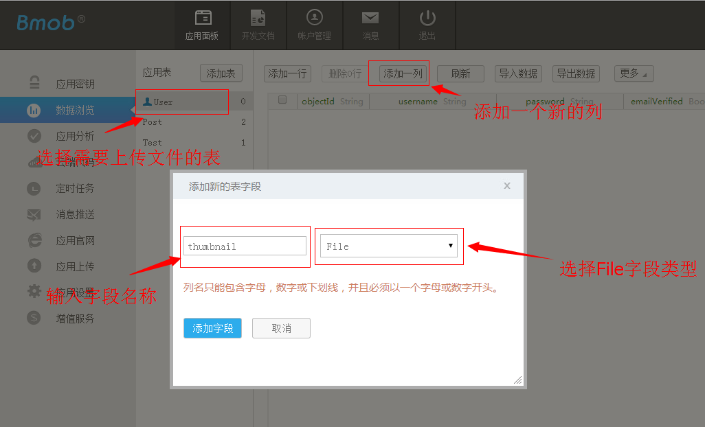
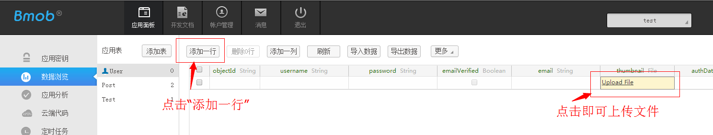

## 平台常见问题

### 你们的平台稳定吗

Bmob采用南北双线，多路分流的方式，将服务器部署在国内外主流的大型服务器提供商中。部署时采用7层负载均衡技术，确保每个节点机房都能够承受大量的并发请求。而每个应用之间采用`Docker`容器虚拟化，确保应用之间的安全隔离性。自2013年7月创立至今，团队积累了大量的运维和服务经验，确保平台的稳定服务。 

### 数据放在云端安全吗

- 首先，数据在传输过程中采用了`requestId` + `timestamp` + `Application Key`的一次性对称加密算法和服务端主动防御的技术，确保数据在传输过程中能够不被`Fiddler`、`Wireshark`等抓包工具恶意抓取进行分析破坏。
- 应用之间除采用Docker虚拟化之外，系统还定期/实时做了3级容灾备份，确保数据的可用性。
- 在软件架构层面，Bmob提供了应用层次、表层次、ACL、角色、IP白名单、签名等多种安全控制方式。如果你想更深入了解Bmob的安全架构，可以详细查看我们的[数据安全文档](http://docs.bmob.cn/datasafety/index.html?menukey=otherdoc&key=datasafety)。


### 你们的SDK会不会有广告

没有，我们不做广告业务，SDK是非常纯净的，不会恶意嵌入广告的。


### 你们支持什么平台

- Android、iOS和WP三种主流的移动操作系统平台
- Cocos2d-x和Unity两种主流的游戏引擎
- Js支持HTML5移动开发
- C#支持PC端开发
- Restful开放API接口（可使用任何语言开发）

### 不同SDK的数据是否打通

当然！本质上，所有的SDK都是基于Restful开发，数据是完全打通的。


### 如何联系Bmob技术和商务

- 技术客服QQ：[2093289624](http://wpa.qq.com/msgrd?v=3&uin=2093289624&site=qq&menu=yes)
- 商务QQ：2499654572
- 商务合作邮件：partner@bmob.cn
- 技术沙龙邮件：event@bmob.cn


## Web开发者后台相关问题

### 如何在Web后台上传文件（如图片）

Bmob提供了一种非常简单的文件上传的方法：

- 在Web后台中点击进入应用程序的控制面板中，如下图所示，选择需要用到文件的表，然后点击“添加一列”按钮，这时，弹出一个“添加新的表字段”的对话框。在这个对话框中，请输入字段名称，选择字段类型（**注意：请选择File类型**）。



- 现在，你就可以快速上传文件了：点击“添加一行”按钮，在File字段中点击“Upload File”就可以直接上传文件。如下图所示。如果想要上传更多的文件，可以重复第二步操作。



### 为什么导入CSV数据之后是乱码

请先将导入的数据编码转换为“UTF-8无BOM格式编码”之后再上传（转换为UTF-8编码的一个简单方法是：用[Notepad++](http://notepad-plus-plus.org/)打开要导入的CSV文件，然后点击“格式->以UTF-8无BOM格式编码”菜单）。

### 为什么导出的CSV数据显示乱码

导出的文件请以“UTF-8无BOM格式编码”格式打开查看(可使用[Notepad++](http://notepad-plus-plus.org/)打开CSV文件，然后点击“格式->以UTF-8无BOM格式编码”菜单)，如果用excel直接打开可能出现中文乱码！

### 能提供一个CSV文件参考下吗

[点击这里下载CSV文件模版](http://static.bmob.cn/new/developmentdoc/appdemo/bmobtest.csv)

使用方法：Web后台->创建应用->创建表->导入数据->选择这个CSV文件

### 能直接在Web后台上传文件吗

可以，先在表中创建需要File类型的字段，然后新增一条记录就可以直接在Web端上传文件了。

## RestApi相关问题

### 如何在线测试RestApi

使用Chrome浏览器的Postman插件就可以进行调试了。[点击链接Postman下载地址](https://chrome.google.com/webstore/detail/postman-rest-client/fdmmgilgnpjigdojojpjoooidkmcomcm?utm_source=chrome-ntp-icon)。

界面效果[点击这里查看](http://docs.bmob.cn/restful/faststart/index.html?menukey=fast_start&key=start_restful#index_RestAPI调试工具)。

### Postman发起数据请求没有反应

首先先检查本地网络，通常是因为本地网络或者Postman没有成功发出数据请求，其次可以打开[https://api.bmob.cn/](https://api.bmob.cn/)查看是否能打开进行测试。

### 其他语言用RestApi开发遇到请求security的错误

请查找相关语言访问HTTPS的配置问题。
如PHP用CURL开发时，需要添加如下脚本：

```java
curl_setopt($c, CURLOPT_SSL_VERIFYPEER, FALSE);
curl_setopt($c, CURLOPT_SSL_VERIFYHOST, FALSE);
```

### 能提供Java调用RestApi的示例代码吗

点击下面的链接可以看到Java调用RestApi的示例代码：

[http://wenda.bmob.cn//?/question/51](http://wenda.bmob.cn//?/question/51)

[http://wenda.bmob.cn/?/question/859](http://wenda.bmob.cn/?/question/859)

### 关于where条件的问题

有开发者提出用PostMan请求的时候没有问题，但是用Java请求构造了where查询条件的时候有错（请求的格式大致如， `https://api.bmob.cn/1/classes/Footballer?limit=20&where={"location": {"$nearSphere": {"__type": "GeoPoint","latitude": 32.31735060,"longitude": 118.32457035 }}}` ）。

这个问题是因为特殊字符导致的问题，大家可以参考以下的解决方案：

[http://stackoverflow.com/questions/636770/is-there-any-java-equivalent-of-phps-http-build-query-function](http://stackoverflow.com/questions/636770/is-there-any-java-equivalent-of-phps-http-build-query-function)

顺便说一句，PHP中的话，可以直接用`http_build_query`方法构造请求参数。

### 哪里可以看到错误码

[点击这里](http://docs.bmob.cn/errorcode/index.html?menukey=otherdoc&key=errorcode)可以查看RestApi的错误码列表。

## Android相关问题

### 支持同步数据上传吗

不支持阻塞主线程同步上传数据的方法！

### SDK请求时占用内存大吗

如果只是数据服务的话，占用内存非常小。如果涉及图片服务，需要视图片大小而定内存占用情况。

### 文件能不能使用批量操作

当然可以。

### 注册和登录的流程是怎样开发的

注册成功之后，服务器会返回`sessionToken`（标识用户登录成功的会话信息）给`BmobUser`对象，这时即可立即显示登录后台的界面，同步在后台调用登录接口进行登录操作。

### 打开了邮箱验证功能，注册成功后未验证也能登录成功？

Bmob SDK中，邮箱的验证和用户的注册登录是异步的关系，也就是说，即使用户没有点击邮箱验证功能，也是一样可以登录成功的。如果需要限制用户的登录或者只能查看到登录后的部分功能，可以使用`BmobUser.getEmailVerified`。

## iOS相关问题

### 支持什么编译器

Bmob完全支持iOS 64bit/32bit的真机和模拟器调试。

### 哪里可以看到错误码

请查看iOS开发文档中的[错误代码列表](http://docs.bmob.cn/ios/developdoc/index.html?menukey=develop_doc&key=develop_ios#index_错误码列表)。

### 注册和登录的流程是怎样开发的

见Android相关部分。

### 打开了邮箱验证功能，注册成功后未验证也能登录成功？

Bmob SDK中，邮箱的验证和用户的注册登录是异步的关系，也就是说，即使用户没有点击邮箱验证功能，也是一样可以登录成功的。如果需要限制用户的登录或者只能查看到登录后的部分功能，可以使用`[[[BmobUser getCurrentUser] objectForKey:@"emailVerified"] boolValue]`方法。

## 云端代码相关问题

### 使用云端代码需要掌握什么语言

`Javascript`，因为云端代码是用`Nodejs`部署架构的。

### 云端代码能做什么事情

云端代码的推出是为了给大家解决更多后端业务逻辑的问题，让大家尽可能把更多的业务逻辑挪到云端，实现更快的更新迭代。目前，云端代码除可以自由操作云端数据库外，还提供了`邮件模块`、`HTTP模块`和`事件模块`等，方便大家自由发挥。

### 云端代码能上传文件吗

暂不支持。

### 如何定时执行云端代码

使用Web后台提供的“定时任务”模块就可以傻瓜式设置。  

### 如何调试云端代码

- Bmob在Web端（当前云端代码的下边）为大家提供最简单的云端代码的调试工具。
- 云端代码本地化调试工具：[https://github.com/bmob/bmob-cloud-tool](https://github.com/bmob/bmob-cloud-tool) 。

## 推送服务相关问题

### 推送服务采用的协议是什么

`Websocket`

### 会不会限制推送消息的数量

没有限制！

推送的用户数量没有限制，每天推送的消息条数也没有限制，所有都没有限制。

### 服务器能支撑的长连接有多大

Bmob的推送服务器是耗内存型的，保持1个长连接占用<10KB的内存，64GB的内存能够支撑600万用户的长连接。

### 推送的耗电和耗流量情况怎样

以下说到的，不考虑推送的内容部分。推送内容的多少是由开发者决定的。

另外，实测电量、流量消耗，与网络状况相关比较大。

所以这里的数据是理论平均值：流量消耗 50K/天，电量消耗 60mAh/天。

### 可以推送富文本到客户端吗

不直接支持文件的推送，但可以通过推送 url 来实现。

即先推送文件下载 url，到客户端触发逻辑来通过 url 下载文件。

### iOS在服务端如何推送有声音和Badge提示

需要开发者自己定义JSON格式，格式如下：
```java
{
	"alert" : "You got your emails.",
	"badge" : 9,
	"sound" : "bingbong.aiff"
}
```

## 即时聊天相关问题

### 为什么我的手机接收不到信息

请先在Web后台配置包名或者证书。

### 为什么发送位置的时候定位不了

1. 如果你是直接用demo里面的bin目录下的apk的话，是不存在这个问题的。
2. 如果你是下载demo之后直接运行的话，需要去重新去百度地图官网申请key,因为demo里面的可以是和我的eclipse绑定在一起的，相信做过百度地图开发的知道这是为什么。


## APP官网相关问题

### APP官网的一些案例

[http://easytouch.bmob.cn/](http://easytouch.bmob.cn/)

[http://xiaocai.bmob.cn/](http://xiaocai.bmob.cn/)

[http://multimomo.bmob.cn/](http://multimomo.bmob.cn/)

### 不使用SDK也可以创建APP官网吗

是的。APP官网是我们为开发者提供的扩展服务，与SDK、云数据库、文件服务等其他业务没有任何联系，完全是耦合的关系。

使用APP官网的流程如下：注册进入官网->创建应用->点击“应用官网”->输入你想要的域名->选择模版->编辑保存。

### 官网修改后怎么没有立即生效

我们采用生成静态文件的方式，生成和同步到泛域名服务器需要30秒的时间，请耐心等待。

### 能使用其他域名吗

可以。但需要提交一些材料给我们（具体材料需要先联系我们的客服QQ：`1506406939`），提交到工信部进行备案。

### 怎么知道我的域名是否备案

登录网站 [http://www.miitbeian.gov.cn/publish/query/indexFirst.action ](http://www.miitbeian.gov.cn/publish/query/indexFirst.action ) 按操作查询即可