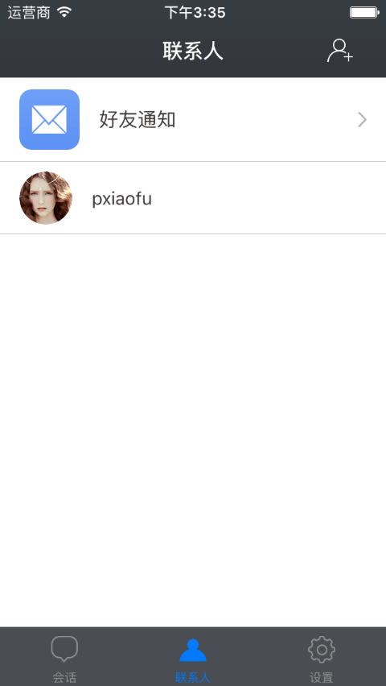
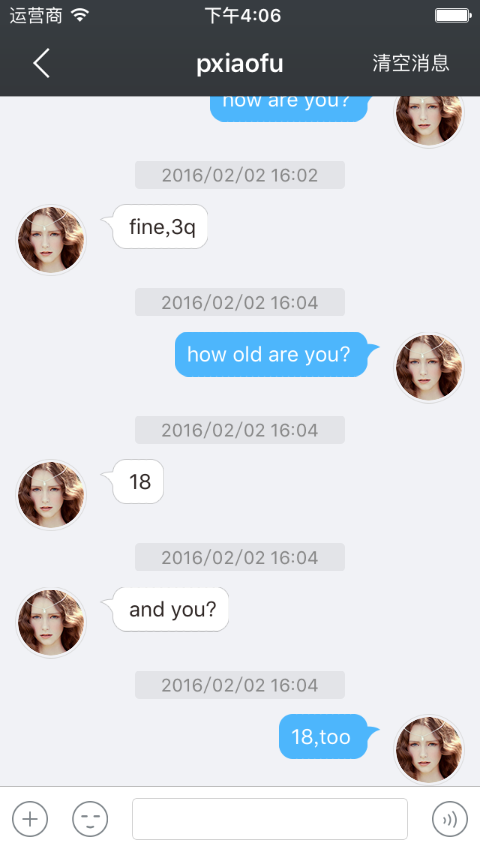
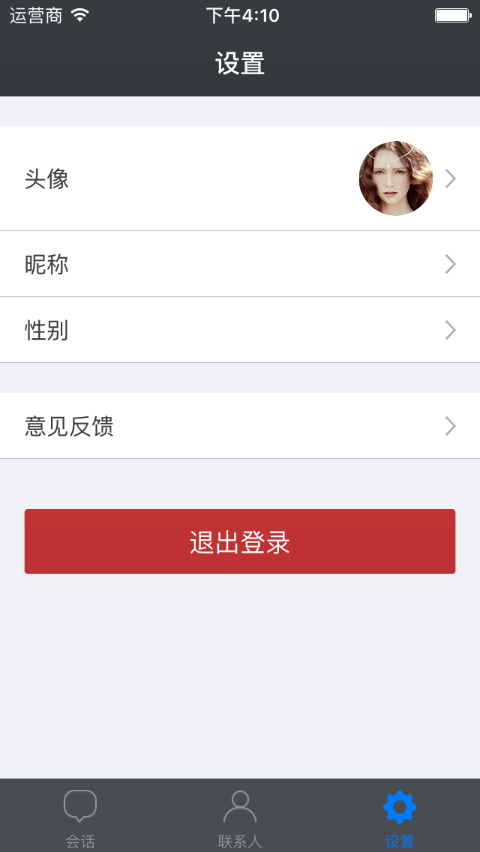

## 下载iOS_Demo

[点击这里下载demo（iOS）源码](https://github.com/pzee/BmobIM-Demo)

Bmob即时聊天demo包含了一个完整的即时通讯的App，功能包括：

1. 支持好友管理功能，包括添加好友、删除好友、获取好友列表，也可以与你已有的用户系统完全解耦；
2. 支持的消息类型：纯文本,语音,图片,自定义消息
3. 支持会话的本地化存储；


## iOS界面效果

### iOS联系人页面




### iOS会话页面


### iOS聊天页面



### iOS搜索联系人页面


### iOS设置页面



## iOSIM快速入门

### 下载安装BmobIMSDK
1. 通过官网下载新的BmobIMSDK
2. 新建项目将BmobIMSDK 复制到新的项目工程
3. 具体可以参照[Demo](https://github.com/pzee/BmobIM-Demo)

### 配置相关服务
如果需要用到推送服务，所以需要在管理后台上传对应Bundle ID的p12文件，请勿加密，
详细详细请参照：http://docs.bmob.cn/iospush/index.html?menukey=otherdoc&key=iospush

### 引入相关的库文件
如果项目中已包含BmobSDK数据服务SDK的话，可以不添加新的框架，如果没有则需添加SystemConfiguration.framework、CoreFoundation.framework、Foundation.framework、CFNetwork.framwork、CoreGraphics.framework、sqlite3.tbd

### 初始化
在你的XCode工程中的AppDelegate.m文件中,引入相关的头文件， 填入申请的授权Key（SDK使用的是应用密钥里的Application ID），示例如下：

`#import <BmobIMSDK/BmobIMSDK.h>`

```
- (BOOL)application:(UIApplication *)application didFinishLaunchingWithOptions:(NSDictionary *)launchOptions {
    // Override point for customization after application launch.
    //这里使用的是BmobSDK提供的用户系统，所以需要初始化BmobSDK
    [Bmob registerWithAppKey:@"Application ID"];
    
    self.sharedIM = [BmobIM sharedBmobIM];
    
    [self.sharedIM registerWithAppKey:@"Application ID"];
    
    [UIApplication sharedApplication].statusBarStyle = UIStatusBarStyleLightContent;
    
    BmobUser *user = [BmobUser getCurrentUser];
    //如果有用户了，不需要推送服务来推送消息的话，可以直接连接服务器
    if (user) {
        self.userId = user.objectId;
        [self connectToServer];
    }else{
    	//如果用户还未登录，则监听对应的通知，再进行处理
        [[NSNotificationCenter defaultCenter] addObserver:self selector:@selector(userLogin:) name:@"Login" object:nil];
        [[NSNotificationCenter defaultCenter] addObserver:self selector:@selector(userLogout:) name:@"Logout" object:nil];
    }
    
    self.sharedIM.delegate = self;
    
    
    
    
    return YES;
}
```

如果需要推送服务的话，可以在其相关代理那里设置调用 [self.sharedIM setupDeviceToken:@"xxxx"]的方法后，在连接服务器

```
-(void)application:(UIApplication *)application didFailToRegisterForRemoteNotificationsWithError:(nonnull NSError *)error{
    BmobUser *user = [BmobUser getCurrentUser];
    if (user) {
        [self connectToServer];
    }
    
}
```

```
-(void)application:(UIApplication *)application didRegisterForRemoteNotificationsWithDeviceToken:(NSData *)deviceToken{
		BmobUser *user = [BmobUser getCurrentUser];
	if (user) {
		//开发者自己将deviceToken转成字符串
		NSString *string = [[NSString alloc] initWithData:deviceToken encoding:NSUTF8StringEncoding];
		self.token = [[[string stringByReplacingOccurrencesOfString:@" " withString:@""] stringByReplacingOccurrencesOfString:@"<" withString:@""] stringByReplacingOccurrencesOfString:@">" withString:@""];
		[self connectToServer];   		
	}
}
```

登录的对应处理是

```
-(void)userLogin:(NSNotification *)noti{
    NSString *userId = noti.object;
    self.userId = userId;
    [self connectToServer];
}
```

退出登录的时候需要断开连接

```
-(void)userLogout:(NSNotification *)noti{
    [self.sharedIM disconnect];
}
```

连接服务器

```
-(void)connectToServer{
    [self.sharedIM setupBelongId:self.userId];
    [self.sharedIM setupDeviceToken:self.token];
    [self.sharedIM connect];
}
```

在应用进入前台或者后台的时候可以重新进行连接或者断开连接

进入前台

```
- (void)applicationWillEnterForeground:(UIApplication *)application {
    // Called as part of the transition from the background to the inactive state; here you can undo many of the changes made on entering the background.
   
    if (self.userId && self.userId.length > 0) {
        [self connectToServer];
    }
}

```

进入后台

```
- (void)applicationDidEnterBackground:(UIApplication *)application {
    // Use this method to release shared resources, save user data, invalidate timers, and store enough application state information to restore your application to its current state in case it is terminated later.
    // If your application supports background execution, this method is called instead of applicationWillTerminate: when the user quits.
    if ([self.sharedIM isConnected]) {
        [self.sharedIM disconnect];
    }
```

**需要说明的是，连接服务器建立一次即可，开发者自己控制连接服务器的时机。建立连接之前必须设置appKey和belongId，不然会抛出异常**

### 注册推送

可以在函数 `- (BOOL)application:(UIApplication *)application didFinishLaunchingWithOptions:(NSDictionary *)launchOptions` 添加推送的相关代码

```

   if (IS_iOS8) {
        //iOS8推送
        UIMutableUserNotificationCategory*categorys = [[UIMutableUserNotificationCategory alloc]init];
        categorys.identifier=@"BmobIMDemo";
        UIUserNotificationSettings*userNotifiSetting = [UIUserNotificationSettings settingsForTypes:(UIUserNotificationTypeAlert|UIUserNotificationTypeBadge|UIUserNotificationTypeSound)
                                                                                         categories:[NSSet setWithObjects:categorys,nil]];
        [[UIApplication sharedApplication]registerUserNotificationSettings:userNotifiSetting];
        [[UIApplication sharedApplication]registerForRemoteNotifications];
    }else{
        [application registerForRemoteNotificationTypes:UIRemoteNotificationTypeAlert | UIRemoteNotificationTypeBadge | UIRemoteNotificationTypeSound];
    }

```

### 接收消息

在初始化的部分，我们已经设置了self.sharedIM的delegate，我们只需要在对应的代理函数那里处理相关的应用逻辑即可。
在应用连接服务器的时候，SDK会主动的获取离线消息，并保存到本地数据库里面。在这里，开发者可能需要知道哪些人发来了消息，并且去下载相关人物信息。

```
-(void)didGetOfflineMessagesWithIM:(BmobIM *)im{
    //获取哪些人的消息还未读
    NSArray *objectIds = [self.sharedIM allConversationUsersIds];
    if (objectIds && objectIds.count > 0) {
        //Demo里面的方法去查找服务器相关人物的信息
        [UserService loadUsersWithUserIds:objectIds completion:^(NSArray *array, NSError *error) {
            if (array && array.count > 0) {
                //保存到本地数据库
                [self.sharedIM saveUserInfos:array];
                //发新用户的通知
                [[NSNotificationCenter defaultCenter] postNotificationName:kNewMessageFromer object:nil];
            }
        }];
    }
}
```

另一方面，已经连接到服务器上了，就可以收到别人发送过来的消息，这是需要在另一个方法处理

```
-(void)didRecieveMessage:(BmobIMMessage *)message withIM:(BmobIM *)im{
	//查看本地有无这个用户的信息
	BmobIMUserInfo *userInfo = [self.sharedIM userInfoWithUserId:message.fromId];
	if (!userInfo) {
		  //如果没有则去下载
	    [UserService loadUserWithUserId:message.fromId completion:^(BmobIMUserInfo *result, NSError *error) {
	        if (result) {
	        	//保存到本地数据库
	            [self.sharedIM saveUserInfo:result];
	            //发新用户的通知
	            [[NSNotificationCenter defaultCenter] postNotificationName:kNewMessageFromer object:nil];
	        }
	        //发接收到新信息的通知
	        [[NSNotificationCenter defaultCenter] postNotificationName:kNewMessagesNotifacation object:message];
	    }];
	}else{
		  //发接收到新信息的通知
	    [[NSNotificationCenter defaultCenter] postNotificationName:kNewMessagesNotifacation object:message];
	}
	}
```


### 用户管理

#### 注册

当用户还未进行注册的时候可以通过调用方法来进行简单的注册

```
	BmobUser *user = [[BmobUser alloc] init];
	user.username = self.usernameTextField.text;
	user.password = self.passwordTextField.text;
	    
	    
	[user signUpInBackgroundWithBlock:^(BOOL isSuccessful, NSError *error) {
	    if (isSuccessful) {
	        [[NSNotificationCenter defaultCenter] postNotificationName:@"Login" object:user.objectId];
	        [self dismissViewControllerAnimated:YES completion:nil];
	    }else{
	        [self showInfomation:error.description];
	    }
	}];
```

#### 登录
用户已经注册了，想要在此应用登录的话，可以直接调用登录的方法

```
	[self showLoading];
	[BmobUser loginWithUsernameInBackground:self.usernameTextField.text password:self.passwordTextField.text block:^(BmobUser *user, NSError *error) {
	    if (user) {
	        [self hideLoading];
	        [[NSNotificationCenter defaultCenter] postNotificationName:@"Login" object:user.objectId];
	        [self dismissViewControllerAnimated:YES completion:nil];
	    }else{
	        [self showInfomation:error.description];
	    }
	}];
```

#### 获取好友列表

```
-(void)loadUserFriends{
    [UserService friendsWithCompletion:^(NSArray *array, NSError *error) {
        if (error) {
            [self showInfomation:error.localizedDescription];
        }else{
            BmobUser *loginUser = [BmobUser getCurrentUser];
            NSMutableArray *result  = [NSMutableArray array];
            for (BmobObject *obj in array) {
               
                BmobUser *friend = nil;
                if ([[(BmobUser *)[obj objectForKey:@"user"] objectId] isEqualToString:loginUser.objectId]) {
                    friend = [obj objectForKey:@"friendUser"];
                }else{
                    friend = [obj objectForKey:@"user"];
                }
                BmobIMUserInfo *info = [BmobIMUserInfo userInfoWithBmobUser:friend];
                
                [result addObject:info];
            }
            if (result && result.count > 0) {
                [self.userArray setArray:result];
                [self.tableView reloadData];
                
            }
            
        }
    }];
}
```

#### 添加好友

```
-(void)addFriend{
    [UserService addFriendNoticeWithUserId:self.userInfo.userId completion:^(BOOL isSuccessful, NSError *error) {
        if (error) {
            [self showInfomation:error.localizedDescription];
        }else{
            [self showInfomation:@"已发送添加好友请求"];
        }
    }];
}
```

### 消息发送

通过IMSDK，用户可以与陌生人聊天，也可以与好友聊天，这个由开发者自由控制。当需要发起聊天的时候，需要建立起一个BmobIMConversation对象来进行管理，SDK提供了方法来快速构建BmobIMConversation对象。

```
//
BmobIMConversation *conversation = [BmobIMConversation conversationWithId:self.userInfo.userId conversationType:BmobIMConversationTypeSingle];
conversation.conversationTitle = self.userInfo.name;
```
#### 查看聊天记录

进入聊天页面是，开发者可能需要让用户查看最近的聊天记录，这个时候可以通过BmobIMConversation 类提供的

`-(NSArray *)queryMessagesWithMessage:(BmobIMMessage *)message  limit:(int)limit;`来处理这个需求。

例如，加载第一页数据的时候，只需要将message设置为nil，即可获取到

```
-(void)loadMessageRecords{
	NSArray *array = [self.conversation queryMessagesWithMessage:nil limit:10];
	    
	if (array && array.count > 0) {
		//排序
		NSArray *result = [array sortedArrayUsingComparator:^NSComparisonResult(BmobIMMessage *obj1, BmobIMMessage *obj2) {
			if (obj1.updatedTime > obj2.updatedTime) {
			    return NSOrderedDescending;
			}else if(obj1.updatedTime <  obj2.updatedTime) {
			    return NSOrderedAscending;
			}else{
			    return NSOrderedSame;
			}
		    
		}];
		[self.messagesArray setArray:result];
		[self.tableView reloadData];
		    
		[self.tableView scrollToRowAtIndexPath:[NSIndexPath indexPathForRow:self.messagesArray.count-1 inSection:0] atScrollPosition:UITableViewScrollPositionBottom animated:YES];
	}
}
```

加载之前的历史消息记录，可以通过将message参数设置为时间为最后一条消息即可

```
-(void)loadMoreRecords{
    if (!self.finished) {
        self.page ++;
        [self.freshControl beginRefreshing];
        
        if (self.messagesArray.count <= 0) {
            [self.freshControl endRefreshing];
            return;
        }
        BmobIMMessage *msg = [self.messagesArray firstObject];
        
        NSArray *array = [self.conversation queryMessagesWithMessage:msg limit:10];
        
        if (array && array.count > 0) {
            NSMutableArray *messages = [NSMutableArray arrayWithArray:self.messagesArray];
            [messages addObjectsFromArray:array];
            //排序
            NSArray *result = [messages sortedArrayUsingComparator:^NSComparisonResult(BmobIMMessage *obj1, BmobIMMessage *obj2) {
                if (obj1.updatedTime > obj2.updatedTime) {
                    return NSOrderedDescending;
                }else if(obj1.updatedTime <  obj2.updatedTime) {
                    return NSOrderedAscending;
                }else{
                    return NSOrderedSame;
                }
                
            }];
            [self.messagesArray setArray:result];
            [self.tableView reloadData];
        }else{
            self.finished = YES;
            [self showInfomation:@"没有更多的历史消息"];
        }
        
    }else{
        [self showInfomation:@"没有更多的历史消息"];
    }
    
    [self.freshControl endRefreshing];
}
```

#### 发送消息

**发送文本消息**

```
-(void)sendTextWithTextField:(UITextField *)textField{
    if (textField.text.length == 0) {
        [self showInfomation:@"请输入内容"];
    }else{
        //创建BmobIMTextMessage对象
        BmobIMTextMessage *message = [BmobIMTextMessage messageWithText:textField.text attributes:nil];
		 //聊天类型设置为单聊
        message.conversationType =  BmobIMConversationTypeSingle;
        message.createdTime = (uint64_t)([[NSDate date] timeIntervalSince1970] * 1000);
        message.updatedTime = message.createdTime;
        [self.messagesArray addObject:message];
        [self.tableView reloadData];
        self.bottomView.textField.text = nil;
        [self.tableView scrollToRowAtIndexPath:[NSIndexPath indexPathForRow:self.messagesArray.count-1 inSection:0] atScrollPosition:UITableViewScrollPositionBottom animated:YES];
        __weak typeof(self)weakSelf = self;
        [self.conversation sendMessage:message completion:^(BOOL isSuccessful, NSError *error) {
            [weakSelf.tableView reloadRowsAtIndexPaths:@[[NSIndexPath indexPathForRow:self.messagesArray.count-1 inSection:0]] withRowAnimation:UITableViewRowAnimationFade];
        
        }];
        
    }
}
```

**发送图片**

发送图片消息的流程是通过把拍照或者图片的内容，转成Data，然后通过Bmob文件上传接口来上传文件，获取到相关的信息（文件地址之类的），再构造对应的BmobIMImageMessage对象来发送消息。

Demo封装了一个直接传入image就能发送图片的方法

```
+(void)uploadImage:(UIImage *)image
        completion:(uploadBlock)block
          progress:(BmobProgressBlock)progressBlock;
```
然后可以直接调用方法来发送图片，并在当前页显示出来

```
[MessageService uploadImage:resizeImage completion:^(BmobIMImageMessage *message, NSError *error) {
        if (!error) {
            [self.messagesArray addObject:message];
            [self scrollToBottom];
             __weak typeof(self)weakSelf = self;
            
            [self.conversation sendMessage:message completion:^(BOOL isSuccessful, NSError *error) {
                [weakSelf reloadLastRow];
            }];
        }else{
            [self showInfomation:error.localizedDescription];
        }
    } progress:^(CGFloat progress) {
        [self showProgress:progress];
    }];

```

**发送语音文件**

发送语音消息的流程是把录音下载的Data转成AMR格式，保存在本地，然后通过Bmob文件上传接口来上传文件，获取到相关的信息（文件地址之类的），再构造对应的BmobIMAudioMessage对象来发送消息。

Demo封装了一个直接传入NSData就能发送语音文件的方法

```
+(void)uploadAudio:(NSData *)data
                          duration:(CGFloat)duration
                        completion:(uploadBlock)block
                          progress:(BmobProgressBlock)progressBlock
```

直接调用这个方法就能发送语音文件

```
[MessageService uploadAudio:data
                           duration:duration
                         completion:^(BmobIMAudioMessage *message, NSError *error) {
                             if (!error) {
                               
                                 [self.messagesArray addObject:message];
                                 [self scrollToBottom];
                                 __weak typeof(self)weakSelf = self;
                                 [self.conversation sendMessage:message completion:^(BOOL isSuccessful, NSError *error) {
                                     [weakSelf reloadLastRow];
                                 }];
                             }
                         } progress:nil];
```

**发送其他文件消息**

当开发者需要发送其他类型的文件消息的时候，先要继承BmobIMFileMessage类，通过BmobSDK提供的文件上传接口，把文件上传至服务器上，获取到url，再去创建对应的对象。
这里的流程可以参照发送图片，发送语音的相关源代码。当然了，开发者也必须指定其msgType属性，好让应用可以根据这个属性来显示相应的视图。


**发送位置**

```
BmobIMLocationMessage *message = [BmobIMLocationMessage messageWithAddress:@"广州大学城" attributes:@{KEY_METADATA:@{KEY_LATITUDE:@(23.039),KEY_LONGITUDE:@(113.388)}}];
    message.conversationType =  BmobIMConversationTypeSingle;
    message.createdTime = (uint64_t)([[NSDate date] timeIntervalSince1970] * 1000);
    message.updatedTime = message.createdTime;
    [self.messagesArray addObject:message];
    [self scrollToBottom];
    
    __weak typeof(self)weakSelf = self;
   
    [self.conversation sendMessage:message completion:^(BOOL isSuccessful, NSError *error) {
        [weakSelf reloadLastRow];
    }];
```

**发送自定义消息**

开发者也可以发送自定义消息(需继承BmobIMMessage)，例如添加好友的请求，当前聊天对象正在输入之类的消息，这种暂态的消息是不需要存储在数据库的，需要设置extra{KEY_IS_TRANSIENT:@(YES),...}。其他额外信息开发者可以自由设置

例如发送添加好友通知，这种消息是暂时的，不需要保存到数据库里面，可以这样构造

```
    BmobIMMessage *message = [[BmobIMMessage alloc] init];
    message.msgType = @"notice";
    message.conversationType = BmobIMConversationTypeSingle;
    message.extra = @{KEY_IS_TRANSIENT:@(YES)};
    message.content = @"添加好友";
    [self.conversation sendMessage:message completion:^(BOOL isSuccessful, NSError *error) {
        NSLog(@"error %@",error.localizedDescription);
    }];
```
#### 接收消息

在上一个大章节 接收消息 那里，我们已经把接收到的消息用通知的形式广播出来，我们只需要在聊天页面添加观察者来监听通知就行了。
在Demo里在函数`- (void)viewDidLoad `

```
[[NSNotificationCenter defaultCenter] addObserver:self selector:@selector(receiveMessage:) name:kNewMessagesNotifacation object:nil];
```

在`-(void)receiveMessage:(NSNotification *)noti`进行对应的处理

```
-(void)receiveMessage:(NSNotification *)noti{
    BmobIMMessage *message = noti.object;
    //如果是消息来源是当前聊天用户，就将其加载到内存里并显示出来
    if ([message.fromId isEqualToString:self.conversation.conversationId]) {
        [self.messagesArray addObject:message];
        [self.tableView reloadData];
        [self.tableView scrollToRowAtIndexPath:[NSIndexPath indexPathForRow:self.messagesArray.count-1 inSection:0] atScrollPosition:UITableViewScrollPositionBottom animated:YES];
    }
    
}
```

