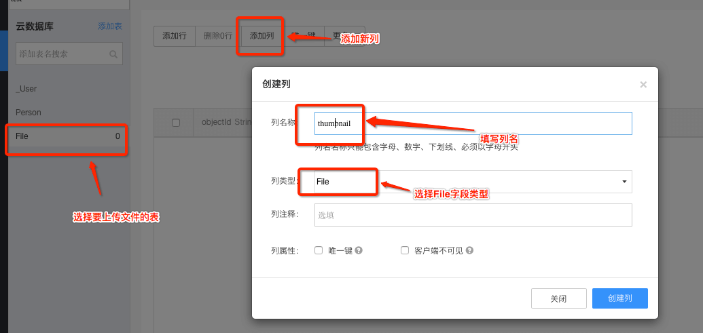

## 平台常见问题

Q:Bmob有哪些优势
A:
1.在很大程度上加快了用户产品的开发速度；对后端的支持让用户有更多的时间关注用户体验方面的设计。   
2.为用户节省了服务端人员的配备和服务器租借，节省了很多成本。    
3.在游戏方面，Bmob云端数据库保存玩家游戏数据，操作非常简单，用Api可以直接操作云端数据库。

---

Q:Bmob有后台介绍视频吗
A:
感谢Bmob用户为我们的后台录制了视频。    
视频地址：[使用 Bmob 搭建我们的第一个后端云 APP](http://www.jikexueyuan.com/course/2208.html)

其它的基础视频：[点击查看入门教程](http://pan.baidu.com/s/1nhPkq)

---
Q:Bmob支持多少用户同时在线存储查询
A:一个APP支持10w+读并发，5w+写并发

---

Q:服务器端运行在什么环境下
A:北京BGP c机房 

---

Q:你们的平台稳定吗
A:Bmob采用南北双线，多路分流的方式，将服务器部署在国内外主流的大型服务器提供商中。部署时采用7层负载均衡技术，确保每个节点机房都能够承受大量的并发请求。而每个应用之间采用`Docker`容器虚拟化，确保应用之间的安全隔离性。自2013年7月创立至今，团队积累了大量的运维和服务经验，确保平台的稳定服务。 

---

Q:数据放在云端安全吗
A:
1.首先，数据在传输过程中采用了`requestId` + `timestamp` + `Application Key`的一次性对称加密算法和服务端主动防御的技术，确保数据在传输过程中能够不被`Fiddler`、`Wireshark`等抓包工具恶意抓取进行分析破坏。
2.应用之间除采用Docker虚拟化之外，系统还定期/实时做了3级容灾备份，确保数据的可用性。
3.在软件架构层面，Bmob提供了应用层次、表层次、ACL、角色、IP白名单、签名等多种安全控制方式。如果你想更深入了解Bmob的安全架构，可以详细查看我们的[数据安全文档](http://docs.bmob.cn/other/Other/n_datasafety/doc/index.html)。

---

Q:Bmob支持国外数据访问吗
A:根据用户反馈，东南亚跟北美那边的访问速度还是可以的。欧洲那边的话，就我们的数据来看那边的访问量不是很高，但是可以访问。

---

Q:你们的SDK会不会有广告
A:没有，我们不做广告业务，SDK是非常纯净的，不会恶意嵌入广告的。

---

Q:你们支持什么平台
A:
1.Android、iOS和WP三种主流的移动操作系统平台
2.Cocos2d-x和Unity两种主流的游戏引擎
3.Js支持HTML5移动开发
4.C#、php、Java支持PC端开发
5.Restful开放API接口（可使用任何语言开发）

---

Q:不同SDK的数据是否打通
A:当然！本质上，所有的SDK都是基于Restful开发，数据是完全打通的。

---

Q:我想迁移数据到Bmob,但是user表如何迁移呢
A:调用restapi的注册接口来插入数据就行

---

Q:Bmob怎么用做HTML5的数据管理后台
A:你可以用js sdk来开发对应的html5页面，开发好之后联系我们客服，我们帮你把h5页面放到你的bmob子域名中去，给用户访问。

---

Q:如何联系Bmob技术和商务
A:
技术客服QQ：[2093289624](http://wpa.qq.com/msgrdv=3&uin=2093289624&site=qq&menu=yes)
商务QQ：[2499654572](http://wpa.qq.com/msgrdv=3&uin=2499654572&site=qq&menu=yes)
商务合作邮件：partner@bmob.cn
技术沙龙邮件：event@bmob.cn

---

## Web开发者后台相关问题

Q:如何在Web后台上传文件
A:
Bmob提供了一种非常简单的文件上传的方法：

1.在Web后台中点击进入应用程序的控制面板中，如下图所示，选择需要用到文件的表，然后点击“添加一列”按钮，这时，弹出一个“添加新的表字段”的对话框。在这个对话框中，请输入字段名称，选择字段类型（**注意：请选择File类型**）。

2.现在，你就可以快速上传文件了：点击“添加一行”按钮，在File字段中点击“Upload File”就可以直接上传文件。如下图所示。如果想要上传更多的文件，可以重复第二步操作。

---

Q:为什么导入CSV数据之后是乱码
A:
请先将导入的数据编码转换为“UTF-8无BOM格式编码”之后再上传（转换为UTF-8编码的一个简单方法是：用[Notepad++](http://notepad-plus-plus.org/)打开要导入的CSV文件，然后点击“格式->以UTF-8无BOM格式编码”菜单）。

---

Q:为什么导出的CSV数据显示乱码
A:
导出的文件请以“UTF-8无BOM格式编码”格式打开查看(可使用[Notepad++](http://notepad-plus-plus.org/)打开CSV文件，然后点击“格式->以UTF-8无BOM格式编码”菜单)，如果用excel直接打开可能出现中文乱码！

---

Q:能提供一个CSV文件参考下吗
A:
[点击这里下载CSV文件模版](http://static.bmob.cn/new/developmentdoc/appdemo/bmobtest.csv)

使用方法：Web后台->创建应用->创建表->导入数据->选择这个CSV文件

---

Q:能直接在Web后台上传文件吗
A:可以，先在表中创建需要File类型的字段，然后新增一条记录就可以直接在Web端上传文件了。

---

Q:我如何修改Bmob上的表名及列名
A:不能修改，考虑发布后的APP会由于修改表名和列名而造成无法使用的问题。开发过程中可以通过删除再创建达到目的。

---

Q:导出数据表中的数据时可以自定义字段吗
A:可以的。开发者后台->数据浏览->更多->导出数据，可以选择导出需要的列。

---

Q:能通过在控制台添加Relation的数据吗
A:可以，你可以点击relation字段，进去之后添加数据

---

Q:如何获取_User表中的password
A:Bmob没有提供直接获取密码的方法。如果直接可以获取密码的话，会存在安全隐患的。如果非要这样做，你可以新增一个字段，记录明文的密码。

---

Q:Bmob中支持的String最大容量是多少
A:4M

---

Q:能不能设置主键
A:可以，存在重复值会留下最早创建的记录，其它的删除。

---

Q:创建了数据库，可以在后台直接添加数据吗
A:可以

---

Q:我想在eclipse用Java web开发，使用struts2框架，然后后台数据库用bmob可以实现吗，需要下载什么东西
A:可以使用java sdk或者自己封装，通过https调用restful接口

---

Q:web端上传文件最大支持多少
A:控制台上传的文件最大为50M

---

Q:新建一张表添加字段为Relation，只能重新添加数据吗
A:Web操作是这样的，但你可以用SDK，通过代码来实现数据的关联。

---

Q:后台能不能支持批量上传文件？
A:不支持，可以自己编写脚本完成。

---

Q:http请求如何访问bomb
A:可以使用restful接口进行访问。

---

Q:ie8下引用 bmob-min.js 出现 “缺少标识符、字符串或数字” 错误
关注
A:ie8不支持html5

---

Q:angularJS如何与bmob配合使用
A:可以使用我们的JS SDK或者是使用angularJS的网络请求使用restful接口进行请求

---

Q:登录问题 能否实现只有通过验证的用户才能登
A:登陆成功之后，你再获取当前的登陆信息，判断这个verified字段是否为true，这样就可以实现你的想法了。

---

Q:Bmob可以做微信公众平台的数据后台么
A:可以

---

Q:数据导出不带objectid 字段吗
A:这个问题我们持续跟进，因为我们无法保证objectId不被用户修改，所以大家开发的时候就没有支持导出objectId了，之后看看怎么解决这个问题。

---

Q:请问服务器上的表名和列名可以修改吗？
A:不能修改，考虑发布后的APP会由于修改表名和列名而造成无法使用的问题。
开发过程中可以通过删除再创建达到目的的。

---

Q:可以在PC端写tool来操作服务器数据?
A:可以，使用restful接口

---

Q:API请求数是实时统计更新的吗？
A:不是的，API请求数一天统计一次，每天凌晨3点进行统计。

## APP官网相关问题

Q:APP官网的一些案例
A:
[http://bikenavi.bmob.site/](http://bikenavi.bmob.site/)
[http://drive.bmob.site/](http://drive.bmob.site/)
[http://qlslylq.bmob.site/](http://qlslylq.bmob.site/)

---

Q:不使用SDK也可以创建APP官网吗
A:是的。APP官网是我们为开发者提供的扩展服务，与SDK、云数据库、文件服务等其他业务没有任何联系，完全是耦合的关系。
使用APP官网的流程如下：注册进入官网->创建应用->点击“应用官网”->输入你想要的域名->选择模版->编辑保存。

---

Q:官网修改后怎么没有立即生效
A:我们采用生成静态文件的方式，生成和同步到泛域名服务器需要30秒的时间，请耐心等待。

---

Q:能使用其他域名吗
A:可以。但需要提交一些材料给我们（具体材料需要先联系我们的客服QQ），提交到工信部进行备案。

---

Q:怎么知道我的域名是否备案
A:登录网站 [http://www.miitbeian.gov.cn/publish/query/indexFirst.action ](http://www.miitbeian.gov.cn/publish/query/indexFirst.action ) 按操作查询即可

---

