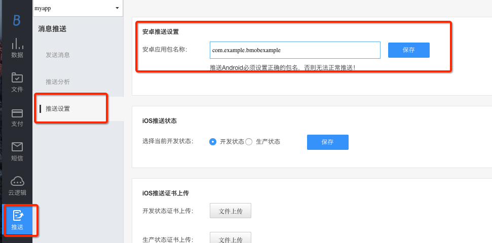
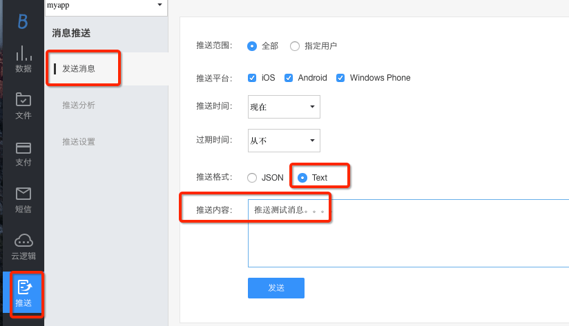

## 1、BmobPush SDK 简介
推送能够让你和你的应用保持联系，你可以快速而有效地通知到所有的用户，下面这个教程将会教你如何使用BmobPush SDK来推送消息。请确保您在使用BmobPush SDK之前已经了解此文档，如有疑问请加Push使用交流群[182897507]()咨询。

## 2、BmobPush SDK 集成

### 2.1、集成SDK

| SDK或Demo     | 下载地址          |
|------------------------------|--------------------------------|
| 数据服务 SDK| 使用最新版本v3.5.7，集成方式请见下方的自动集成方式。手动集成下载地址：[https://www.bmob.cn/downloads](https://www.bmob.cn/downloads)|
| 消息推送 SDK| 使用最新版本v1.0.1，集成方式请见下方的自动集成方式。手动集成下载地址：[https://www.bmob.cn/downloads](https://www.bmob.cn/downloads)|  
| 消息推送 Demo| [https://github.com/chaozhouzhang/bmob-push-demo](https://github.com/chaozhouzhang/bmob-push-demo)|

自动集成方式：

1、配置project下的build.gradle文件：
```gradle
allprojects {
    repositories {
        jcenter()
        //Bmob的maven仓库地址
        maven { url "https://raw.github.com/bmob/bmob-android-sdk/master" }
    }
}
```
2、配置app下的build.gradle文件：
```gradle
dependencies {
    //Bmob的数据服务SDK
    compile 'cn.bmob.android:bmob-sdk:3.5.7'
    //Bmob的消息推送SDK
    compile 'cn.bmob.android:bmob-push:1.0.1'
}
```
### 2.2、配置AndroidManifest.xml
#### 2.2.1、在您的应用程序AndroidManifest.xml文件中添加相应的权限
请注意在Android 6.0版本开始某些权限需要动态获取，详情请看Android Developwers官方文档，[android-6.0-changes](http://developer.android.com/intl/zh-cn/about/versions/marshmallow/android-6.0-changes.html)和[android-7.0-changes](https://developer.android.google.cn/about/versions/nougat/android-7.0-changes.html)。

```xml
    <!--TODO 集成：1.1、添加数据SDK和推送SDK需要的权限-->
    <!--比目数据SDK所需的权限-->
    <!--允许联网 -->
    <uses-permission android:name="android.permission.INTERNET" />
    <!--获取GSM（2g）、WCDMA（联通3g）等网络状态的信息  -->
    <uses-permission android:name="android.permission.ACCESS_NETWORK_STATE" />
    <!--获取wifi网络状态的信息 -->
    <uses-permission android:name="android.permission.ACCESS_WIFI_STATE" />
    <!--保持CPU 运转，屏幕和键盘灯有可能是关闭的,用于文件上传和下载 -->
    <uses-permission android:name="android.permission.WAKE_LOCK" />
    <!--获取sd卡写的权限，用于文件上传和下载-->
    <uses-permission android:name="android.permission.WRITE_EXTERNAL_STORAGE" />
    <!--允许读取手机状态 用于创建BmobInstallation-->
    <uses-permission android:name="android.permission.READ_PHONE_STATE" />


    <!--推送所需的权限-->
    <uses-permission android:name="android.permission.RECEIVE_USER_PRESENT" />
    <uses-permission android:name="android.permission.RECEIVE_BOOT_COMPLETED" />
```

#### 2.2.2、在您的应用程序AndroidManifest.xml文件中注册BmobPush SDK运行所需的推送服务和消息接收器

```xml
  <!--TODO 集成：1.2、添加推送所需要的服务和广播-->
	<service
	    android:label="PushService"
		android:name="cn.bmob.push.lib.service.PushService"
		android:process=":bmobpush"
		android:exported="true">
	     <intent-filter>
	         <action android:name="cn.bmob.push.lib.service.PushService"/>
	     </intent-filter>
	</service>

	<!-- 用于进程保活 -->
    <service
        android:name="cn.bmob.push.lib.service.PushNotifyService"
        android:process=":bmobpush" >
    </service>
	
	<receiver android:name="cn.bmob.push.PushReceiver" >
	    <intent-filter>
	        <!-- 系统启动完成后会调用 -->
	        <action android:name="android.intent.action.BOOT_COMPLETED" />               
	        <!-- 解锁完成后会调用 -->
	        <action android:name="android.intent.action.USER_PRESENT" />
	        <!-- 监听网络连通性 -->
	        <action android:name="android.net.conn.CONNECTIVITY_CHANGE" />               
	    </intent-filter>
	</receiver>

	<!-- 第3步中创建的消息接收器，在这里进行注册 -->
	<receiver android:name="your.package.MyPushMessageReceiver">
	     <intent-filter >
	          <action android:name="cn.bmob.push.action.MESSAGE"/>
	     </intent-filter>
	</receiver>

	<!-- 接收心跳和唤醒的广播，要和PushService运行在同个进程 -->
    <receiver
         android:name="cn.bmob.push.PushNotifyReceiver"
         android:process=":bmobpush" >
         <intent-filter>
             <!-- 接收心跳广播的action -->
             <action android:name="cn.bmob.push.action.HEARTBEAT" />
             <!-- 接收唤醒广播的action -->
             <action android:name="cn.bmob.push.action.NOTIFY" />
         </intent-filter>
    </receiver>
```
### 2.3、配置代码
#### 2.3.1、在你的应用程序中创建一个消息接收器

Push消息通过`action=cn.bmob.push.action.MESSAGE`的Intent把数据发送给客户端`your.package.MyPushMessageReceiver`,消息格式由应用自己决定，PushService只负责把服务器下发的消息以字符串格式透传给客户端。

`your.package.MyPushMessageReceiver`的代码示例如下：

```java
//TODO 集成：1.3、创建自定义的推送消息接收器，并在清单文件中注册
public class MyPushMessageReceiver extends BroadcastReceiver{

	@Override
	public void onReceive(Context context, Intent intent) {
		// TODO Auto-generated method stub
		if(intent.getAction().equals(PushConstants.ACTION_MESSAGE)){
			Log.d("bmob", "客户端收到推送内容："+intent.getStringExtra("msg"));
		}
	}
	
}
```

#### 2.3.2、启动推送服务

在你的应用程序主Application中调用如下方法：

```java
//TODO 集成：1.4、初始化数据服务SDK、初始化设备信息并启动推送服务
// 初始化BmobSDK
Bmob.initialize(this, "你的Application Id");
// 使用推送服务时的初始化操作
BmobInstallationManager.getInstance().initialize(new InstallationListener<BmobInstallation>() {
            @Override
            public void done(BmobInstallation bmobInstallation, BmobException e) {
                if (e == null) {
                    Logger.i(bmobInstallation.getObjectId() + "-" + bmobInstallation.getInstallationId());
                } else {
                    Logger.e(e.getMessage());
                }
            }
        });
// 启动推送服务
BmobPush.startWork(this);
```
代码中的"你的Application Id"就是你在Bmob后台中创建的应用程序的Application Id，如果你不知道这是什么，可以参考[快速入门文档](https://docs.bmob.cn/data/Android/a_faststart/doc/index.html)中的注册Bmob账号部分。

## 3、控制台推送消息给客户端
### 3.1、推送设置

在应用面板-->消息推送-->推送设置界面中填写包名进行保存。


### 3.2、推送消息

完成设置后，你可以运行应用程序，从控制台送一条消息给客户端。


### 3.3、推送注意事项
在后台推送消息给Android和iOS两个平台的时候，有一些需要注意的：
1、由于Android和iOS的提送机制不同，iOS要经过APNS，Android的推送完全是走Bmob的长连接服务，为兼容这个问题，如果你选择发送格式为“json”格式时，需要添加APNS兼容头部（见下面json的aps部分），其中，sound是iOS接收时的声音，badge是iOS通知栏的累计消息数，推送内容格式如下：

```
{
	"aps": {
	"sound": "cheering.caf", 
	"alert": "这个是通知栏上显示的内容", 
	"badge": 0 
	}, 
	"xx" : "json的key-value对，你可以根据情况添加更多的，客户端进行解析获取", 
}
```

2、如果你选择发送格式为“text”时，推送内容为“推送消息测试”，Bmob会自动添加aps部分发送给APNS，，相当于自动生成如下的json格式的推送内容：

```
{
	"aps": {
		"alert": "推送消息测试", 
	}
}
```
同时，也会发送给Android端，相当于自动生成如下的json格式的推送内容：

```
{
	"alert" : "推送消息测试", 
}
```

3、如果只是发送给Android端，大家可以自定义json格式的数据。

4、由于iOS的APNS的推送的大小是有限制的，默认最多256bytes，因此,如果你需要跨平台互通的话，需注意推送的内容不要太长。


# 4、BmobPush SDK 的使用


## 4.1、初始化设备信息
每一个Bmob的App被安装在用户的设备上后，如果要使用消息推送功能，Bmob Data SDK会自动生成一个Installation对象，它包含了推送所需要的所有信息。

举例：一个棒球的App，你可以让用户订阅感兴趣的棒球队，然后及时将这个球队的消息推送给用户。
您可以使用 BmobSDK，通过 **BmobInstallationManager** 对**BmobInstallation**进行一系列操作，就像你存储和获取其他的普通对象一样。

BmobInstallation对象有几个系统默认的特殊字段来帮助你进行设备定位的管理：

| 字段名称     | 解释         |
|------------------------------|--------------------------------|
| channels| 当前这个设备订阅的渠道名称数组|  
| timeZone| 设备所在位置的时区， 如Asia/Shanghai，这个会在每个BmobInstallation对象更新时同步（只读）|
| deviceType| 设备的的类型, 值为："ios" 或 "android" (只读)|
| installationId| Bmob使用的设备唯一号 (只读)| 


使用消息推送前，首先需要初始化设备信息。

```java
BmobInstallationManager.getInstance().initialize(new InstallationListener<BmobInstallation>() {
            @Override
            public void done(BmobInstallation bmobInstallation, BmobException e) {
                if (e == null) {
                    Logger.i(bmobInstallation.getObjectId() + "-" + bmobInstallation.getInstallationId());
                } else {
                    Logger.e(e.getMessage());
                }
            }
        });
```

## 4.2、自定义Installation表

开发者如果想要为设备信息表增加其他属性，则可以通过继承BmobInstallation类的方式来完成，用来定制更通用的推送。

举例：

```java
public class Installation extends BmobInstallation {

    private User user;
    private BmobGeoPoint location;


    public User getUser() {
        return user;
    }

    public void setUser(User user) {
        this.user = user;
    }

    public BmobGeoPoint getLocation() {
        return location;
    }

    public void setLocation(BmobGeoPoint location) {
        this.location = location;
    }
}
```

那么如何更新增加的`uid`字段的值呢？

**具体思路：先将当前设备查询出来，之后调用`update`方法更新该值**

示例如下：

```java
    /**
     * 修改设备表的用户信息：先查询设备表中的数据，再修改数据中用户信息
     * @param user
     */
    private void modifyInstallationUser(final User user) {
        BmobQuery<Installation> bmobQuery = new BmobQuery<>();
        final String id = BmobInstallation.getInstallationId(mContext);
        bmobQuery.addWhereEqualTo("installationId", id);
        bmobQuery.findObjectsObservable(Installation.class)
                .subscribe(new Action1<List<Installation>>() {
                    @Override
                    public void call(List<Installation> installations) {

                        if (installations.size() > 0) {
                            Installation installation = installations.get(0);
                            installation.setUser(user);
                            installation.updateObservable()
                                    .subscribe(new Action1<Void>() {
                                        @Override
                                        public void call(Void aVoid) {
                                            toastI("更新设备用户信息成功！");
                                        }
                                    }, new Action1<Throwable>() {
                                        @Override
                                        public void call(Throwable throwable) {
                                            toastE("更新设备用户信息失败：" + throwable.getMessage());
                                        }
                                    });

                        } else {
                            toastE("后台不存在此设备Id的数据，请确认此设备Id是否正确！\n" + id);
                        }

                    }
                }, new Action1<Throwable>() {
                    @Override
                    public void call(Throwable throwable) {
                        toastE("查询设备数据失败：" + throwable.getMessage());
                    }
                });
    }
```


## 4.3、频道的订阅和退订

### 4.3.1、订阅频道

订阅频道可使用 **subscribe** 方法

```java
BmobInstallationManager.getInstance().subscribe(Arrays.asList("NBA", "CBA", "IJK", "NBA", "CBA", "USA"), new InstallationListener<BmobInstallation>() {
                    @Override
                    public void done(BmobInstallation bmobInstallation, BmobException e) {
                        if (e == null) {
                            toastI("批量订阅成功");
                        } else {
                            toastE(e.getMessage());
                        }
                    }
                });
```

Bmob SDK对频道订阅增加去重操作，也就是说：即使你调用subscribe方法订阅了多个相同的频道，Bmob只会记录一个频道。


### 4.3.2、退订频道

退订频道可使用 **unsubscribe** 方法

```java
BmobInstallationManager.getInstance().unsubscribe(Arrays.asList("CBA", "USA"), new InstallationListener<BmobInstallation>() {
                    @Override
                    public void done(BmobInstallation bmobInstallation, BmobException e) {
                        if (e == null) {
                            toastI("批量取消订阅成功");
                        } else {
                            toastE(e.getMessage());
                        }
                    }
                });
```

### 4.3.3、获取已经订阅的频道
获取已经订阅的频道可以使用**getCurrentInstallation()**方法
```java
BmobInstallation bmobInstallation = BmobInstallationManager.getInstance().getCurrentInstallation();
                List<String> channels = bmobInstallation.getChannels();
                if (channels.size() < 1) {
                    toastI("您没有订阅任何频道！");
                } else {
                    for (String channel : channels) {
                        mTvChannel.append(channel + "\n");
                    }
                }
```

## 4.4、客户端广播推送消息

和控制台推送消息给客户端一样，在客户端推送消息也需要进行推送的包名设置，请在应用面板-->消息推送-->推送设置界面中填写包名进行保存。

在客户端实现推送消息的功能，通过 **BmobPushManager** 对象来完成，比如给所有设备推送消息：
```java
    BmobPushManager bmobPushManager = new BmobPushManager();
    bmobPushManager.pushMessageAll("消息内容", new PushListener() {
        @Override
        public void done(BmobException e) {
            if (e==null){
                Logger.e("推送成功！");
            }else {
                Logger.e("异常：" + e.getMessage());
            }
        }
    });
```

## 4.5、客户端组播推送消息

```java
                BmobPushManager bmobPushManager = new BmobPushManager();
                BmobQuery<BmobInstallation> query = BmobInstallation.getQuery();
                List<String> channels = new ArrayList<>();
                //TODO 替换成你需要推送的所有频道，推送前请确认已有设备订阅了该频道，也就是channels属性存在该值
                channels.add("NBA");
                query.addWhereContainedIn("channels", channels);
                bmobPushManager.setQuery(query);
                bmobPushManager.pushMessage("消息内容", new PushListener() {
                    @Override
                    public void done(BmobException e) {
                        if (e == null) {
                            Logger.e("推送成功！");
                        } else {
                            Logger.e("异常：" + e.getMessage());
                        }
                    }
                });
```

## 4.6、客户端多播推送消息
### 4.6.1、根据平台做推送
给Android平台的终端推送：
```java
                BmobPushManager bmobPushManager = new BmobPushManager();
                BmobQuery<BmobInstallation> query = BmobInstallation.getQuery();
                //TODO 属性值为android
                query.addWhereEqualTo("deviceType", "android");
                bmobPushManager.setQuery(query);
                bmobPushManager.pushMessage("消息内容", new PushListener() {
                    @Override
                    public void done(BmobException e) {
                        if (e == null) {
                            Logger.e("推送成功！");
                        } else {
                            Logger.e("异常：" + e.getMessage());
                        }
                    }
                });
```
给IOS平台的终端推送：
```java
                BmobPushManager bmobPushManager = new BmobPushManager();
                BmobQuery<BmobInstallation> query = BmobInstallation.getQuery();
                //TODO 属性值为ios
                query.addWhereEqualTo("deviceType", "ios");
                bmobPushManager.setQuery(query);
                bmobPushManager.pushMessage("消息内容", new PushListener() {
                    @Override
                    public void done(BmobException e) {
                        if (e == null) {
                            Logger.e("推送成功！");
                        } else {
                            Logger.e("异常：" + e.getMessage());
                        }
                    }
                });
```

### 4.6.2、根据地理位置信息推送
```java
                BmobPushManager bmobPushManager = new BmobPushManager();
                BmobQuery<BmobInstallation> query = BmobInstallation.getQuery();
                //TODO 替换你需要推送的地理位置的经纬度和范围，发送前请确认installation表中已有location的BmobGeoPoint类型属性
                query.addWhereWithinRadians("location", new BmobGeoPoint(113.385610000, 23.0561000000), 1.0);
                bmobPushManager.setQuery(query);
                bmobPushManager.pushMessage("消息内容", new PushListener() {
                    @Override
                    public void done(BmobException e) {
                        if (e == null) {
                            Logger.e("推送成功！");
                        } else {
                            Logger.e("发送前请确认installation表中已有location的BmobGeoPoint类型属性");
                            Logger.e("异常：" + e.getMessage());
                        }
                    }
                });
```

### 4.6.3、推送消息给不活跃的设备
```java
                BmobPushManager bmobPushManager = new BmobPushManager();
                BmobQuery<BmobInstallation> query = BmobInstallation.getQuery();
                //TODO 替换你需要的判断为不活跃的时间点
                query.addWhereLessThan("updatedAt", new BmobDate(new Date()));
                bmobPushManager.setQuery(query);
                bmobPushManager.pushMessage("消息内容", new PushListener() {
                    @Override
                    public void done(BmobException e) {
                        if (e == null) {
                            Logger.e("推送成功！");
                        } else {
                            Logger.e("异常：" + e.getMessage());
                        }
                    }
                });
```
### 4.6.4、根据查询条件做推送
```java
               //TODO 替换成你作为判断需要推送的属性名和属性值，推送前请确认installation表已有该属性
                query.addWhereEqualTo("替换成你作为判断需要推送的属性名", "替换成你作为判断需要推送的属性值");
                bmobPushManager.setQuery(query);
                bmobPushManager.pushMessage("消息内容", new PushListener() {
                    @Override
                    public void done(BmobException e) {
                        if (e == null) {
                            Logger.e("推送成功！");
                        } else {
                            Logger.e("异常：" + e.getMessage());
                        }
                    }
                });
```

## 4.7、客户端点播推送消息
发送给Android单个客户端：
```java
                //TODO 替换成所需要推送的Android客户端installationId
                BmobPushManager bmobPushManager = new BmobPushManager();
                BmobQuery<BmobInstallation> query = BmobInstallation.getQuery();
                String installationId = "【替换你需要的id】其他Android客户端installationId";
                query.addWhereEqualTo("installationId", installationId);
                bmobPushManager.setQuery(query);
                bmobPushManager.pushMessage("消息内容", new PushListener() {
                    @Override
                    public void done(BmobException e) {
                        if (e == null) {
                            Logger.e("推送成功！");
                        } else {
                            Logger.e("异常：" + e.getMessage());
                        }
                    }
                });
```
发送给iOS单个客户端：
```java
                //TODO 替换成所需要推送的iOS客户端deviceToken
                BmobPushManager bmobPushManager = new BmobPushManager();
                BmobQuery<BmobInstallation> query = BmobInstallation.getQuery();
                String deviceToken = "替换成所需要推送的iOS客户端deviceToken";
                query.addWhereEqualTo("deviceToken", deviceToken);
                bmobPushManager.setQuery(query);
                bmobPushManager.pushMessage("消息内容", new PushListener() {
                    @Override
                    public void done(BmobException e) {
                        if (e == null) {
                            Logger.e("推送成功！");
                        } else {
                            Logger.e("异常：" + e.getMessage());
                        }
                    }
                });
```

