## 推送证书设置指南

### 创建应用

1.进入并登录[apple member center](https://developer.apple.com/membercenter/index.action)

2.点击进入Certificates, Identifiers & Profiles

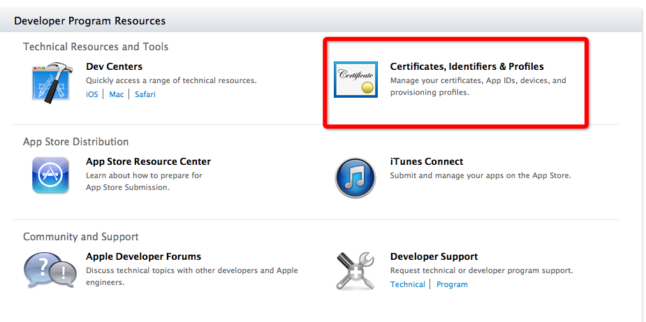

3.点击进入iOS Apps下面的Provisioning Portal

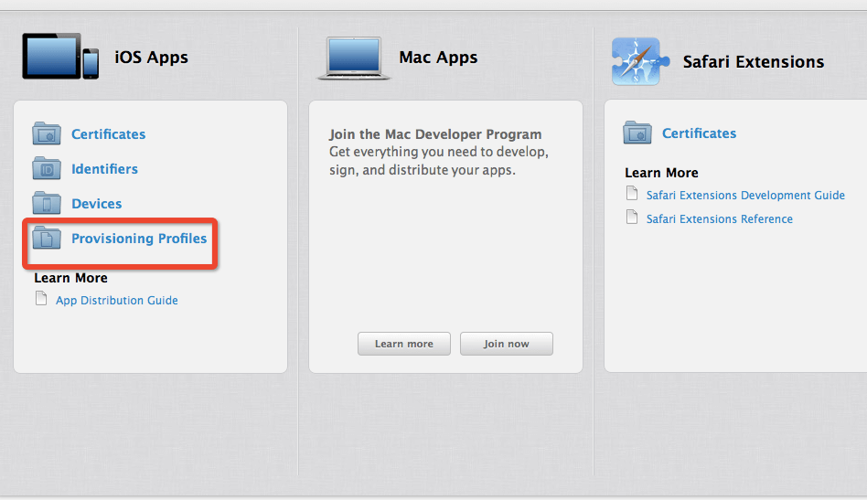

4.点击App IDs栏目中的加号，根据提示创建应用ID(图1)，如图2所示，在创建过程中勾选Push Notification服务；

**图1**

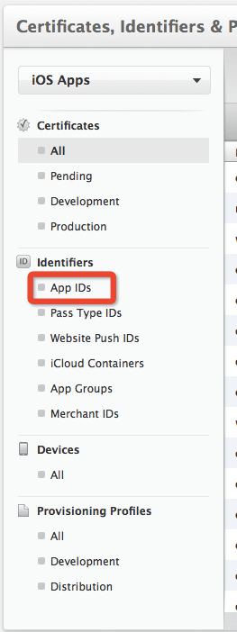


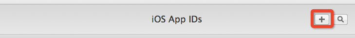


**图2**

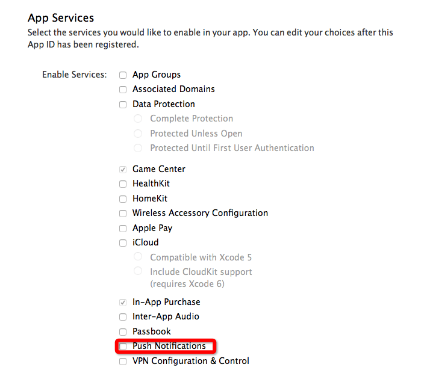


### 创建和上传证书
1.创建完成后再次点击应用，点击Edit；

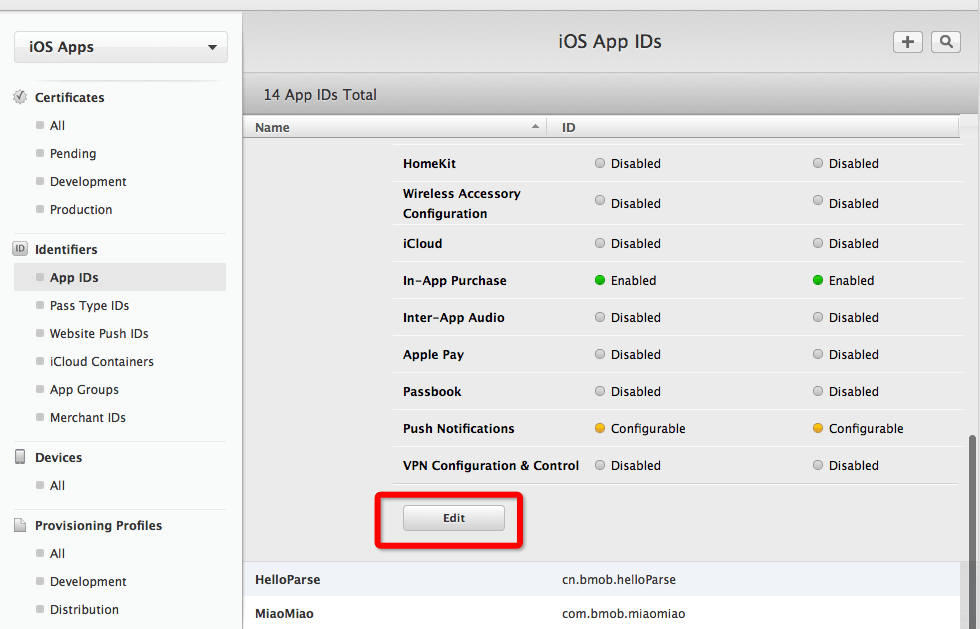

2.点击创建证书（图1）,并根据提示创建证书（图2）， 

**图1**

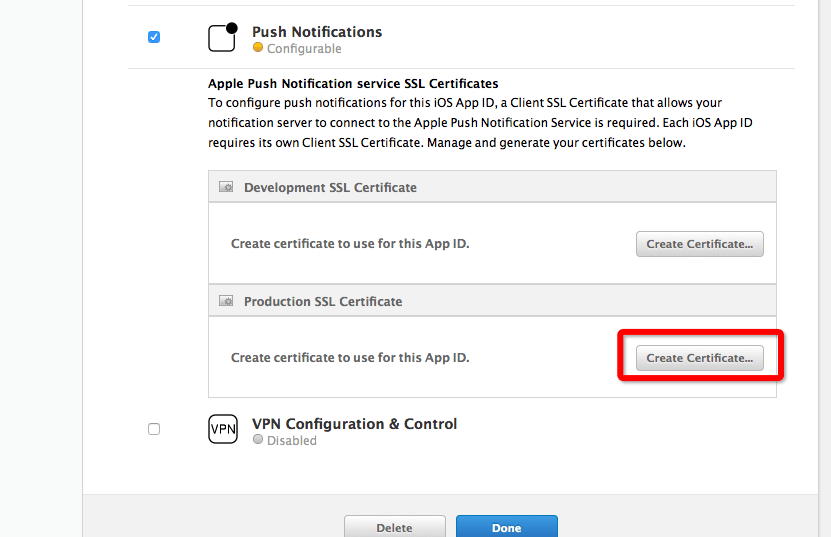

**图2**

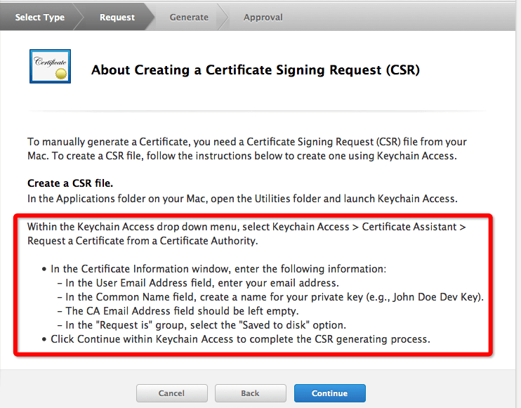

3.生成证书后点击一下步，并上传刚刚创建好的证书，点击生成

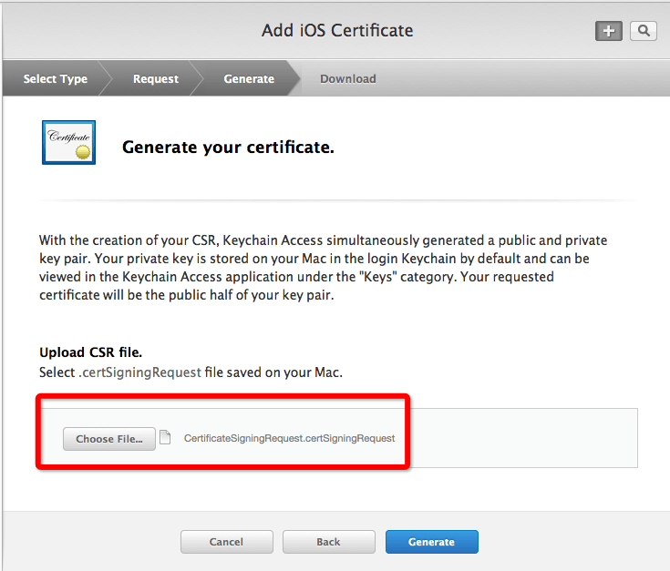

4.如图所示，点击Download下载APNs，完成后点击Done。

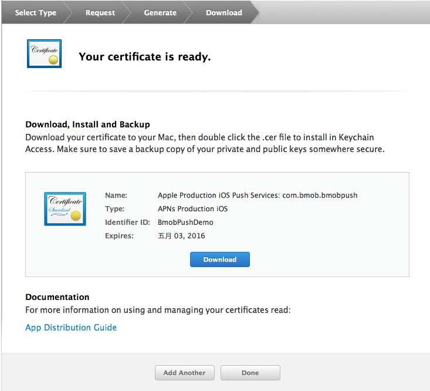

5.导出.p12文件

* 双击刚刚生成的.cer文件；

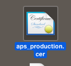

* 进入"钥匙串访问"，选中刚刚导入的证书；

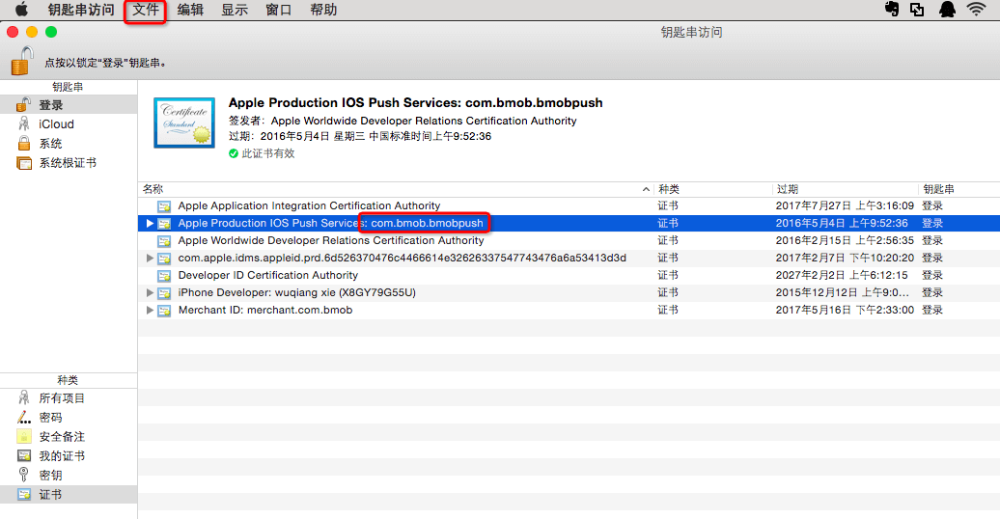

* 选择导出项目（图1），导出.12文件，可以修改文件保存位置为桌面，方便后续上传（图2）；

**图1**

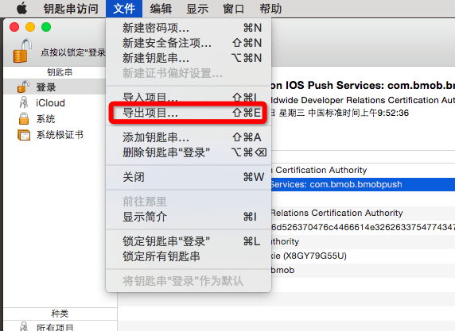

**图2**

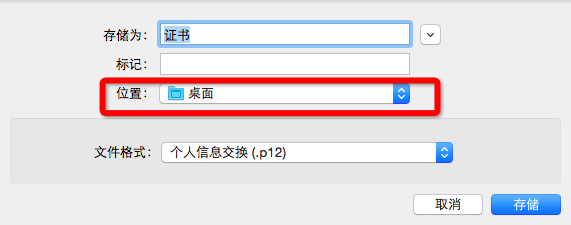

* 点击存储，会提示设置密码，此处密码需为空，点击“好”，根据提示输入登录密码即可导出。

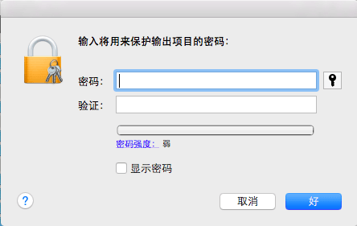

6.按照1~5步创建开发证书

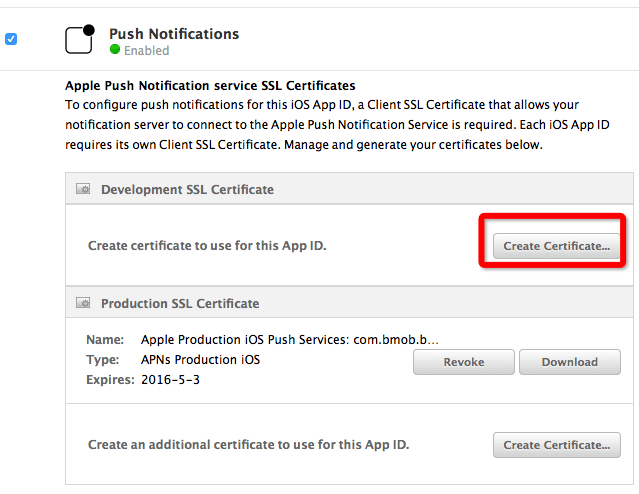

7.进入Bmob后台，在消息推送的推送设置处上传刚刚生成的两个.p12文件，并且选择目前是开发状态还是生产状态（图1）。`证书是具有有效时间的，需要注意在过期后重新生成`

**图1**

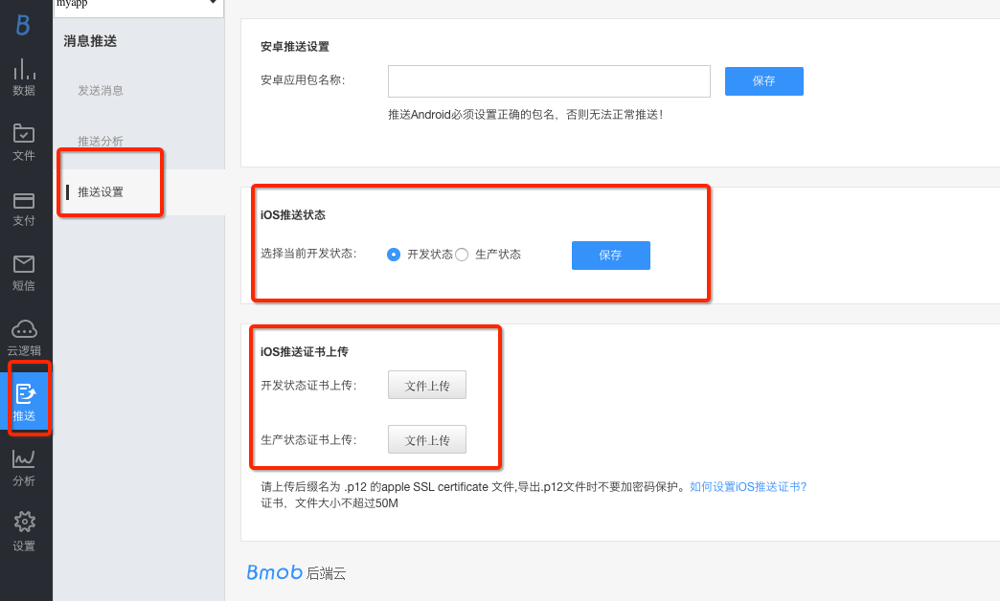

**图2**

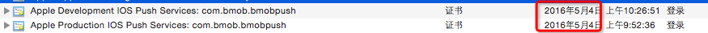

## 推送使用
使用Bmob的推送服务，需要添加BmobSDK及其依赖库，具体可以参考[BmobSDK iOS快速入门](http://docs.bmob.cn/data/iOS/a_faststart/doc/index.html)

### 推送消息接收
接收推送消息需要做两件事情，一是注册远程推送，一是将注册后得到的Token值保存至服务器。

1.注册远程推送，在AppDelegate.m中的`- (BOOL)application:(UIApplication *)application didFinishLaunchingWithOptions:(NSDictionary *)launchOptions`中使用以下代码

```
- (BOOL)application:(UIApplication *)application didFinishLaunchingWithOptions:(NSDictionary *)launchOptions {
    [Bmob registerWithAppKey:@"your appkey"];
    
    // Override point for customization after application launch.
    //注册推送，iOS 8的推送机制与iOS 7有所不同，这里需要分别设置
    if ([[[UIDevice currentDevice] systemVersion] floatValue] >= 8.0) {
        UIMutableUserNotificationCategory *categorys = [[UIMutableUserNotificationCategory alloc]init];
        //注意：此处的Bundle ID要与你申请证书时填写的一致。
        categorys.identifier=@"com.bmob.bmobpushdemo";
        
        UIUserNotificationSettings *userNotifiSetting = [UIUserNotificationSettings settingsForTypes:(UIUserNotificationTypeAlert|UIUserNotificationTypeBadge|UIUserNotificationTypeSound) categories:[NSSet setWithObjects:categorys,nil]];
        
        [[UIApplication sharedApplication] registerUserNotificationSettings:userNotifiSetting];
        
        [[UIApplication sharedApplication] registerForRemoteNotifications];
    }else {
        //注册远程推送
        UIRemoteNotificationType myTypes = UIRemoteNotificationTypeBadge|UIRemoteNotificationTypeAlert|UIRemoteNotificationTypeSound;
        [[UIApplication sharedApplication] registerForRemoteNotificationTypes:myTypes];
    }
    return YES;
}

```

2.在AppDelegate.m中添加以下代码，上传Token至服务器

```
-(void)application:(UIApplication *)application didRegisterForRemoteNotificationsWithDeviceToken:(NSData *)deviceToken{
    
    //注册成功后上传Token至服务器
    BmobInstallation  *currentIntallation = [BmobInstallation installation];
    [currentIntallation setDeviceTokenFromData:deviceToken];
    [currentIntallation saveInBackground];
}
```
至此就可以接收到通知消息了。

`注意`

1. iOS的推送只能在真机上使用，因此测试只能在真机上进行。

2. 项目一般需要设置自己的 `Provisioning Profile` ，如果是第一次跑该应用程序，可能会遇到以下问题，这是没有设置 `Provisioning Profile` 导致的。

```
Domain=NSCocoaErrorDomain Code=3000 "未找到应用程序的“aps-environment”的权利字符串"
```

解决过程如下：
1）添加一个新的许可文件（如下图），将你要测试的设备添加入许可文件，并将该文件下载下来，双击安装至xcode;

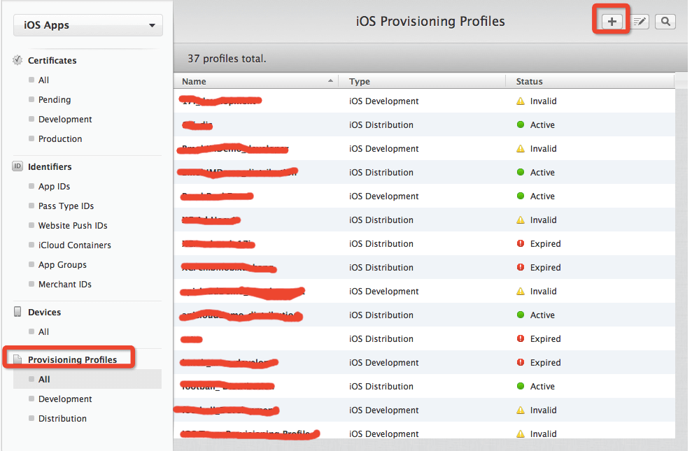

2）在Build Settings/Code Signing/Prvisioning Profile中选择刚刚导入至xcode的许可文件。


3）在info.plist的Bundle identifier中填入Bundle ID即可，注意：此处的Bundle ID要与你申请证书时填写的一致。

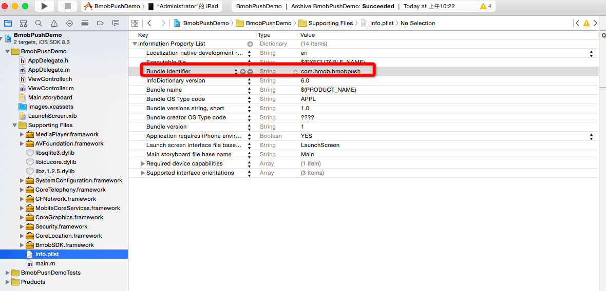

完成上述内容后，如果你的应用不是在运行状态，苹果的服务器就会发送推送至用户的设备上，并且由操作系统显示给用户，并不需要开发者做任何操作。如果推送到达时，应用是处于前台运行状态，开发者可以解析这条推送的内容。代码如下：

```objc
- (void)application:(UIApplication *)application didReceiveRemoteNotification:(NSDictionary *)userInfo{
    // 处理推送消息
    NSLog(@"userinfo:%@",userInfo);
   
    NSLog(@"收到推送消息:%@",[[userInfo objectForKey:@"aps"] objectForKey:@"alert"]);
｝
```


### 推送消息发送
推送消息一种是直接在Web端进行发送，另外一种则是在app端进行发送。

#### Web端发送

完成以上步骤后，你可以运行应用程序，从web推送一条消息给客户端。

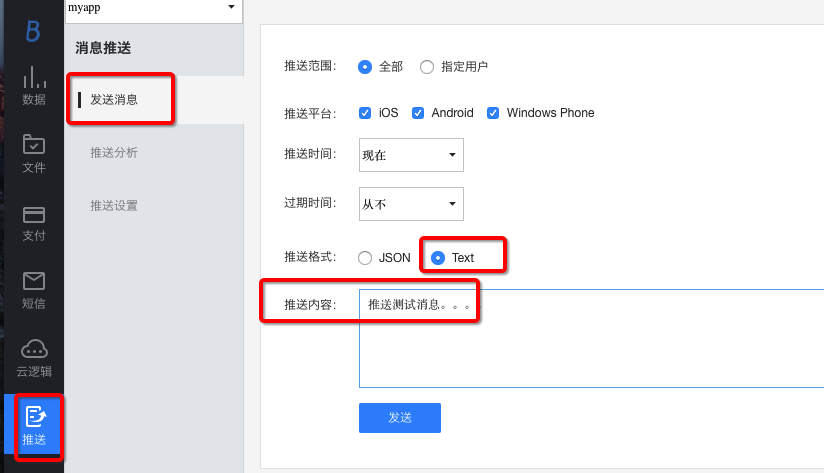

在后台推送消息给Android和iOS两个平台的时候，有一些需要注意的：

1、由于Android和iOS的提送机制不同，iOS要经过APNS，Android的推送完全是走Bmob的长连接服务，为兼容这个问题，如果你选择发送格式为“json”格式时，需要添加APNS兼容头部（见下面json的aps部分），推送内容格式如下：

```
{
	"aps": {
	"sound": "cheering.caf", 
	"alert": "这个是通知栏上显示的内容", 
	"badge": 0 
	}, 
	"xx" : "json的key-value对，你可以根据情况添加更多的，客户端进行解析获取", 
}
```

其中，sound是iOS接收时的声音，badge是iOS通知栏的累计消息数(`目前该值服务器并没有主动处理，需要开发者自行维护该值`)。

2、如果你选择发送格式为“text”时，推送内容为“推送消息测试。。。。”，Bmob会自动添加aps部分发送给APNS，，相当于自动生成如下的json格式的推送内容：

```
{
	"aps": {
		"alert": "推送消息测试。。。。", 
	}
}
```
同时，也会发送给Android端，相当于自动生成如下的json格式的推送内容：

```
{
	"alert" : "推送消息测试。。。。", 
}
```

3、如果只是发送给Android端，大家可以自定义json格式的数据。

4、由于iOS的APNS的推送的大小是有限制的，默认最多256bytes，因此,如果你需要跨平台互通的话，需注意推送的内容不要太长。

5、想要更多了解Bmob的推送格式的朋友，如即时聊天，可以查看我们在问答社区中的回答：[http://wenda.bmob.cn//?/question/204](http://wenda.bmob.cn//?/question/204)

#### app端发送

app端推送我们可以有以下类型

1. 广播推送，即给所有安装了该应用的设备发送推送
2. 组播推送，即给特定用户群发送推送
3. 点播推送，即给特定某一用户发送推送

##### 广播推送
采用以下代码

```
BmobPush *push = [BmobPush push];
//设置推送消息
[push setMessage:@"所有人的推送的消息"];
//发送推送
[push sendPushInBackgroundWithBlock:^(BOOL isSuccessful, NSError *error) {
        NSLog(@"error %@",[error description]);
}];
```

##### 组播推送

可以自定义筛选条件给特定的用户群进行推送，这里我们将通过案例来说明如何使用组播推送。

###### 1.根据订阅频道推送
如我们做电台应用，只希望给订阅了特定频道的用户进行推送，我们可以使用利用在Intallation表中定义了的`channels`字段，我们可以设置该字段，然后只给订阅了特定channels的用户推送消息。首先，来看看如何设置该字段。

**覆盖已订阅的频道：**

```
BmobInstallation  *currentIntallation = [BmobInstallation objectWithoutDatatWithClassName:nil objectId:@"szK8444I"];
[currentIntallation setObject:@[@"Giants",@"Mets"] forKey:@"channels"];
[currentIntallation updateInBackground];
```

**订阅一个新频道，不覆盖已订阅的频道:**

```
BmobInstallation  *currentIntallation = [BmobInstallation objectWithoutDatatWithClassName:nil objectId:@"szK8444I"];
[currentIntallation subscribeFromChannels:@[@"Giants"]];
[currentIntallation updateInBackground];
```

**退订一个订阅频道**

```
BmobInstallation  *currentIntallation = [BmobInstallation objectWithoutDatatWithClassName:nil objectId:@"szK8444I"];
[currentIntallation unsubscribeFromChannels:@[@"Giants"]];
[currentIntallation updateInBackground];
```

设置好订阅频道后我们可以给订阅了特定频道的用户推送消息，代码如下：

```
BmobPush *push = [BmobPush push];
[push setMessage:@"推送给订阅了体育频道的用户"];
[push setChannel:@"Sports"];
[push sendPushInBackgroundWithBlock:^(BOOL isSuccessful, NSError *error) {
        NSLog(@"error %@",[error description]);
}];
```

###### 2.根据特定的查询条件进行推送
我们可以设置查询条件，然后给符合条件的用户进行推送，样例如下：

```
BmobQuery *query = [BmobInstallation query];
//设置查询条件
...

BmobPush *push = [BmobPush push];
[push setQuery:query];
[push setMessage:@"推送给满足条件的用户"];
[push sendPushInBackgroundWithBlock:^(BOOL isSuccessful, NSError *error) {
    NSLog(@"error %@",[error description]);
}];
```

如我们可以根据平台进行推送

1）推送给安卓用户

```
BmobPush *push = [BmobPush push];
BmobQuery *query = [BmobInstallation query];
[query whereKey:@"deviceType" equalTo:@"android"];
[push setQuery:query];
[push setMessage:@"推送给安卓用户的消息"];
[push sendPushInBackgroundWithBlock:^(BOOL isSuccessful, NSError *error) {
    NSLog(@"error %@",[error description]);
}];
```

2）推送给苹果用户

```
BmobPush *push = [BmobPush push];
BmobQuery *query = [BmobInstallation query];
[query whereKey:@"deviceType" equalTo:@"ios"];
[push setQuery:query];
push setMessage:@"推送给苹果用户的消息"];
[push sendPushInBackgroundWithBlock:^(BOOL isSuccessful, NSError *error) {
        NSLog(@"error %@",[error description]);
}];
```

##### 点播推送
给特定的用户发送信息，推送给安卓用户与推送给苹果用户有所区别，样例如下：

1、发送给单个安卓用户

```
BmobPush *push = [BmobPush push];
BmobQuery *query = [BmobInstallation query];
[query whereKey:@"installationId" equalTo:@"xxxxxxxxxxxxxxxx"];
[push setQuery:query];
[push setMessage:@"推送给某个安卓用户的消息"]
[push sendPushInBackgroundWithBlock:^(BOOL isSuccessful, NSError *error) {
        NSLog(@"error %@",[error description]);
}];
```

2、推送给单个苹果用户

```
BmobPush *push = [BmobPush push];
BmobQuery *query = [BmobInstallation query];
[query whereKey:@"deviceToken" equalTo:@"xxxxxxxxxxxxxxxx"];
[push setQuery:query];
[push setMessage:@"推送给某个苹果用户的消息"]
[push sendPushInBackgroundWithBlock:^(BOOL isSuccessful, NSError *error) {
        NSLog(@"error %@",[error description]);
}];
```

