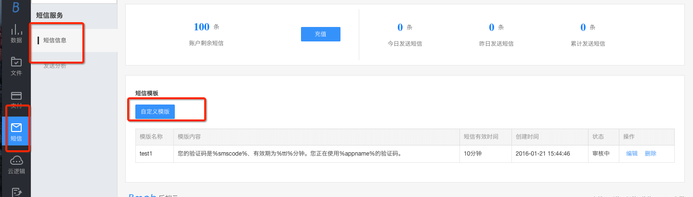

除了与用户相关的包括一键注册，手机号码登录等操作外，Bmob 还推出了单独的短信验证码服务。 在实际的应用中，开发者希望能够通过短信验证的方式来与用户进行某些重要操作的确认，你就可以在用户验证过手机号码的前提下，使用 Bmob 提供的短信验证码服务(`Bmob SMS SDK`)。

每个 Bmob 帐户有 10 条免费额度的短信数量用于测试，超过需要购买短信条数才能继续使用。

默认使用 【比目科技】 作为签名，可以在控制台进行修改。

下面是使用方法：

## SMS初始化

此短信SDK可单独使用，调用如下方法完成应用的初始化：

1.默认的初始化
```java

BmobSMS.initialize(context,Bmob_Application_ID);

```
2.从v1.2.0开始，提供了对应的接口回调，收到短信验证码能读取到验证码，读取后能自动填入EditText，能提高用户体验，你需要传对应的接口参数：

```java

BmobSMS.initialize(context,Bmob_Application_ID，new MySMSCodeListener());

class MySMSCodeListener implements SMSCodeListener{

		@Override
		public void onReceive(String content) {
			if(et_smscode != null){
				et_smscode.setText(content);
			}
		}
		
	}

```
注: 如果用第二种方式初始化，需要相应的广播和短信权限，详见BmobSMSDemo。
## 请求发送自定义的短信内容

**使用场景**

 此方法允许开发者使用 Bmob 的短信功能灵活发送自定义的短信内容到用户的手机上，可运用于多种场景下，比如 `发送祝福短信、推送消息、通知`等


**使用前准备**

有两种方式可以使用自定义模板
1.开发者可在Bmob后台提交身份证信息（`Bmob后台->账户管理->身份验证`），并经`Bmob官方审核`通过，可以自定义模板。
2.不提交身份信息，直接提交短信模板，并经`Bmob官方审核`通过，可以使用该模板。

**短信模板需要符以下要求，否则模板审核不予通过。**

注意：请不要发送任何敏感内容，请不要定制广告、营销以诱导用户行为的信息。具体如下：
1.不得包含敏感关键，[关键字列表文档下载](https://github.com/bmob/bmob-public-docs)，不得包含【】和 [] 
2.带联系方式（电话、qq微信、邮箱地址）的短信。如：“目前我司推出xx产品最新优惠，联系陈生了解详情，电话123-1234-1234”;
3.诱导用户行为，特别是带超链接。如“我司推出新作xxx游戏，下载链接http://xxx.com”等；
当前有两种使用自定义模板

发现上述情况，针对通过身份审核的开发者，第一次给予警告，第二次将直接关闭接口使用，针对通过模板审核请求使用的开发者，模板审核不给予通过。

**调用示例**

```java

SimpleDateFormat format =new SimpleDateFormat("yyyy-MM-dd HH:mm:ss");
String sendTime = format.format(new Date());
BmobSMS.requestSMS(context, number, "审核通过后的短信内容",sendTime,new RequestSMSCodeListener() {
	
	@Override
	public void done(Integer smsId,BmobException ex) {
		// TODO Auto-generated method stub
		if(ex==null){//
			Log.i("bmob","短信发送成功，短信id："+smsId);//用于查询本次短信发送详情
		}else{
			Log.i("bmob","errorCode = "+ex.getErrorCode()+",errorMsg = "+ex.getLocalizedMessage());
		}
	}
});

```

注：

1、如果需要立即发送，sendTime设置为null(不是空字符串"");

2、sendTime的格式为 `yyyy-MM-dd HH:mm:ss`,如果sendTime的格式不正确或者是这个时间是过去的时间，那么短信会立即发送;

3、smsId可用于查询该条短信的发送状态。


## 请求发送短信验证码

通过`requestSMSCode`方式给绑定手机号的该用户发送指定短信模板的短信验证码：

```java

BmobSMS.requestSMSCode(context, "11位手机号码", "模板名称",new RequestSMSCodeListener() {
			
	@Override
	public void done(Integer smsId,BmobException ex) {
		// TODO Auto-generated method stub
		if(ex==null){//验证码发送成功
			Log.i("bmob", "短信id："+smsId);//用于查询本次短信发送详情
		}
	}
});

```

短信默认模板：

```java 

	您的验证码是`%smscode%`，有效期为`%ttl%`分钟。您正在使用`%appname%`的验证码。【比目科技】

```

**注：**

1、`模板名称`：模板名称需要开发者在应用的管理后台进行短信模板的添加工作，具体：`短信服务`->`短信模板`,之后点击创建即可。


具体请看下图：




2、只有审核通过之后的自定义短信模板才可以被使用，如果自定义的短信模板其状态显示`审核中`或者`审核失败`,再调用该方法则会以`默认模板`来发送验证码。

**3、开发者提交短信验证码模板时需注意以下几点：**

**1）、模板中不能有【】和 [] ，否则审核不通过；**

**2）、如果你提交的短信模板无法发送，则有可能包含一些敏感监控词，具体可去Github下载  [短信关键字监控参考文档](https://github.com/bmob/bmob-public-docs/blob/master/%E7%9F%AD%E4%BF%A1%E5%85%B3%E9%94%AE%E5%AD%97%E7%9B%91%E6%8E%A7%E5%8F%82%E8%80%83%E6%96%87%E6%A1%A3.doc) 来查看提交内容是否合法。**

**3）、一天一个应用给同一手机号发送的短信不能超过10条，否则会报`10010`错误，其他错误码可查看：[短信功能相关错误码](http://docs.bmob.cn/sms/Android/g_errorcode/doc/index.html) 。**

### 验证验证码

通过`verifySmsCode`方式可验证该短信验证码：

```java

BmobSMS.verifySmsCode(context,"11位手机号码", "验证码", new VerifySMSCodeListener() {
			
	@Override
	public void done(BmobException ex) {
		// TODO Auto-generated method stub
		if(ex==null){//短信验证码已验证成功
			Log.i("bmob", "验证通过");
		}else{
			Log.i("bmob", "验证失败：code ="+ex.getErrorCode()+",msg = "+ex.getLocalizedMessage());
		}
	}
});

```

### 查询短信发送状态

通过`querySmsState`方式可查询指定`smsId`的发送状态：

```java

BmobSMS.querySmsState(context, smsId, new QuerySMSStateListener() {
			
			@Override
			public void done(SmsState state, BmobException ex) {
				// TODO Auto-generated method stub
				if(ex==null){
					Log.i("bmob","短信状态："+state.getSmsState()+",验证状态："+state.getVerifyState());
				}
			}
		});

```

注：`SmsState`包含两种状态：

1、`smsState`（短信状态）   :SUCCESS（发送成功）、FAIL（发送失败）、SENDING(发送中)。

2、`verifyState`（验证状态）:true(已验证)、false(未验证)。


**注意事项：**

**关于短信条数的计算规则如下:**

1. 实际计算的短信字数 = 模板的内容或自定义短信的内容字数 + 6。加上6是因为默认的签名【比目科技】占了6个字。
2. 实际计算的短信字数在70个字以下算1条。
3. 实际计算的短信字数超过70字的以67字为一条来计算的。也就是135个字数是计算为3条的。
4. 计算得到的短信条数在本条短信发送成功后将会从你的账户剩余的短信条数中扣除。

**短信发送限制规则是1/分钟，5/小时，10/天。即对于一个应用来说，一天给同一手机号发送短信不能超过10条，一小时给同一手机号发送短信不能超过5条，一分钟给同一手机号发送短信不能超过1条。**

## 购买事项

### 购买方法

短信条数只能输入整数，且不能少于1000条

![短信计费模式][1]

进入账号控制台，财务/财务统计点击购买短信即可。

![购买短信][2]

### 发票事宜

购买金额满100可提供发票，1000元以内的到付，1000以上（含1000）包邮。

登录后台提交工单，提供购买服务的订单号和开票信息。

**个人**

发票抬头、邮寄地址、联系人及电话

**企业**

公司名称、统一社会信用代码、开户行及账号、邮寄地址、联系人及电话


  [1]: http://bmob-file-service-t.b0.upaiyun.com/Doc_File/jfms.png
  [2]: http://bmob-file-service-t.b0.upaiyun.com/Doc_File/14703632600603.jpg
