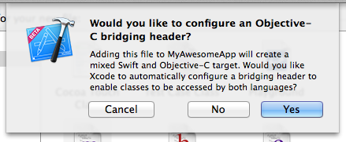

# Swift项目中使用BmobSDK

本文档的目的是为了方便大家在Swift工程中使用BmobSDK，实现应用的快速开发。下面介绍怎么在 Swift 工程中使用 BmobSDK。

## 在Bmob上创建应用
关于如何创建应用，具体请参照[快速入门](http://docs.bmob.cn/ios/faststart/index.html?menukey=fast_start&key=start_ios)

## 创建Swift项目
使用Xcode6创建一个新的Single View Application


Language选择Swift


## 设置BmobSDK
从官网下载最新的[BmobSDK](http://www.bmob.cn/sdk/Bmob_SDK_iOS_v1.4.1.zip),解压导入项目。

添加依赖库文件:
- Foundation.framework
- CoreLocation.framework
- Security.framework
- CoreGraphics.framework
- MobileCoreServices.framework
- CFNetwork.framework
- CoreTelephony.framework
- SystemConfiguration.framework
- AVFoundation.framework
- MediaPlayer.framework
- libz.1.2.5.dylib
- libicucore.dylib
- libsqlite3.dylib

添加完成后，应该像这个样子


## 创建桥接头文件(Bridging Header)

想要在Swift中使用Objective-C 的类和方法的话，需要创建一个.h 头文件，把你想在 Swift 中使用的 Objective-C 的头文件都包含进来。创建桥接头文件的方法有两种：可以自己手动创建一个桥接头文件并在项目配置项里面进行设置，也可以使用更快捷的方式，在你的项目里创建一个无用的 Objective-C 类文件（如：test.m），Xcode 将询问你是否要创建一个桥接头文件：



完成之后，你就可以删除test.m文件了,然后在 BmobSwift-Bridging-Header.h 中引入

```
#import <BmobSDK/Bmob.h>
```

## 测试CURD功能

在AppDelegate.swift注册申请的AppKey

```
func application(application: UIApplication, didFinishLaunchingWithOptions launchOptions: [NSObject: AnyObject]?) -> Bool {
        // Override point for customization after application launch.
        
         Bmob.registerWithAppKey("xxxxxx")
        
        return true
    }
```

在ViewController.swift 中添加函数

```
//创建方法
func saveObj(){
        var obj:BmobObject = BmobObject(className: "GameScore")
        obj.setObject(3, forKey: "class")
        obj.saveInBackground()
    }
```

然后在viewDidLoad函数中调用

```
override func viewDidLoad() {
        super.viewDidLoad()
        // Do any additional setup after loading the view, typically from a nib.
        self.saveObj()
    }
```

现在就可以在WEB后台查看是否创建成功，如下图所示。


```
//查询方法
func queryObj(){
        var query:BmobQuery = BmobQuery(className:"Post")
        query.includeKey("author")
        query.whereKeyExists("author")
        query.findObjectsInBackgroundWithBlock({array,error in
            for obj in array{
                if obj is BmobObject{
                    var obj2:BmobObject = obj.objectForKey("author") as BmobObject
                    var name:String   = obj2.objectForKey("username") as String
                    var classNumber:Int =  obj.objectForKey("class").integerValue
                    println("class is!   \(classNumber)")
                }
            }
            }
        )
    }

```

```
//更新方法
func update(){
        var obj:BmobObject = BmobObject(withoutDatatWithClassName: "Post", objectId: "a1419df47a")
        obj.incrementKey("class", byAmount: 5)
        obj.updateInBackgroundWithResultBlock({isSuccessful,error in
            if error{
                println("error is : \(error.description)")
            }else{
                println("update Successful")
            }
        })
    }
```

```
//删除方法
func delete(){
        var obj:BmobObject = BmobObject(withoutDatatWithClassName: "Post", objectId: "a1419df47a")
        obj.deleteInBackgroundWithBlock({isSuccessful,error in
            if error{
                println("error is : \(error.description)")
            }else{
                println("delete Successful")
            }
        })
    }
```


## 案例源码

[点击下载源码](https://github.com/bmob/bmob-app-demo-show/blob/master/download/BmobSwift.zip "点击下载源码")

